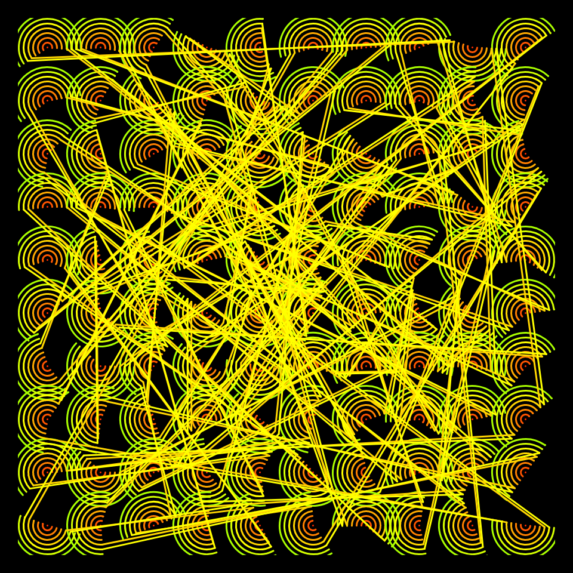
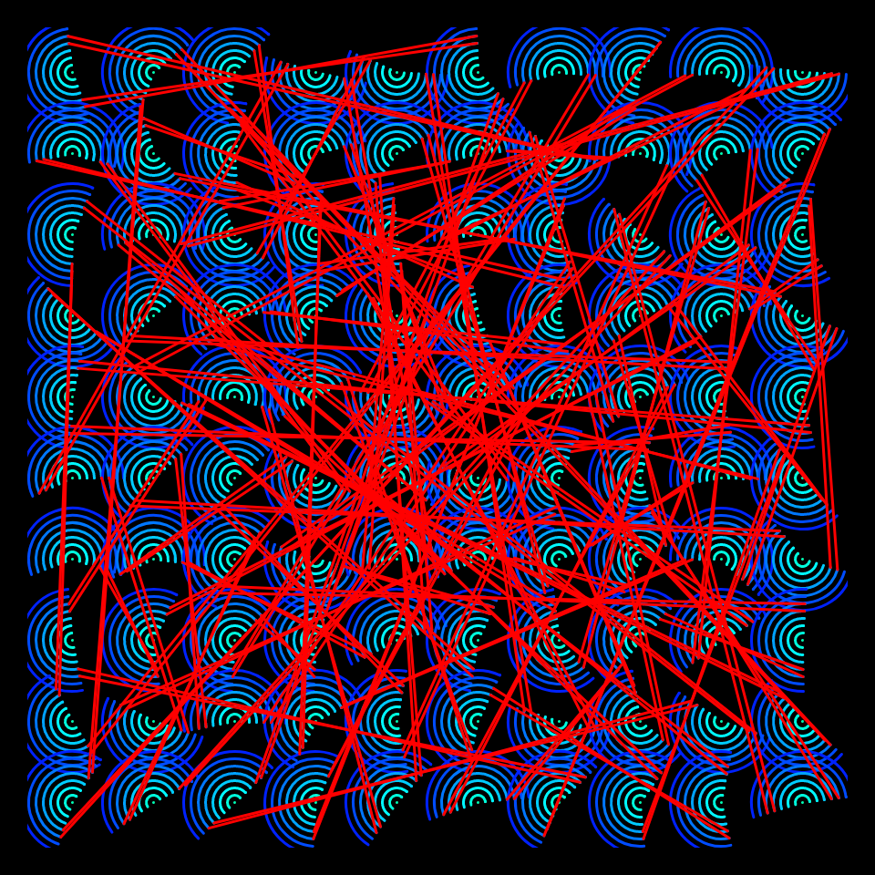
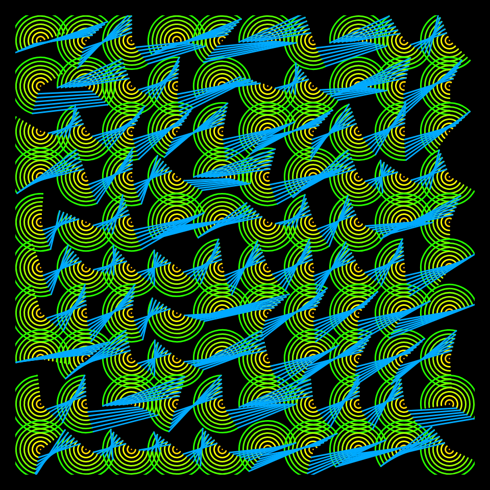
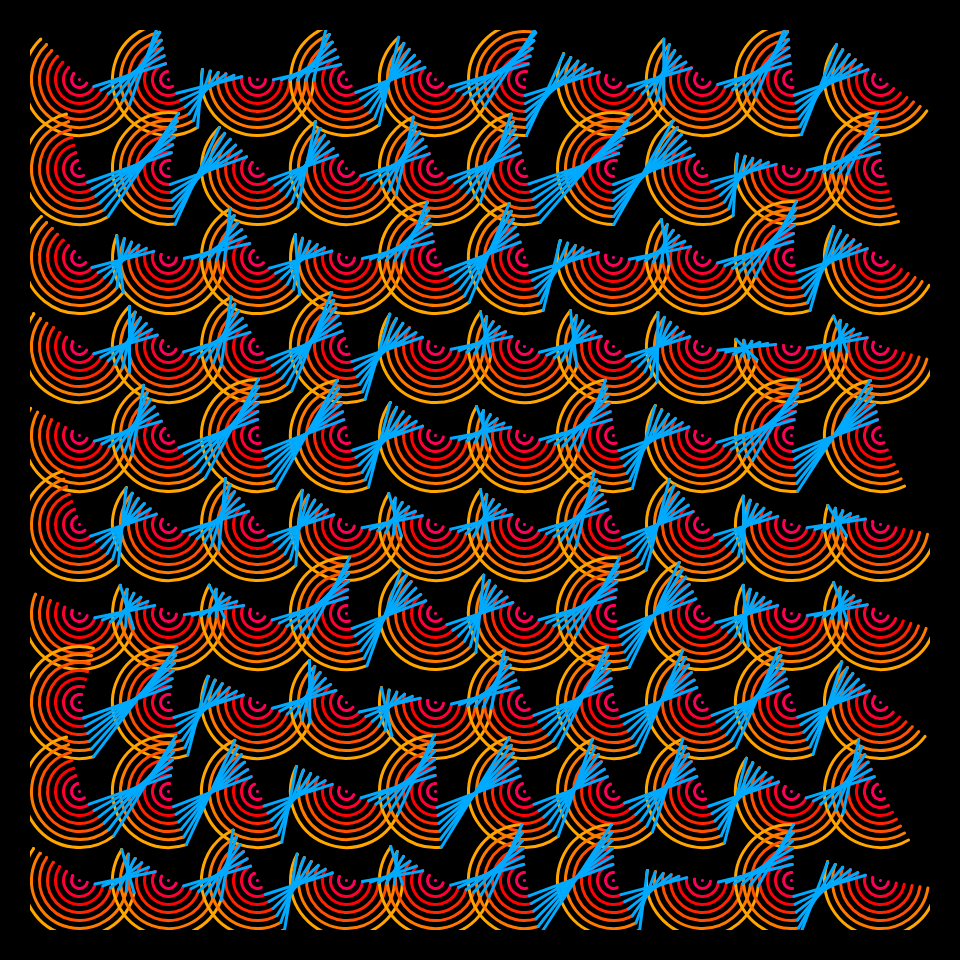

# DAILY SKETCH for 2021-11-13

## Done using P5.js

### Description

These `daily sketches` which are meant to be quick explorations     on whatever topic interested me on that day. This code is not typically optimized, but I share it as-is     for anyone interested.

     

## Progression of Images that were generated.

 
 
 
 
 

## 2021-11-13
Keywords: Echoes
 

## Description 

 100 circles, concentric, Color variation, connecting lines
 

Made using P5.js. | [Code](2021/2021-11-13/) | [Top](#daily-sketches) 

-----

