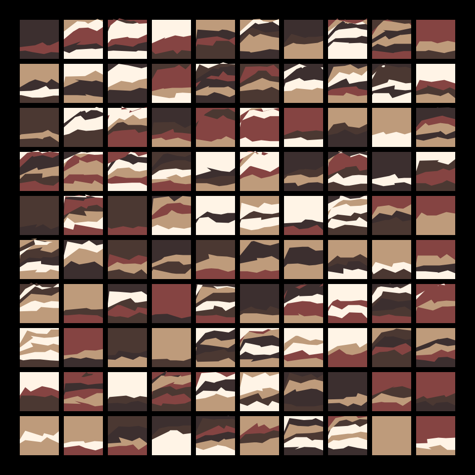

# DAILY SKETCH for 2021-11-18

## Done using P5.js

### Description

These `daily sketches` which are meant to be quick explorations     on whatever topic interested me on that day. This code is not typically optimized, but I share it as-is     for anyone interested.

  

## Progression of Images that were generated.

 
 

## 2021-11-18
Keywords: Background
 

## Description 

 10x10 layered Backgrounds inside panel boxes. Each box/panel has a slightly different background
 The idea is to use one of the corners and to draw colored shapes. 
 Just working on creating a set of usable Backgrounds, which I hope to use in future images 

Made using P5.js. | [Code](2021/2021-11-18/) | [Top](#daily-sketches) 

-----

