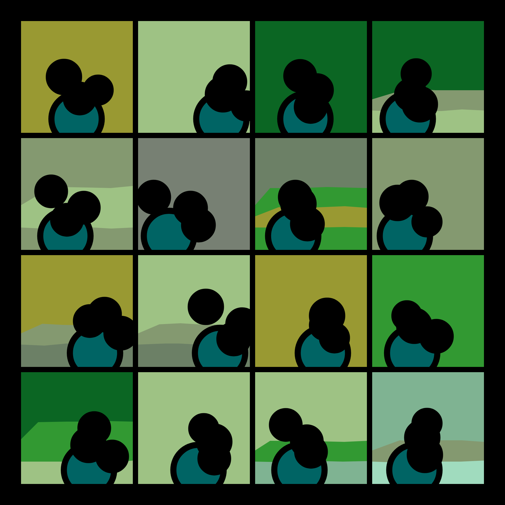
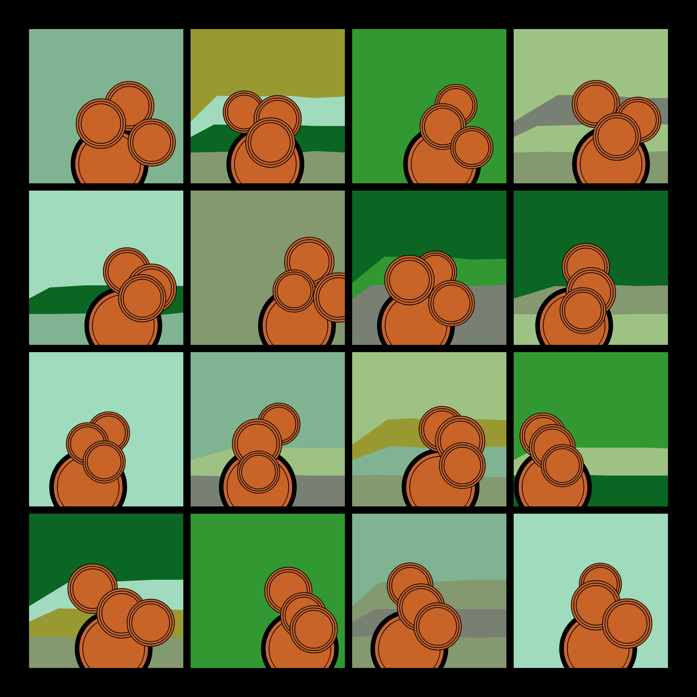
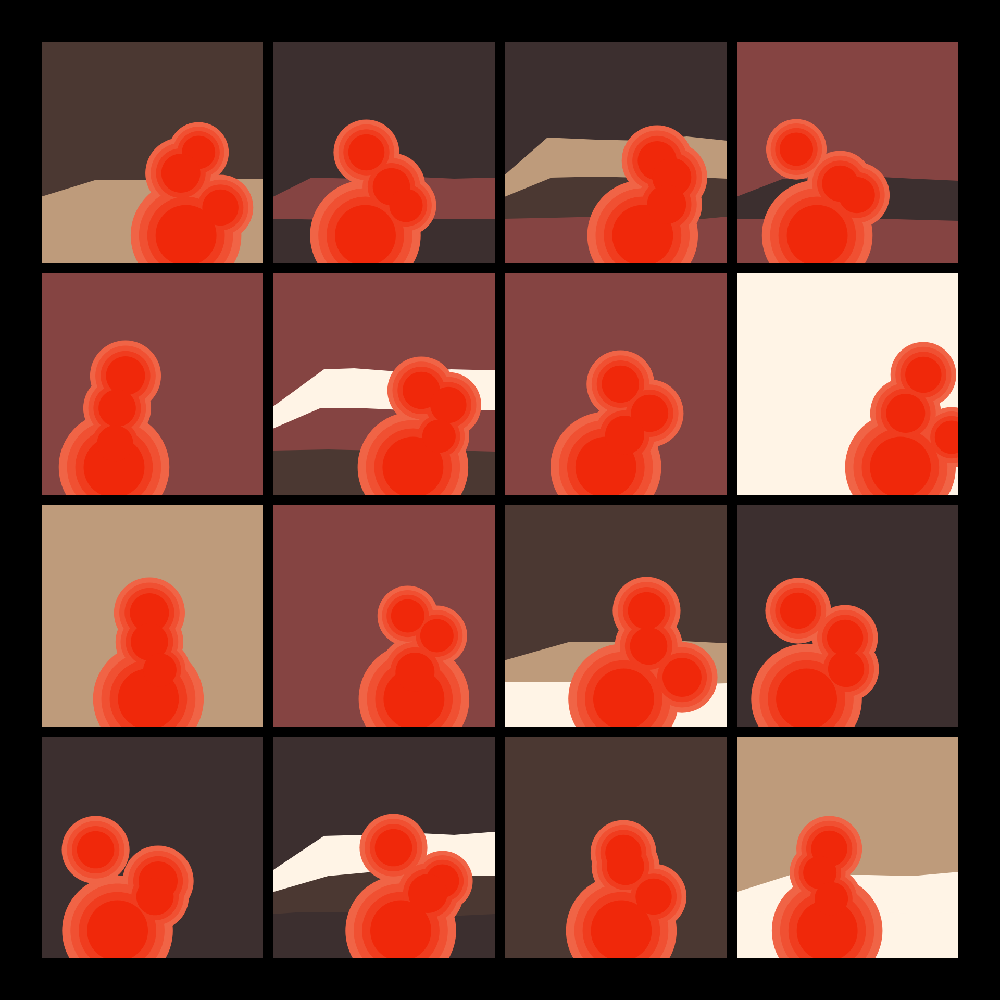

# DAILY SKETCH for 2021-11-21

## Done using P5.js

### Description

These `daily sketches` which are meant to be quick explorations     on whatever topic interested me on that day. This code is not typically optimized, but I share it as-is     for anyone interested.

    

## Progression of Images that were generated.

 
 
 
 

## 2021-11-21
Keywords: circloids
 

## Description 

 Drawing a few "circloids" inside panel boxes. Each box/panel has a slightly different background
 One big circle anchors all the others.
 

Made using P5.js. | [Code](2021/2021-11-21/) | [Top](#daily-sketches) 

-----

