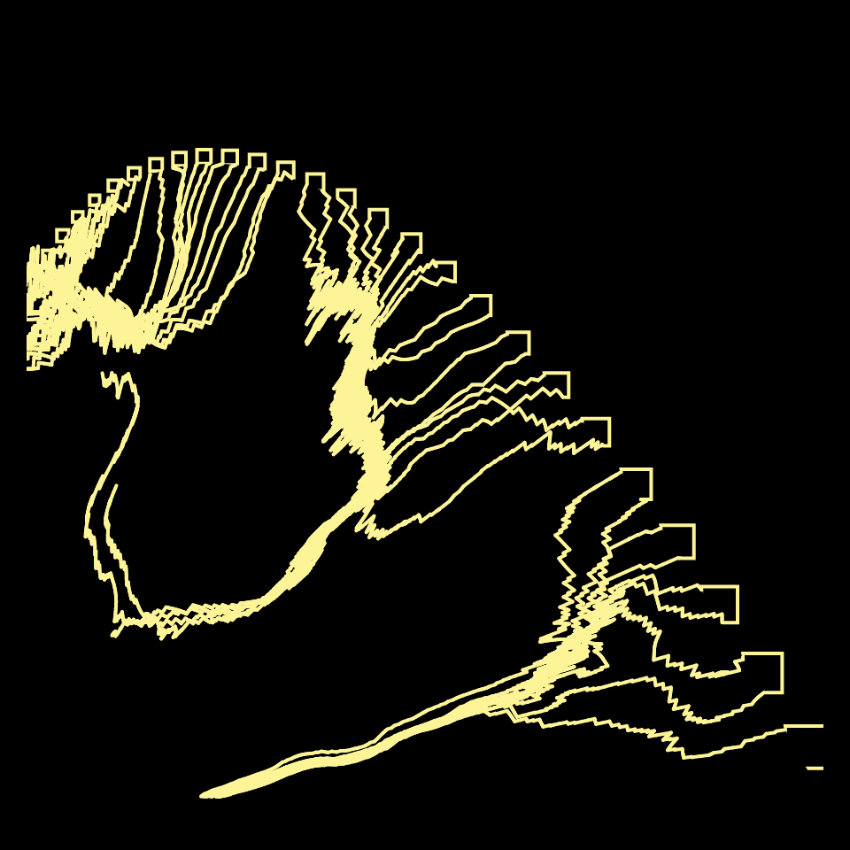

# DAILY SKETCH for 2021-11-26

## Done using P5.js

### Description

These `daily sketches` which are meant to be quick explorations     on whatever topic interested me on that day. This code is not typically optimized, but I share it as-is     for anyone interested.

  

## Progression of Images that were generated.

 
 

## 2021-11-26
Keywords: Bezier, Flow Field
 

## Description 

 Contrast between two halves, leading to a grid meltdown 

Made using P5.js. | [Code](2021/2021-11-26/) | [Top](#daily-sketches) 

-----

