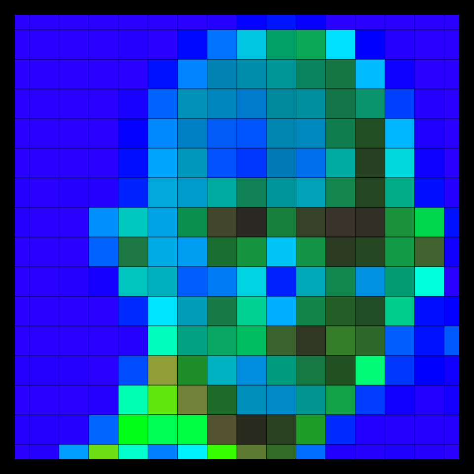

# DAILY SKETCH for 2021-12-02

## Done using P5.js

### Description

These `daily sketches` which are meant to be quick explorations     on whatever topic interested me on that day. This code is not typically optimized, but I share it as-is     for anyone interested.

 

## Progression of Images that were generated.

 

## 2021-12-02
Keywords: images
 

## Description 

 Neon Gandhi. Take patches of Gandhi image and render it in HSB for a different effect.
 

Made using P5.js. | [Code](2021/2021-12-02/) | [Top](#daily-sketches) 

-----

