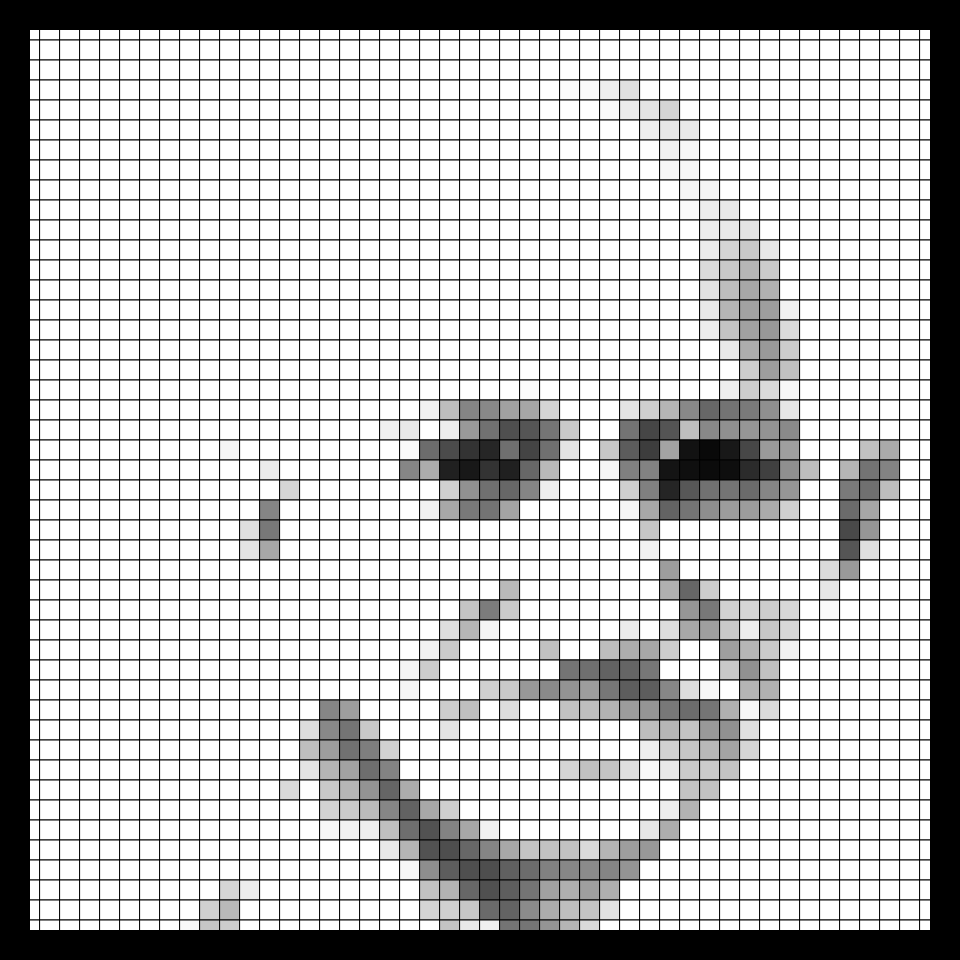
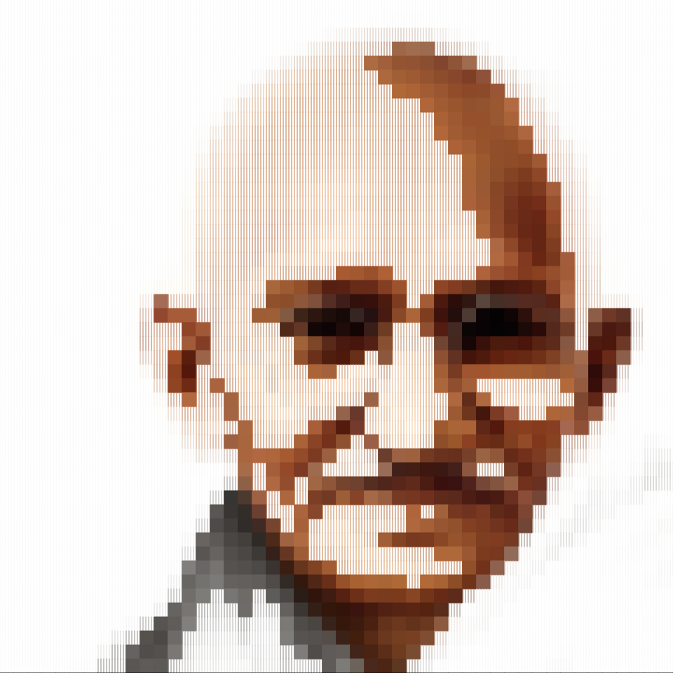

# DAILY SKETCH for 2021-12-03

## Done using P5.js

### Description

These `daily sketches` which are meant to be quick explorations     on whatever topic interested me on that day. This code is not typically optimized, but I share it as-is     for anyone interested.

   

## Progression of Images that were generated.

 
 
 

## 2021-12-03
Keywords: images
 

## Description 

 Gandhi Experiments. Take patches of Gandhi image and render it for a different effect.
 

Made using P5.js. | [Code](2021/2021-12-03/) | [Top](#daily-sketches) 

-----

