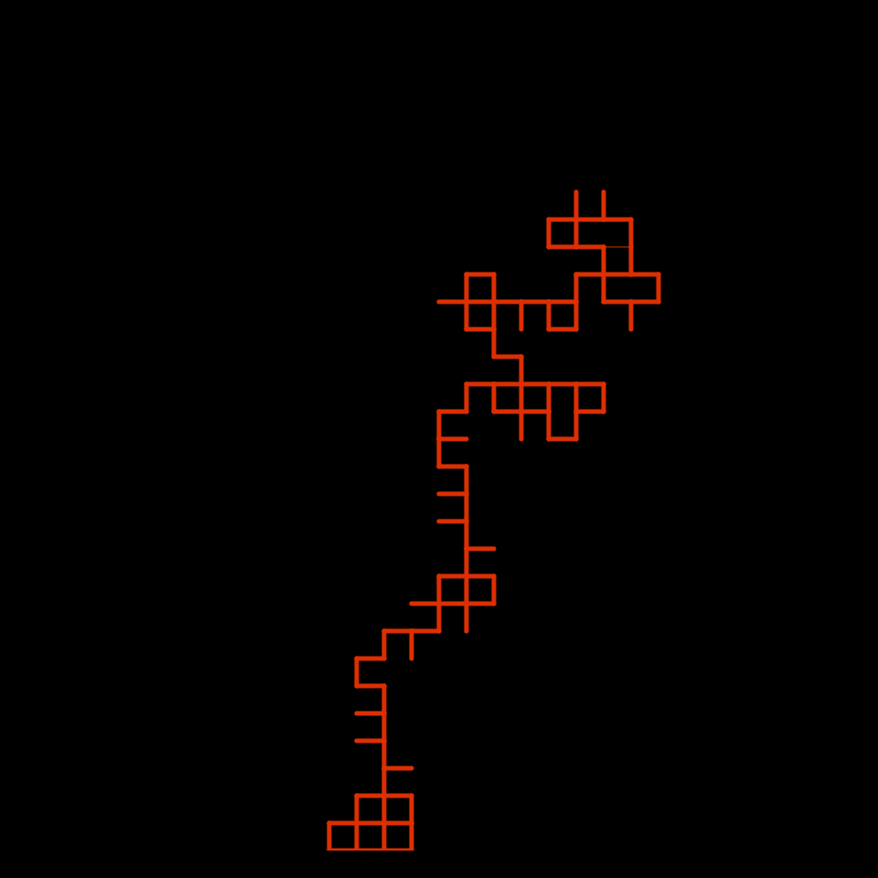
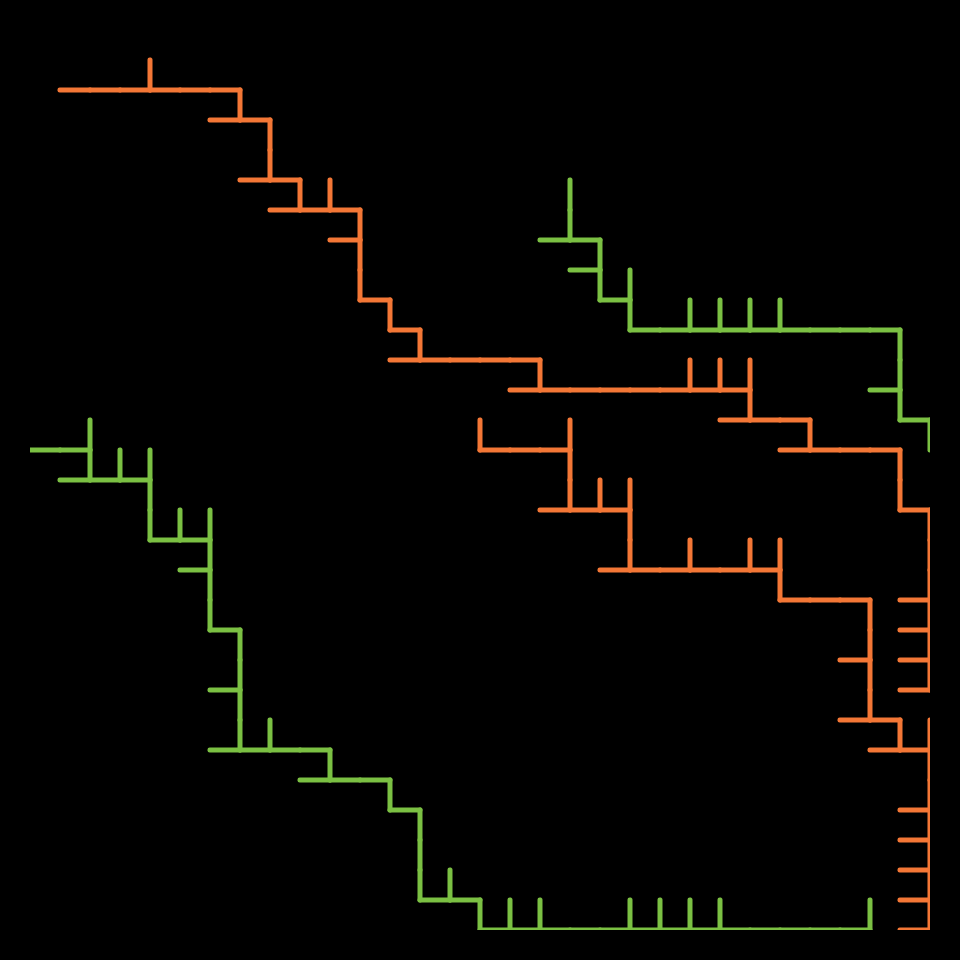
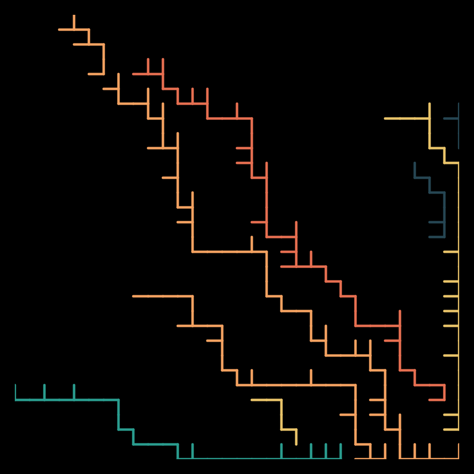
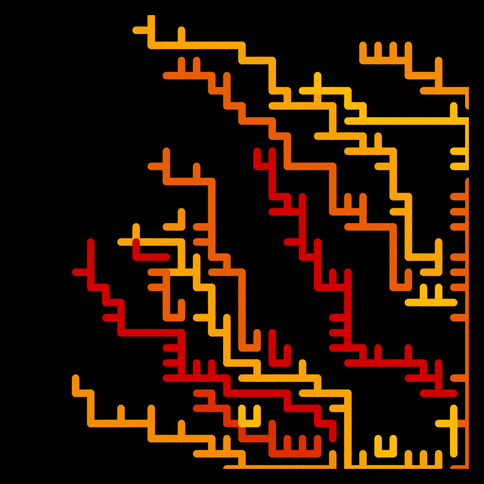

# DAILY SKETCH for 2021-12-12

## Done using P5.js

### Description

These `daily sketches` which are meant to be quick explorations     on whatever topic interested me on that day. This code is not typically optimized, but I share it as-is     for anyone interested.

    

## Progression of Images that were generated.

 
 
 
 

## 2021-12-12
Keywords: segments
 

## Description 

 Draw segments randomly, but keep growing them to adjacent segments, such that they cannot circle back on themselves.
 Some glitch makes them grow only down and to the right.
 

Made using P5.js. 

-----

