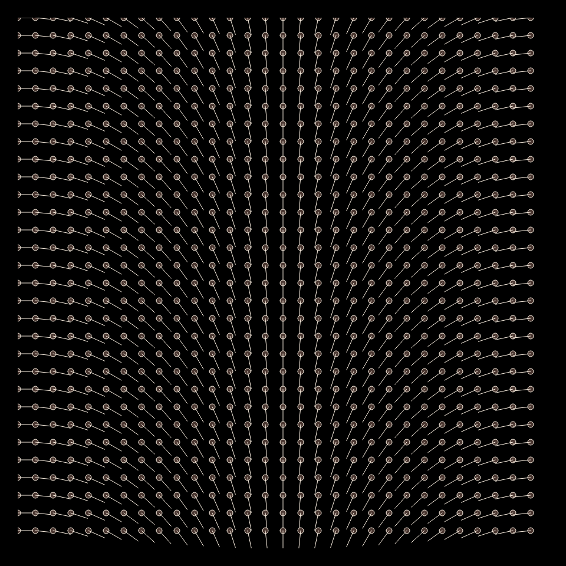
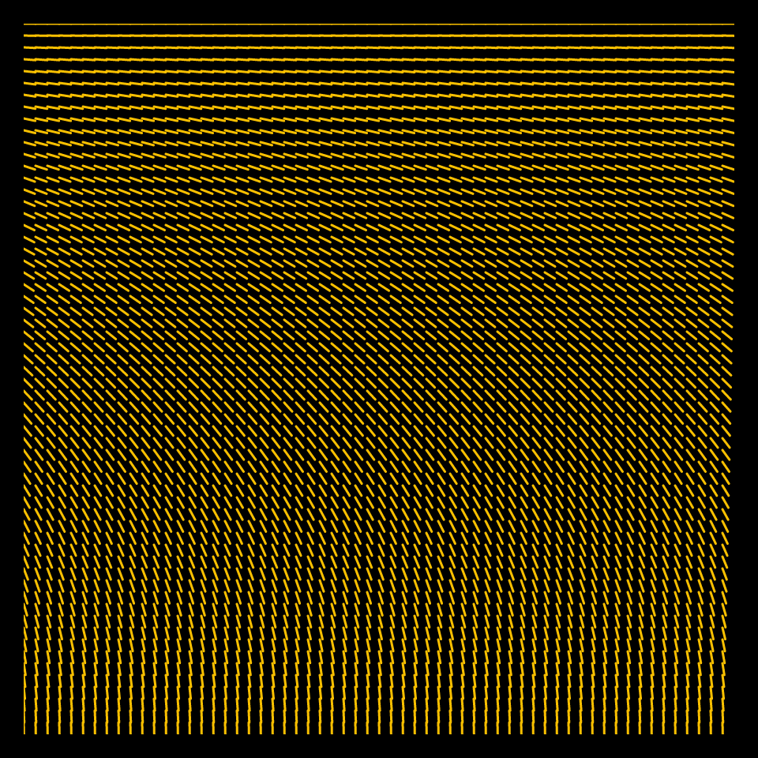
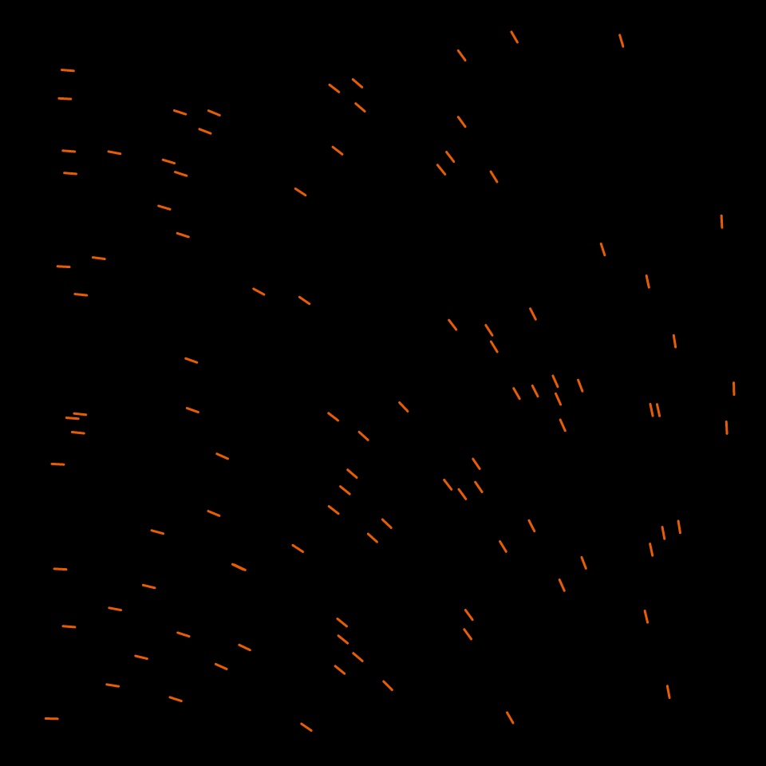
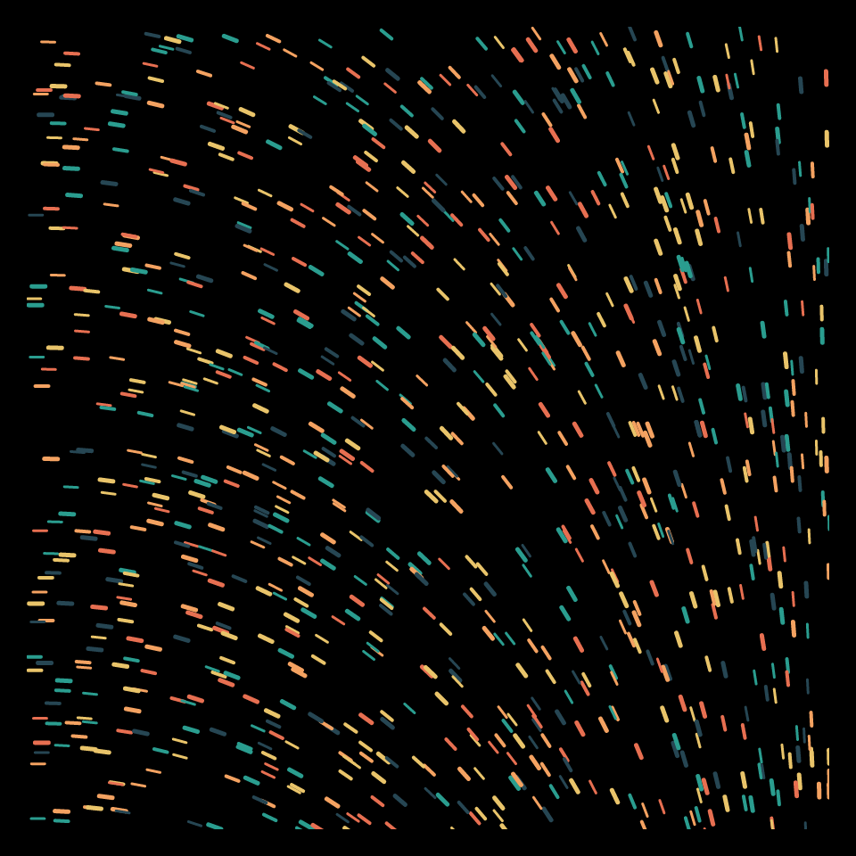
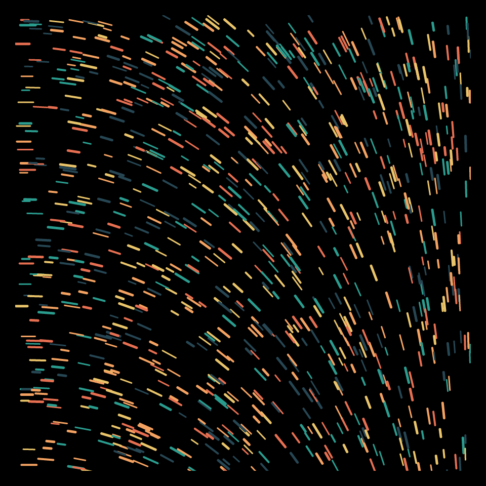

# DAILY SKETCH for 2021-12-16

## Done using P5.js

### Description

These `daily sketches` which are meant to be quick explorations     on whatever topic interested me on that day. This code is not typically optimized, but I share it as-is     for anyone interested.

     

## Progression of Images that were generated.

 
 
 
 
 

## 2021-12-16
Keywords: flow field
 

## Description 

 Draw segments randomly, in a flow-field
 

Made using P5.js. 

-----

