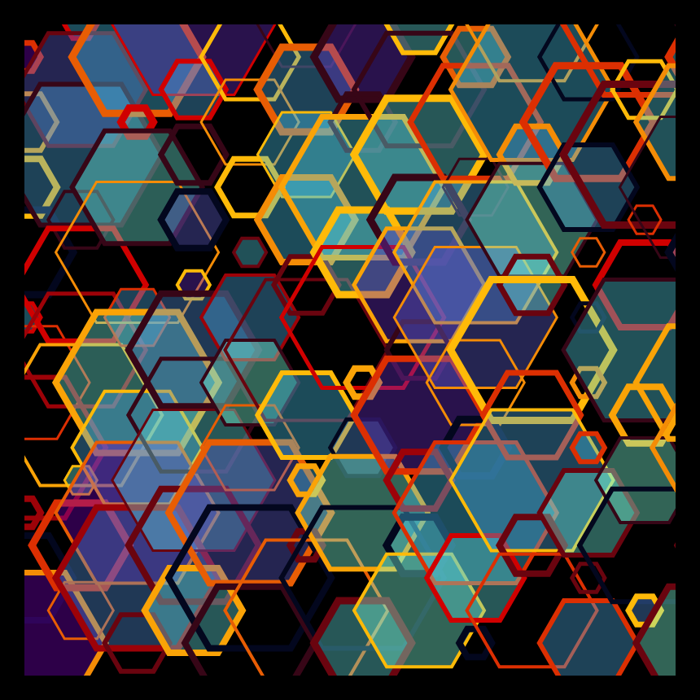

# DAILY SKETCH for 2021-12-22

## Done using P5.js

### Description

These `daily sketches` which are meant to be quick explorations     on whatever topic interested me on that day. This code is not typically optimized, but I share it as-is     for anyone interested.

 

## Progression of Images that were generated.

 

## 2021-12-22
Keywords: Hexagons, Hexagonal grid 

## Description 

 Placing cubes (hexagons) on an isometric grid. The transparent colors lead to interesting effects.
 

Made using P5.js. 

-----

