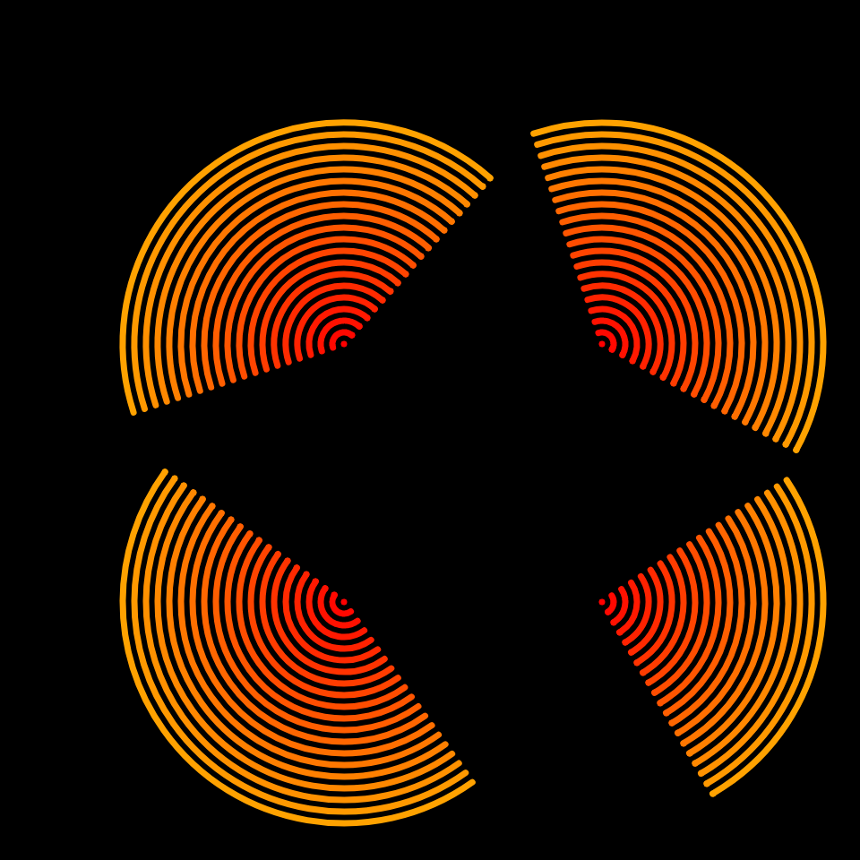
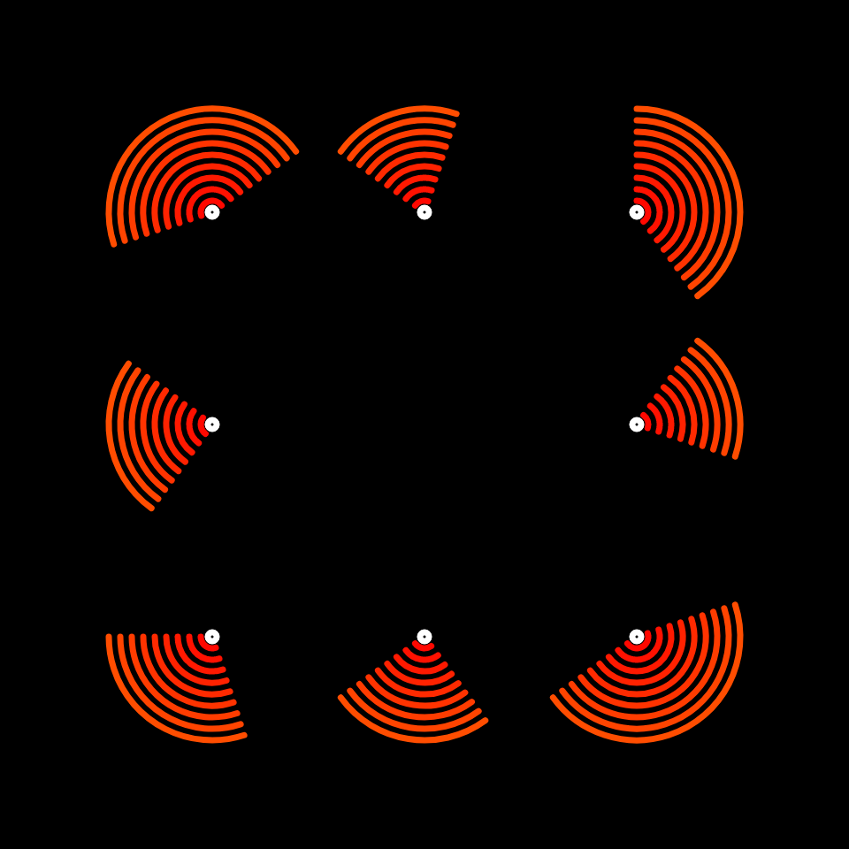
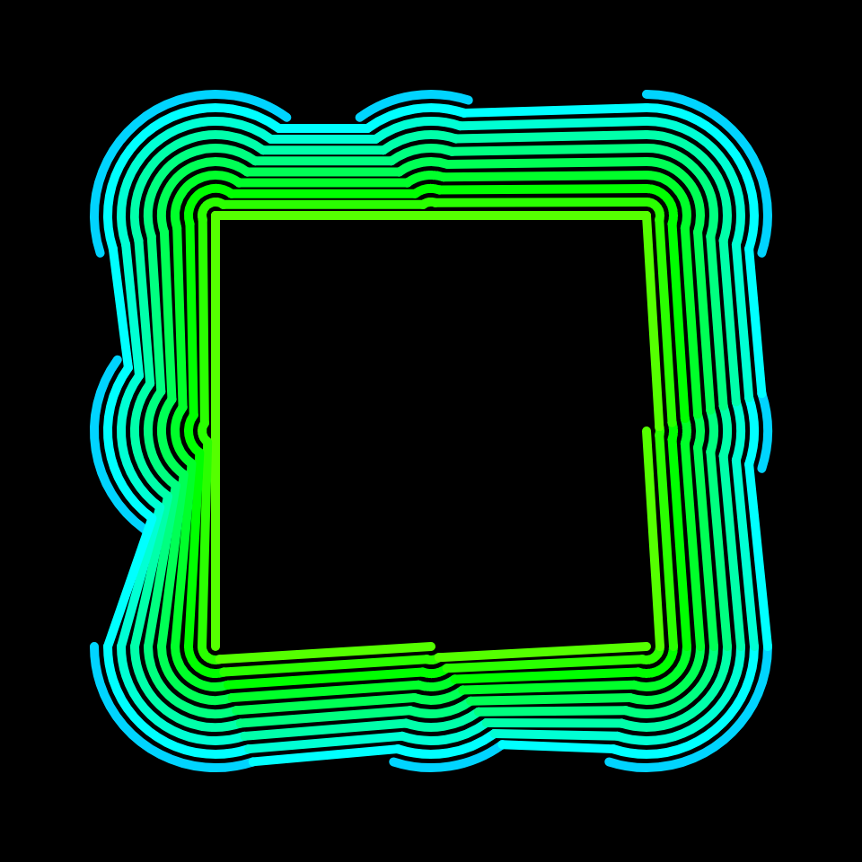

# DAILY SKETCH for 2021-12-26

## Done using P5.js

### Description

These `daily sketches` which are meant to be quick explorations     on whatever topic interested me on that day. This code is not typically optimized, but I share it as-is     for anyone interested.

   

## Progression of Images that were generated.

 
 
 

## 2021-12-26
Keywords: Echoes, single line
 

## Description 

 4 circles, concentric, interconnected. If you look closely, they are one line. Color variation
 

Made using P5.js. 

-----

