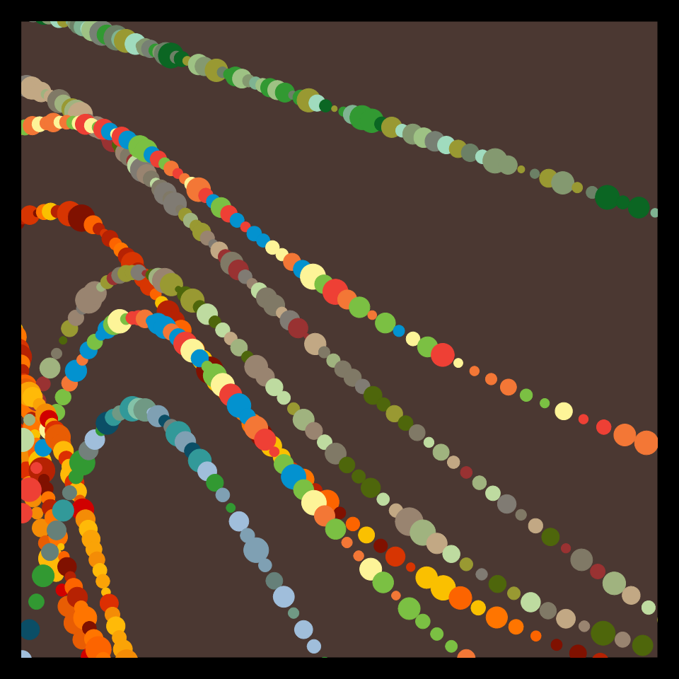

# DAILY SKETCH for 2021-12-28

## Done using P5.js

### Description

These `daily sketches` which are meant to be quick explorations     on whatever topic interested me on that day. This code is not typically optimized, but I share it as-is     for anyone interested.

 

## Progression of Images that were generated.

 

## 2021-12-28
Keywords: Bezier
 

## Description 

 Draw a Bezier curve. Draw circles along this curve.
 Radius of the circles varies, and they give the impression of a pearl necklace 

Made using P5.js. 

-----

