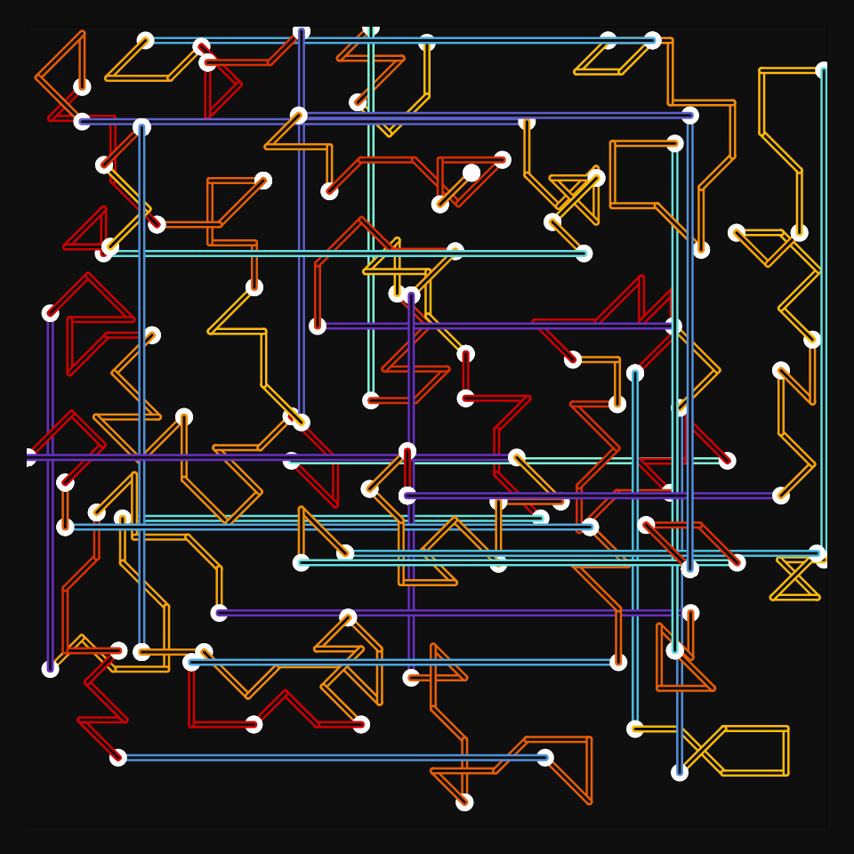

# DAILY SKETCH for 2021-12-30

## Done using P5.js

### Description

These `daily sketches` which are meant to be quick explorations     on whatever topic interested me on that day. This code is not typically optimized, but I share it as-is     for anyone interested.

 

## Progression of Images that were generated.

 

## 2021-12-30
Keywords: Single Line, 45-degree-angles-only
 

## Description 

 The idea is to imply a Metro transportation map.
 A cluster is a suburban location with multiple stops, and then a LongDistance jump.
 LongDistance jumps are only horizontal, and purple.
 

Made using P5.js. 

-----

