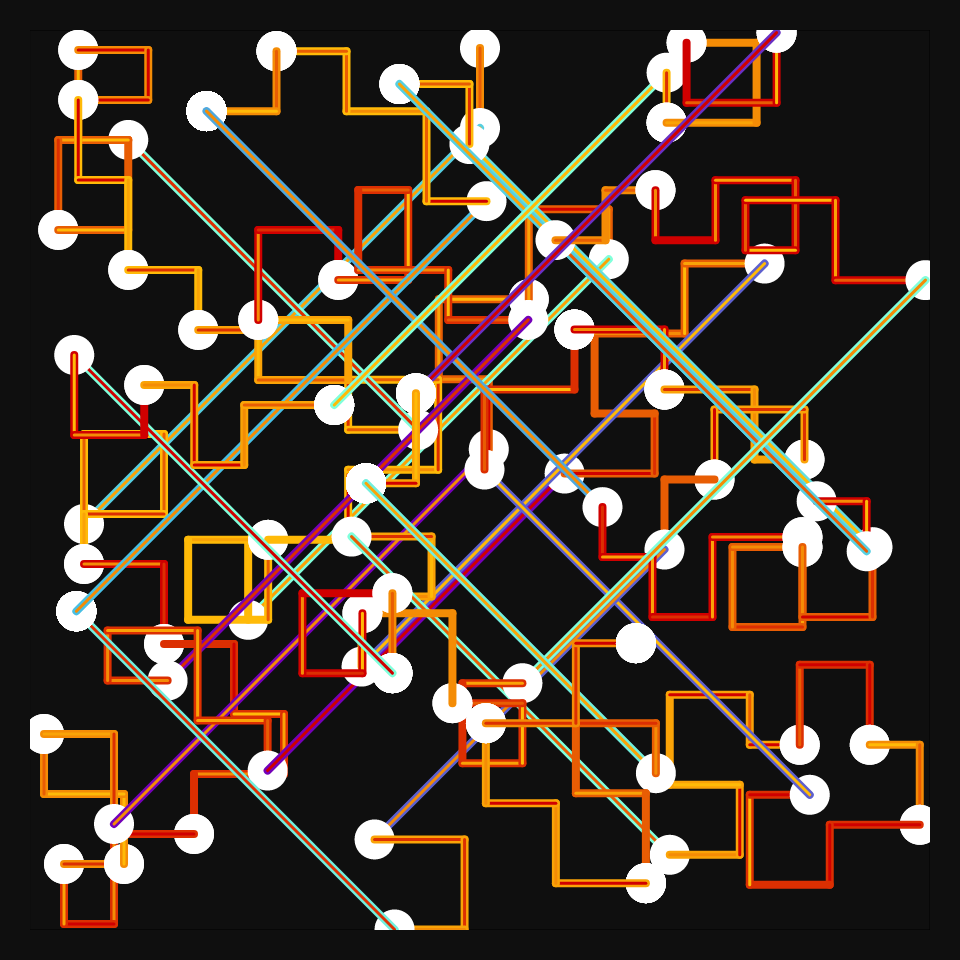
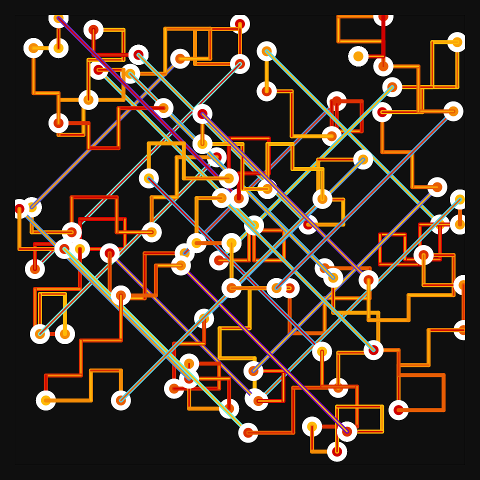
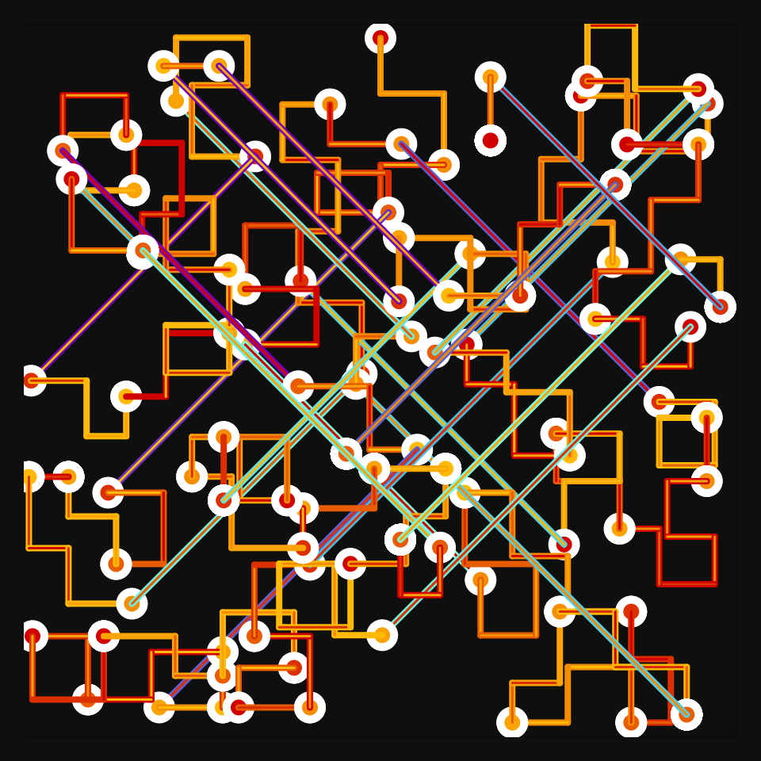

# DAILY SKETCH for 2021-12-31

## Done using P5.js

### Description

These `daily sketches` which are meant to be quick explorations     on whatever topic interested me on that day. This code is not typically optimized, but I share it as-is     for anyone interested.

   

## Progression of Images that were generated.

 
 
 

## 2021-12-31
Keywords: Single Line, 45-degree-angles-only
 

## Description 

 The idea is to imply a Metro transportation map.
 A cluster is "distribution" - small rectilinear jumps.
 followed by  a LongDistance jump.
 LongDistance jumps are only 45 degrees, and purple.
 

Made using P5.js. 

-----

