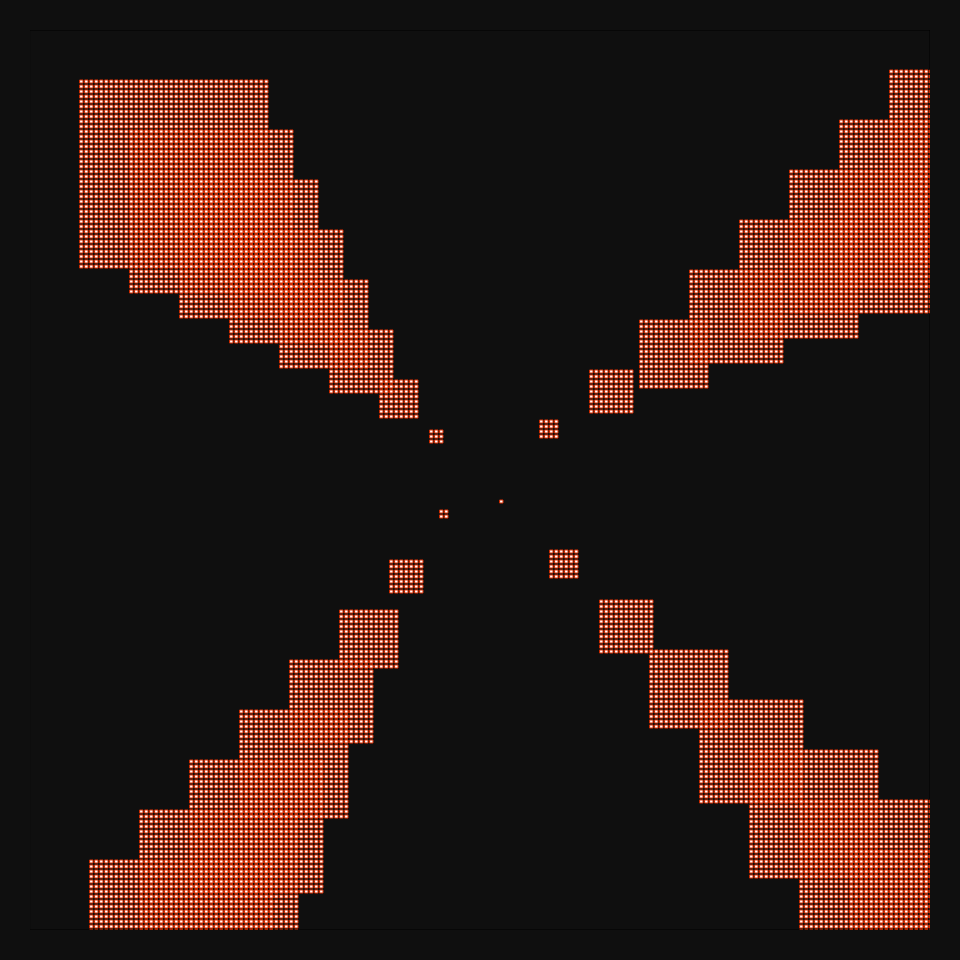
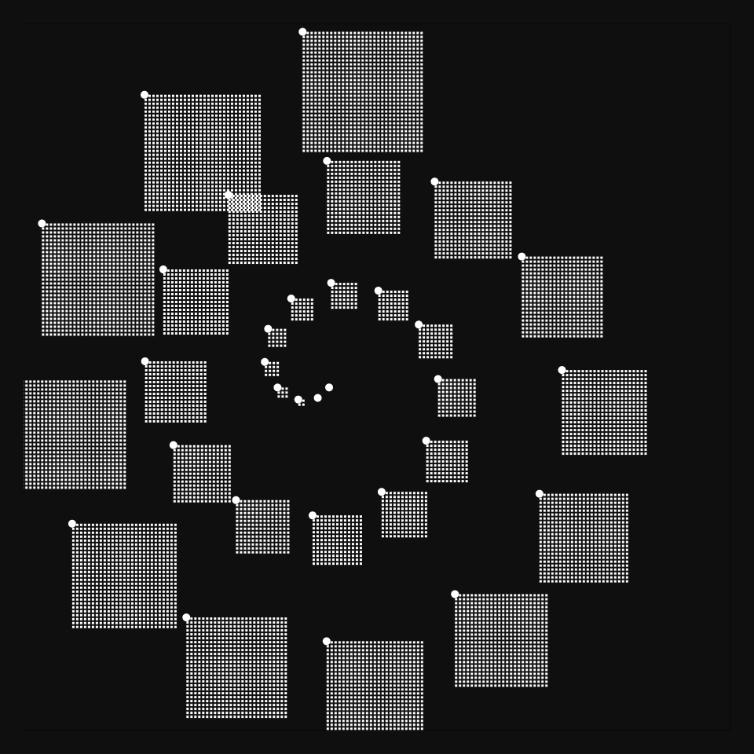
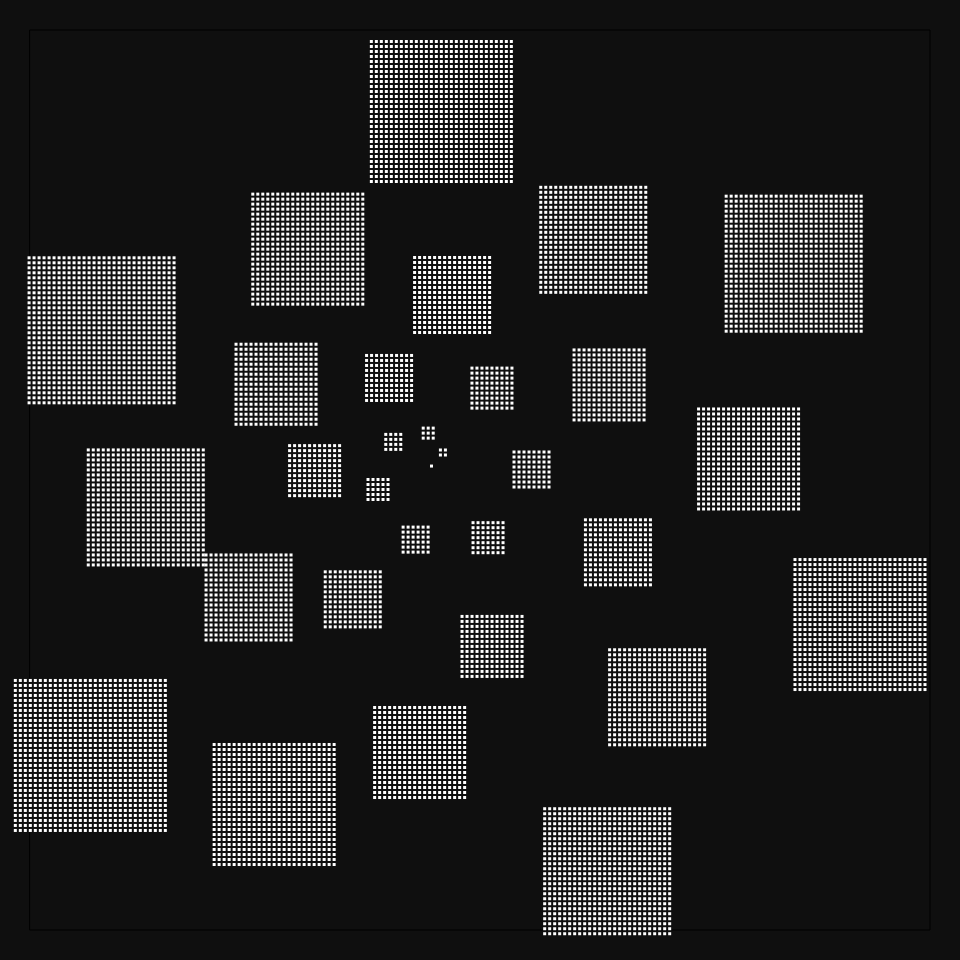
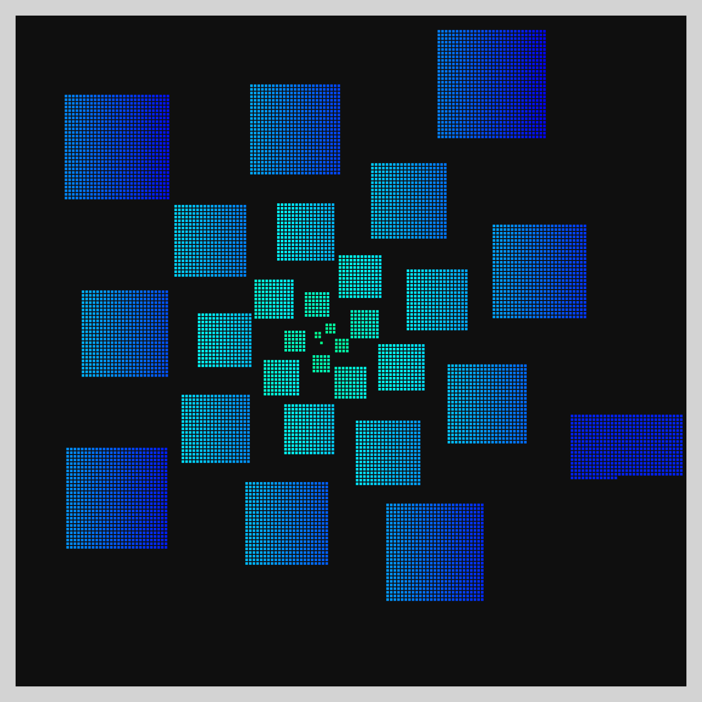
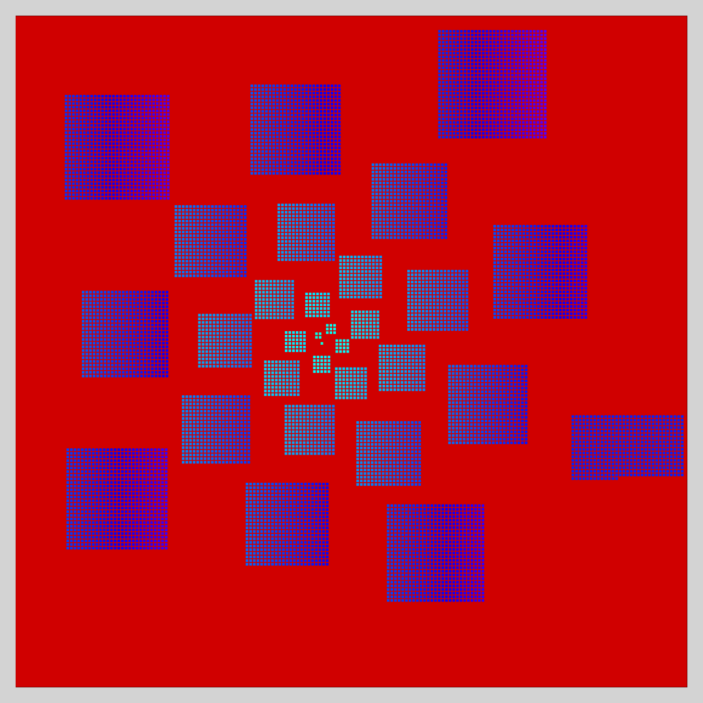

# DAILY SKETCH for 2022-01-01

## Done using P5.js

### Description

These `daily sketches` which are meant to be quick explorations     on whatever topic interested me on that day. This code is not typically optimized, but I share it as-is     for anyone interested.

      

## Progression of Images that were generated.

 
 
 
 
 
 

## 2022-01-01
Keywords: Genuary2022
 

## Description 

 On a spiral, draw n^2 squares for n going from 1 to 30. For n=31, only draw 545 remaining
 for a total of 10,000 tiny squares.
 

Made using P5.js. 

-----

