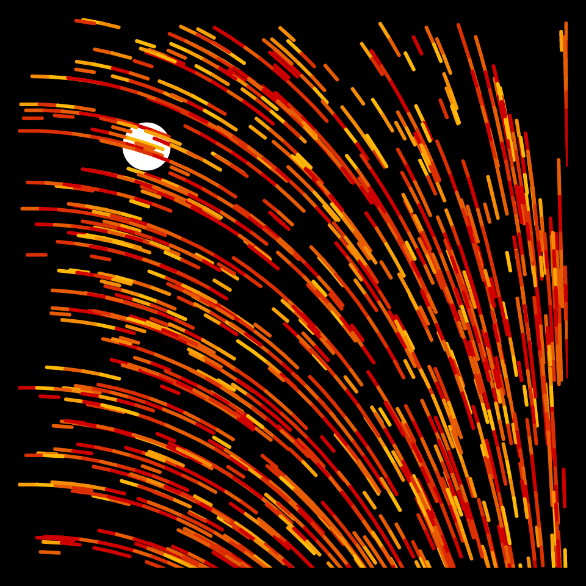
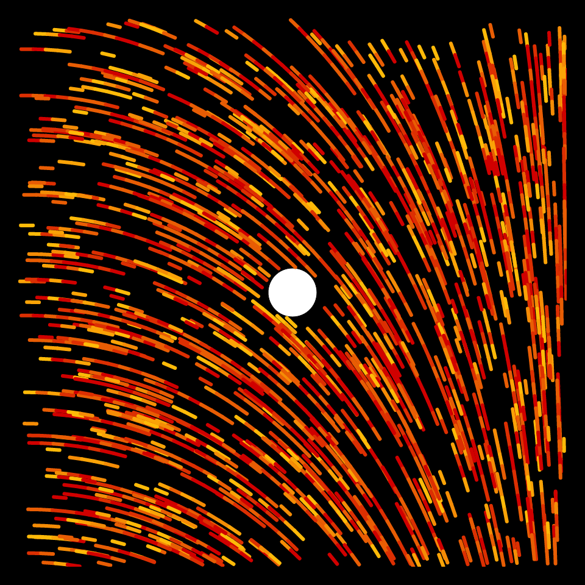
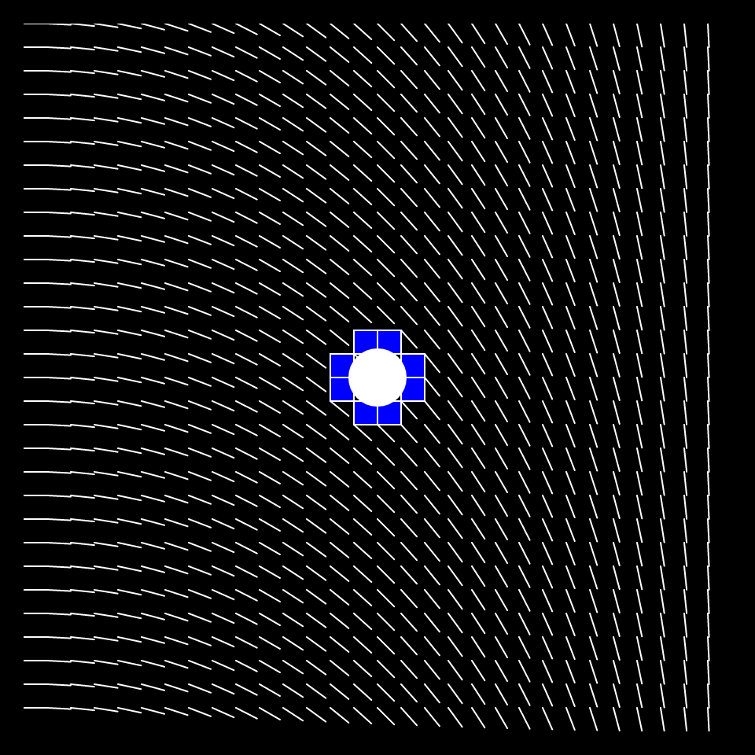
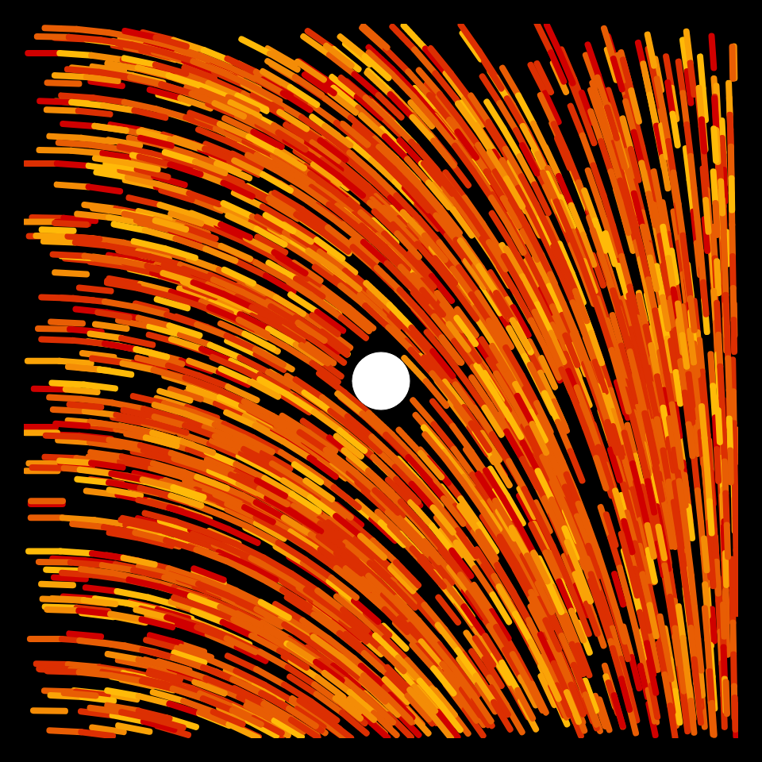
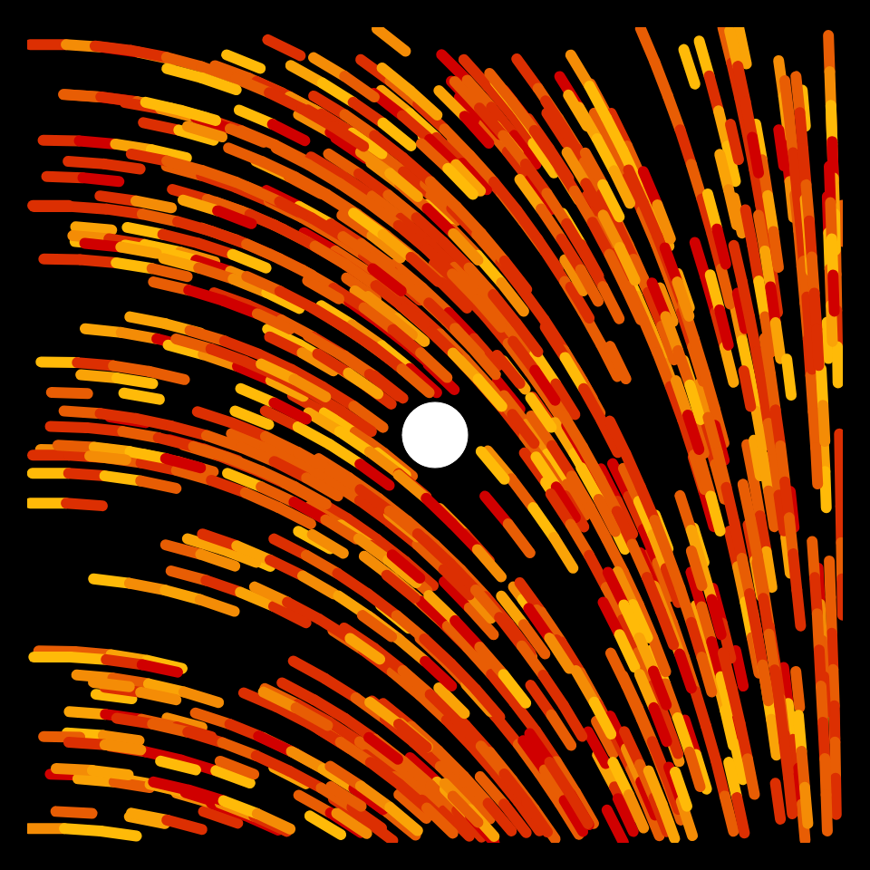
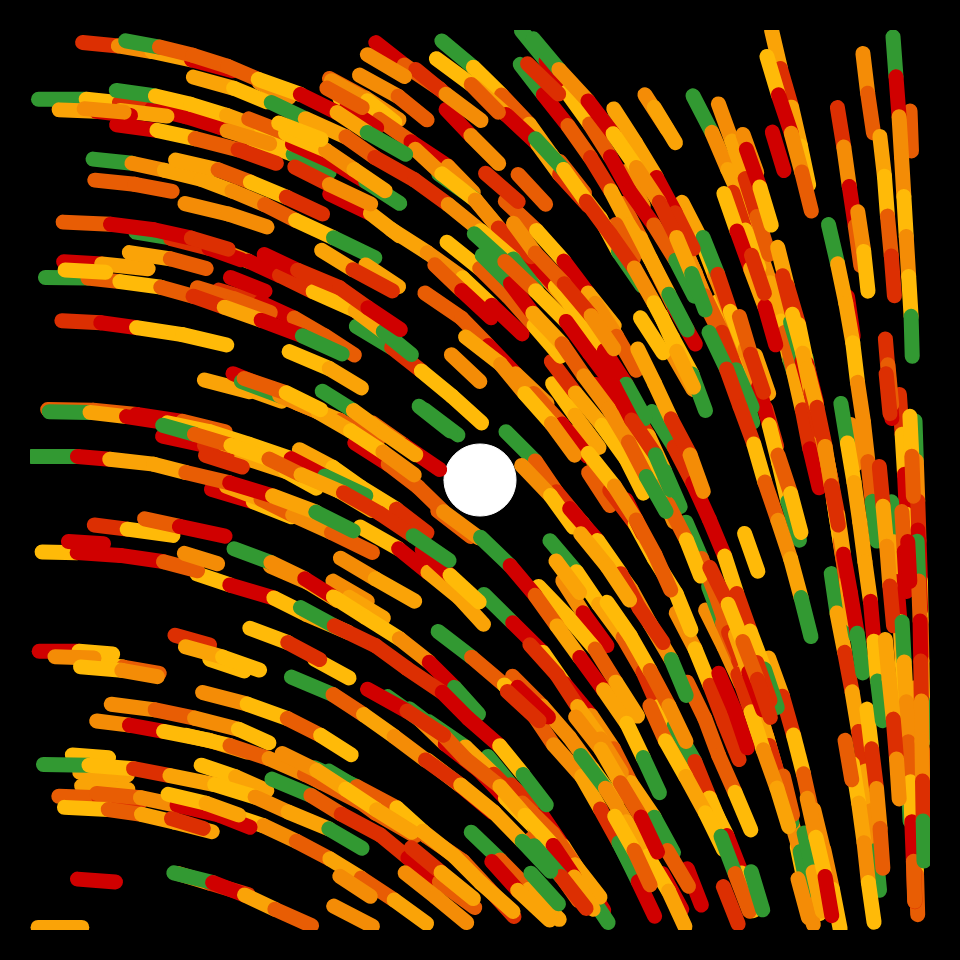
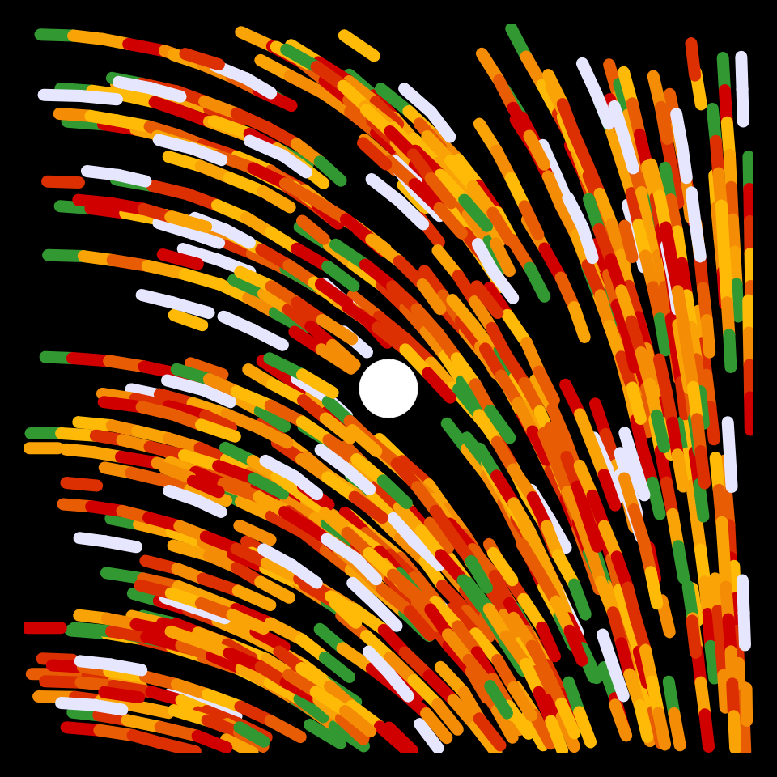
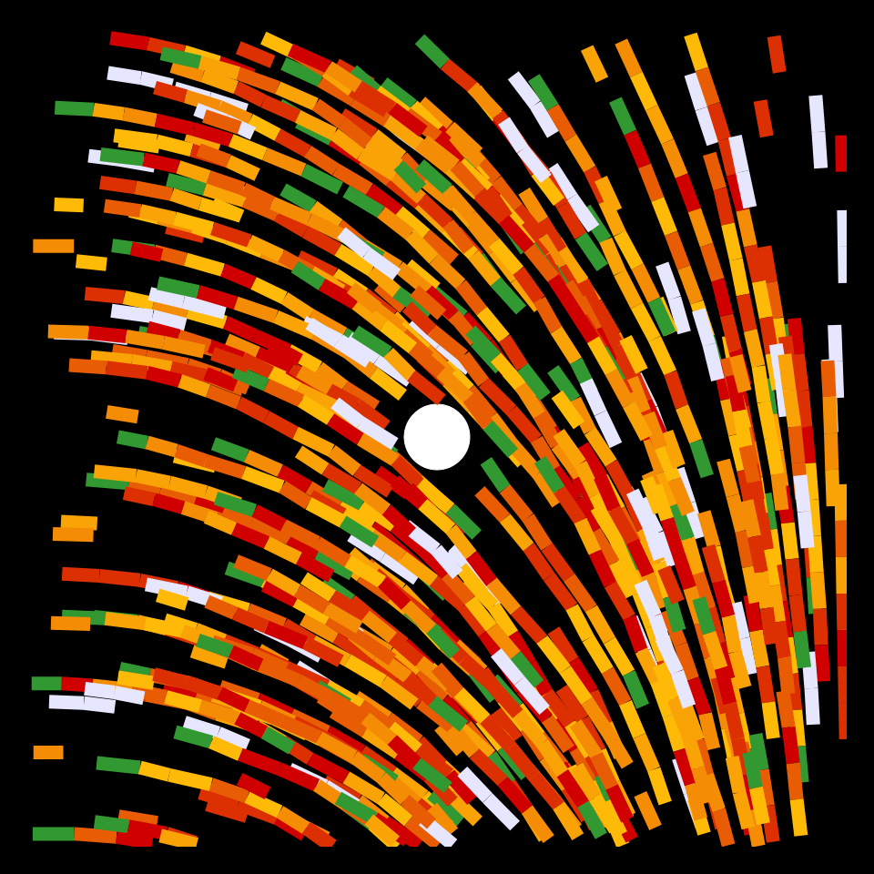
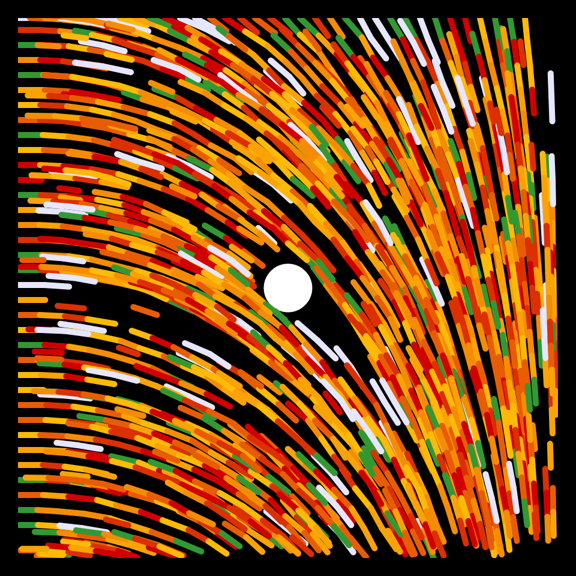
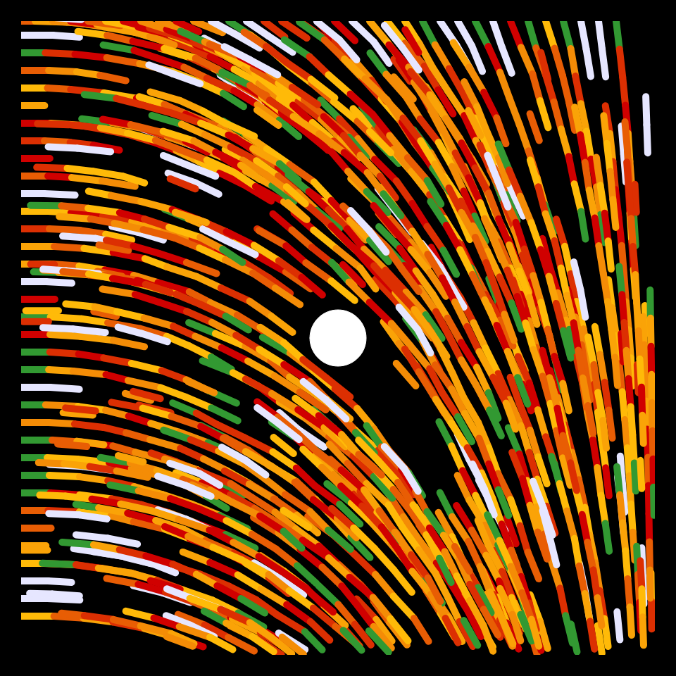

# DAILY SKETCH for 2022-01-04

## Done using P5.js

### Description

These `daily sketches` which are meant to be quick explorations     on whatever topic interested me on that day. This code is not typically optimized, but I share it as-is     for anyone interested.

           

## Progression of Images that were generated.

 
 
 
 
 
 
 
 
 
 
 

## 2022-01-04
Keywords: flow-field, genuary2022
 

## Description 

 Draw segments randomly, in a simple flow-field
 Variation is that one strand is made up of segments, and each subsequent
 segment starts where the previous one ends. Longer segments are of one of two colors.
 I made the flow go around a circle in the middle.
 

Made using P5.js. 

-----

