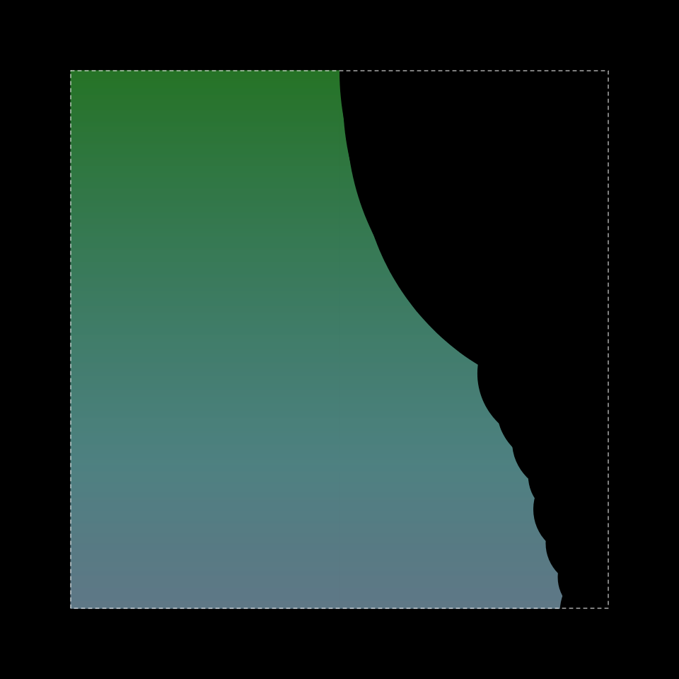
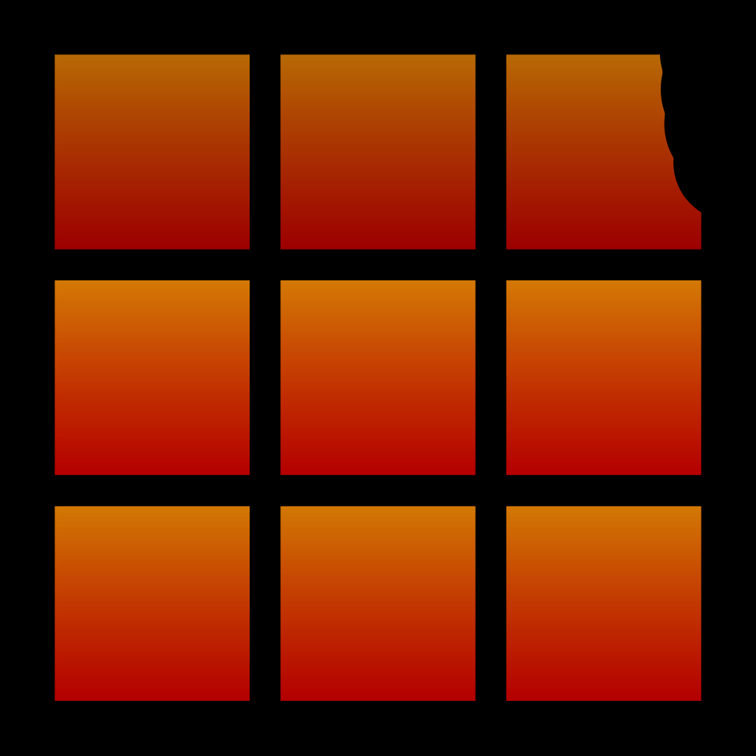
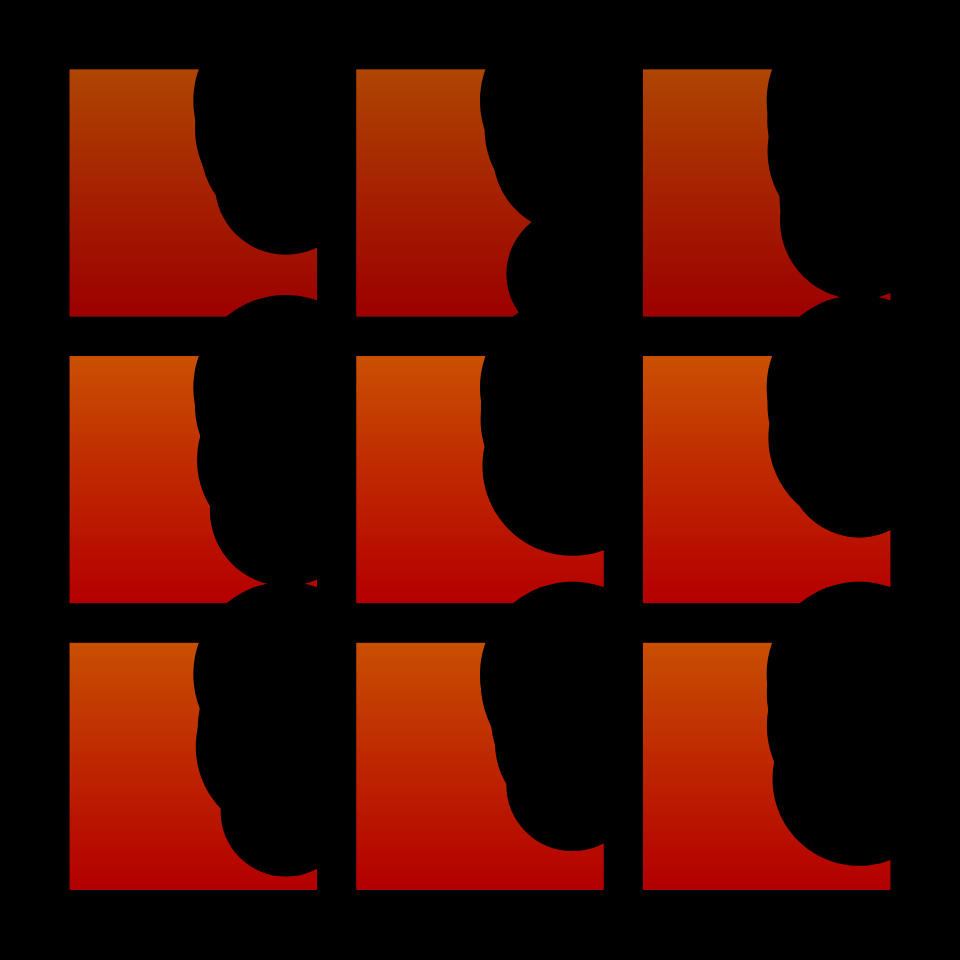
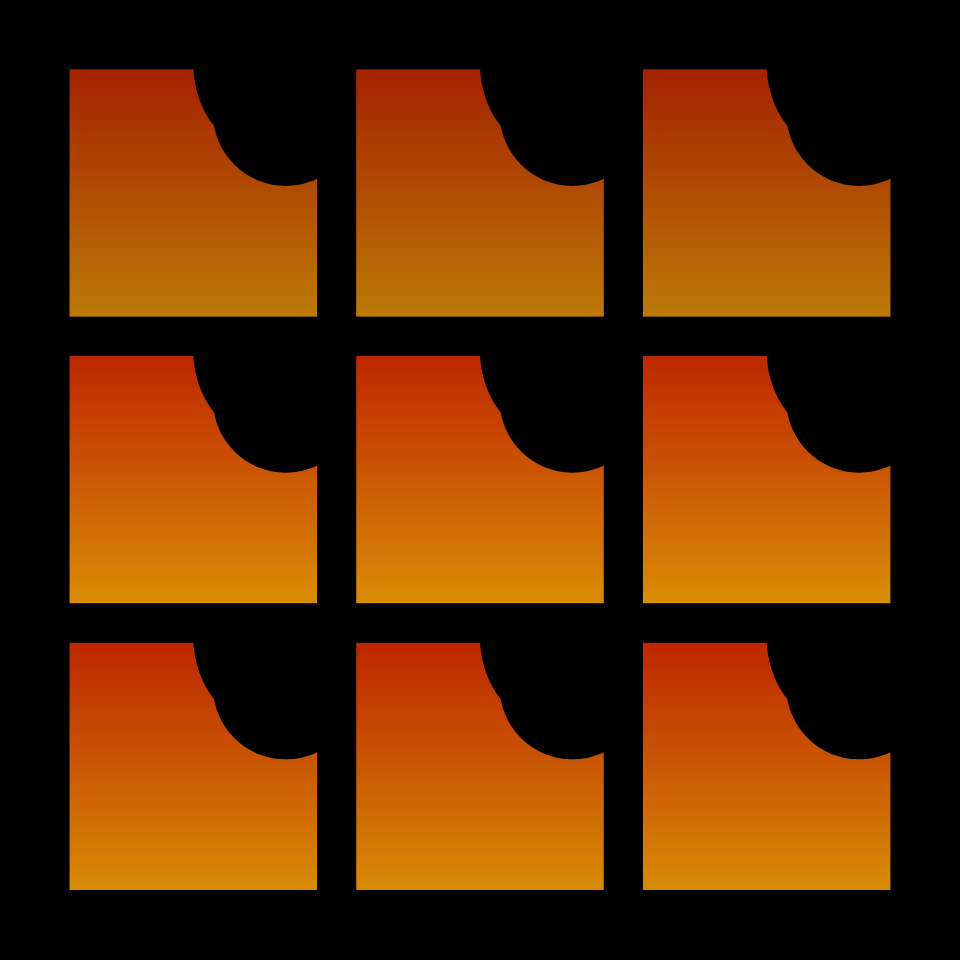
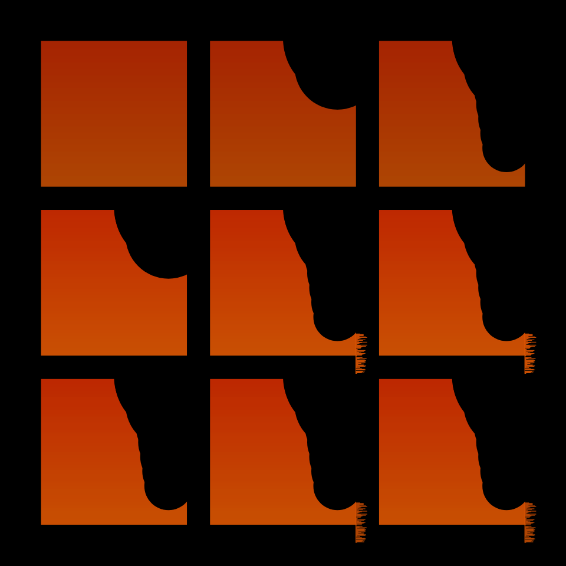
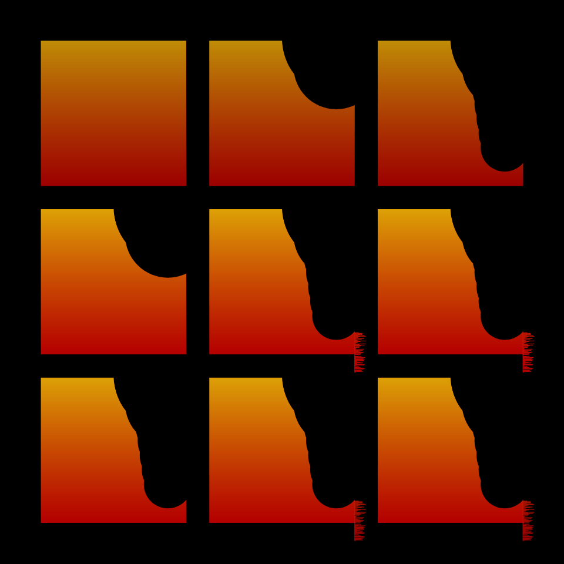
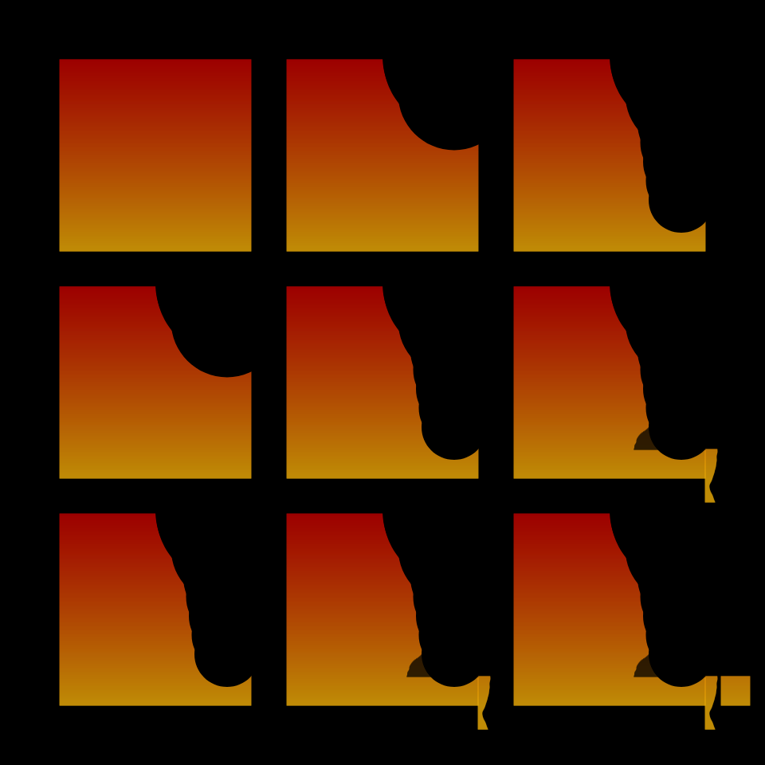

# DAILY SKETCH for 2022-01-05

## Done using P5.js

### Description

These `daily sketches` which are meant to be quick explorations     on whatever topic interested me on that day. This code is not typically optimized, but I share it as-is     for anyone interested.

          

## Progression of Images that were generated.

 
 
 
 
 
 
 
 
 
 

## 2022-01-05
Keywords: square, genuary2022
 

## Description 

 In a panel of squares with color gradient, progressively eat them up.
 But a square cannot really be destroyed. Like a Phoenix, it will rise up again! 

Made using P5.js. 

-----

