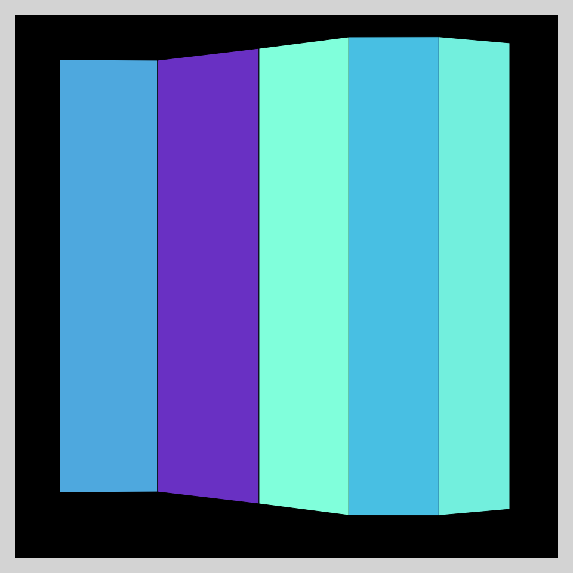
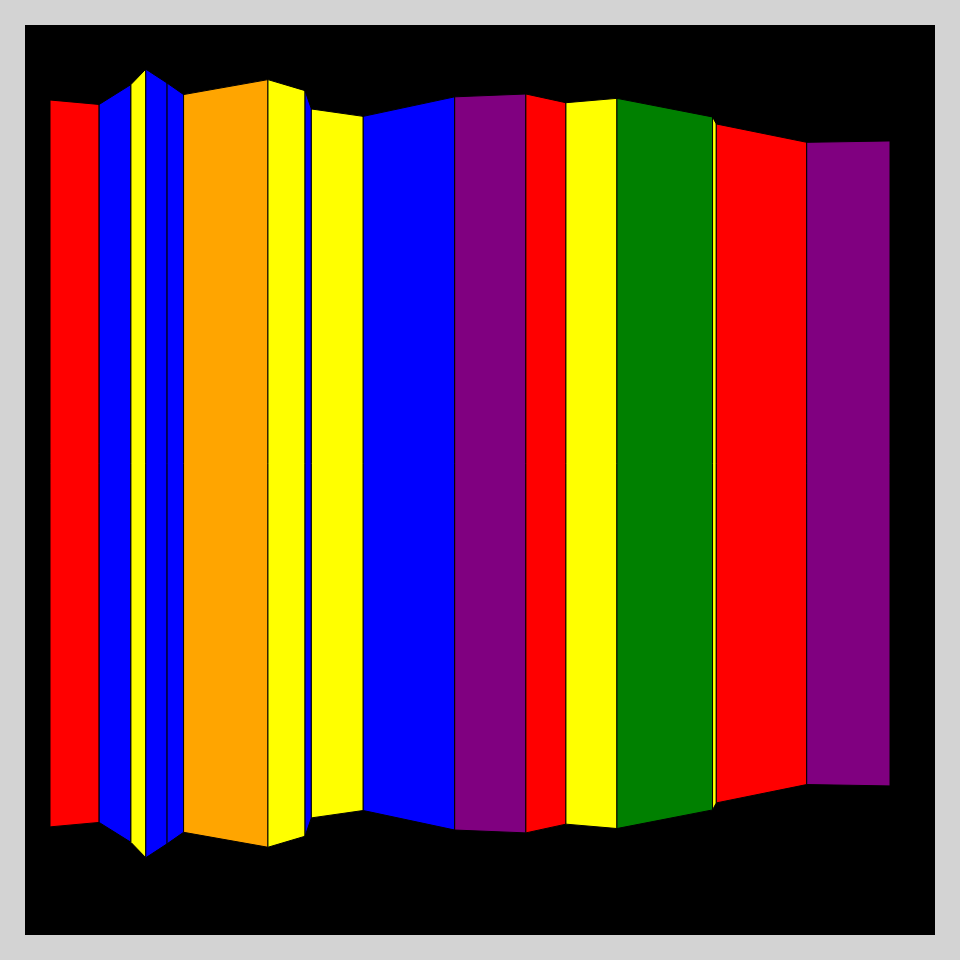
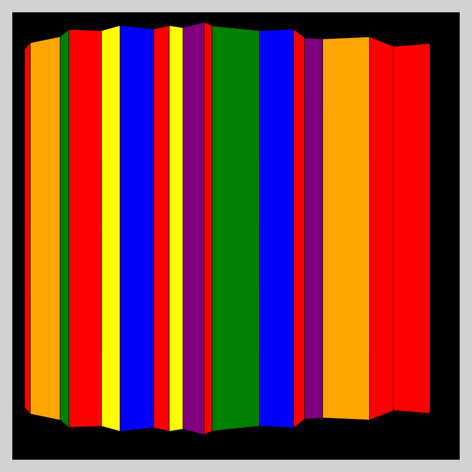
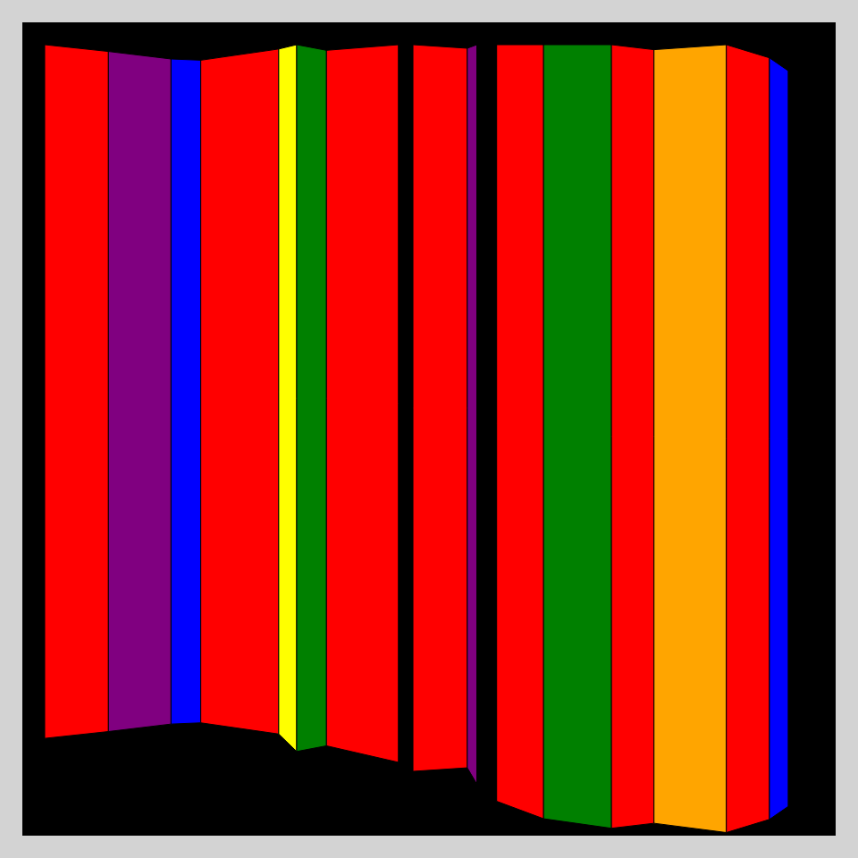

# DAILY SKETCH for 2022-01-07

## Done using P5.js

### Description

These `daily sketches` which are meant to be quick explorations     on whatever topic interested me on that day. This code is not typically optimized, but I share it as-is     for anyone interested.

     

## Progression of Images that were generated.

 
 
 
 
 

## 2022-01-07
Keywords: Sol LeWitt, genuary2022, Wall Drawing
 

## Description 

 This is a generative version of Sol LeWitt's Wall Drawing 1081
 and the trapezoid, two of the original six that LeWitt used. 
 The colors are only the three primary colors; red, blue and yellow, and the three secondary colors; green, purple and orange. 

Made using P5.js. 

-----

