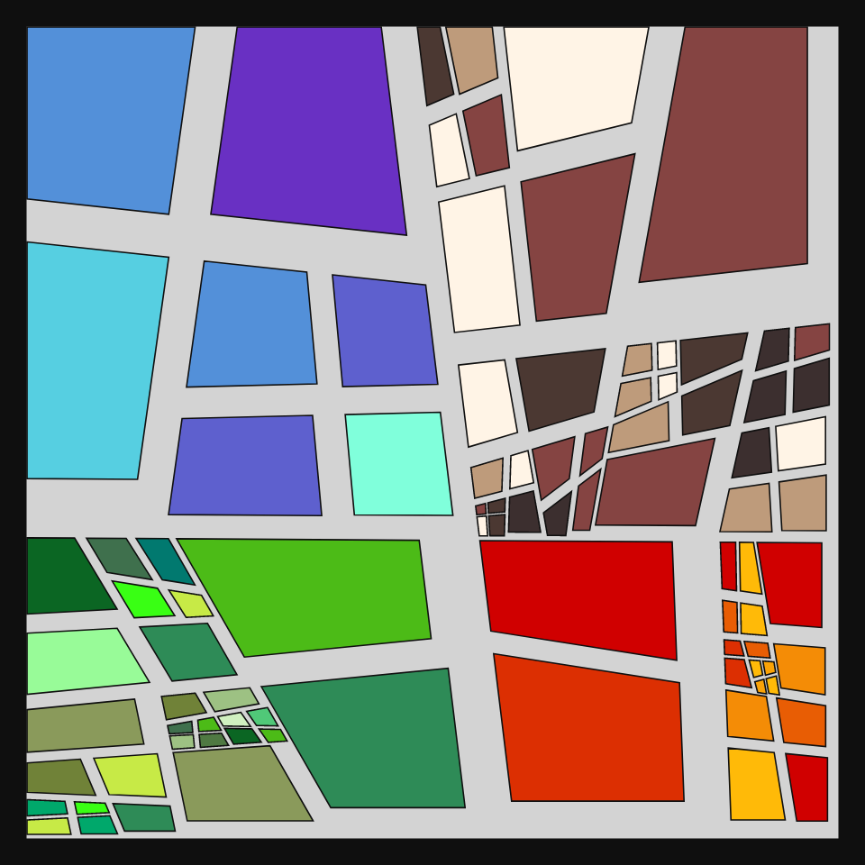
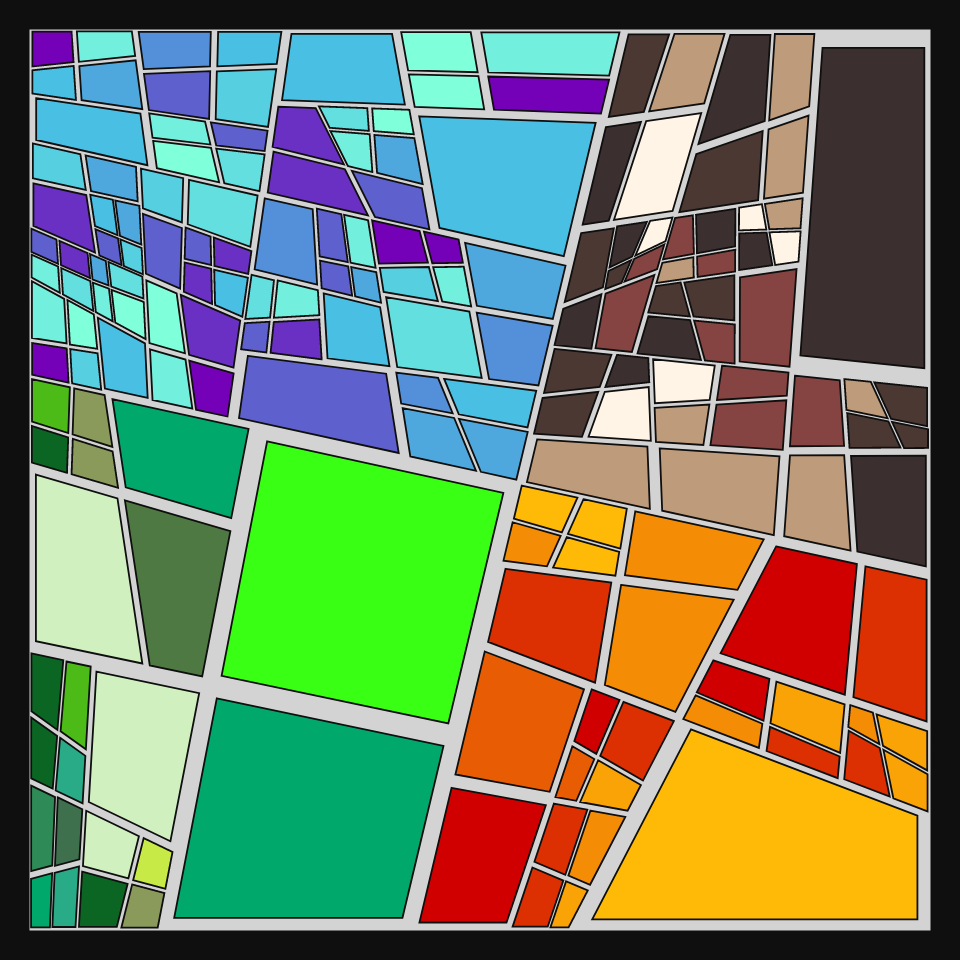

# DAILY SKETCH for 2022-01-12

## Done using P5.js

### Description

These `daily sketches` which are meant to be quick explorations     on whatever topic interested me on that day. This code is not typically optimized, but I share it as-is     for anyone interested.

   

## Progression of Images that were generated.

 
 
 

## 2022-01-12
Keywords: Fractal, subdivision, shapes, Genuary2022
 

## Description 

 Fractal subdivision with random splits on 4 sides. Calculate midpoint and then connect.
 Zonal Colors and traingle-divisions added.
 

Made using P5.js. 

-----

