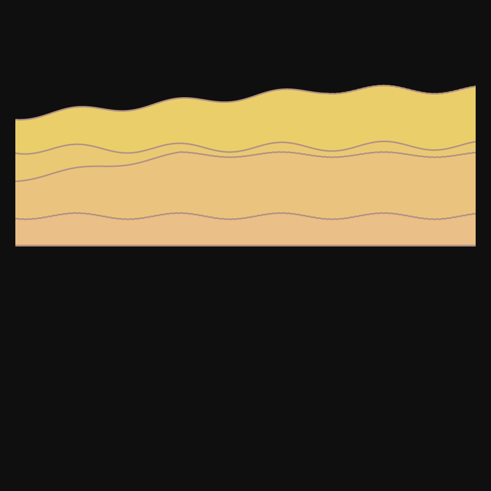
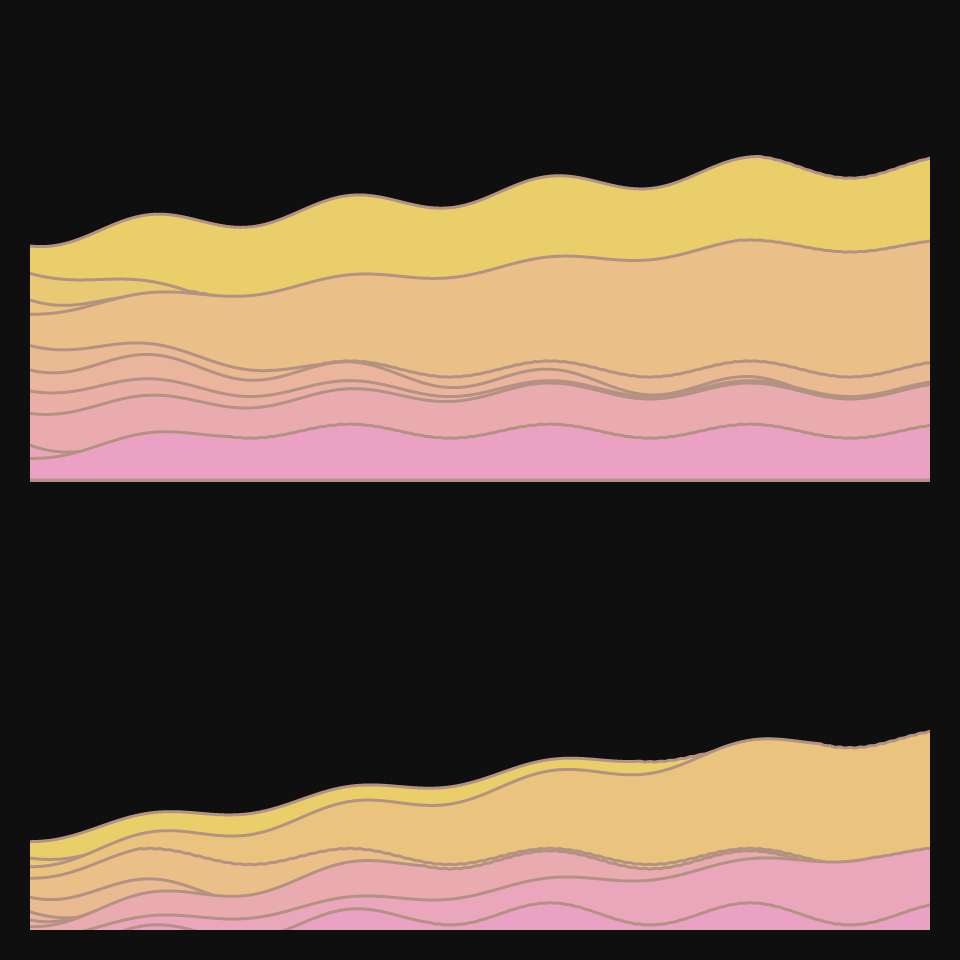
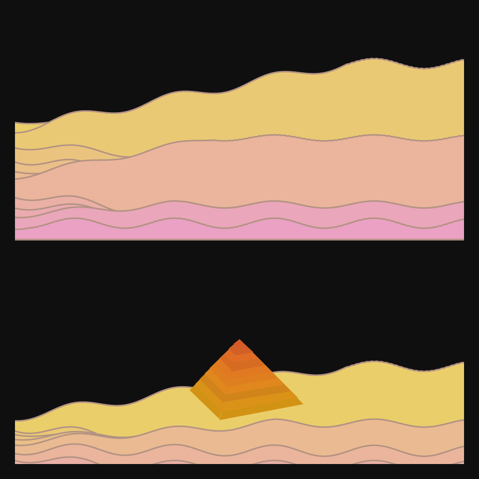
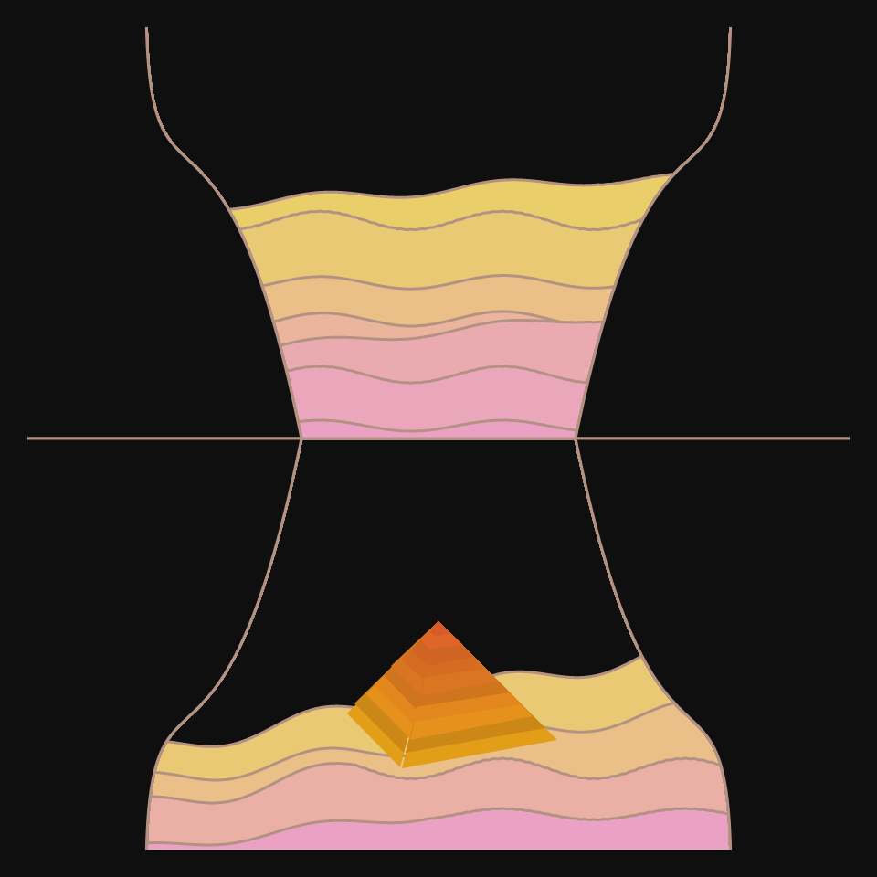
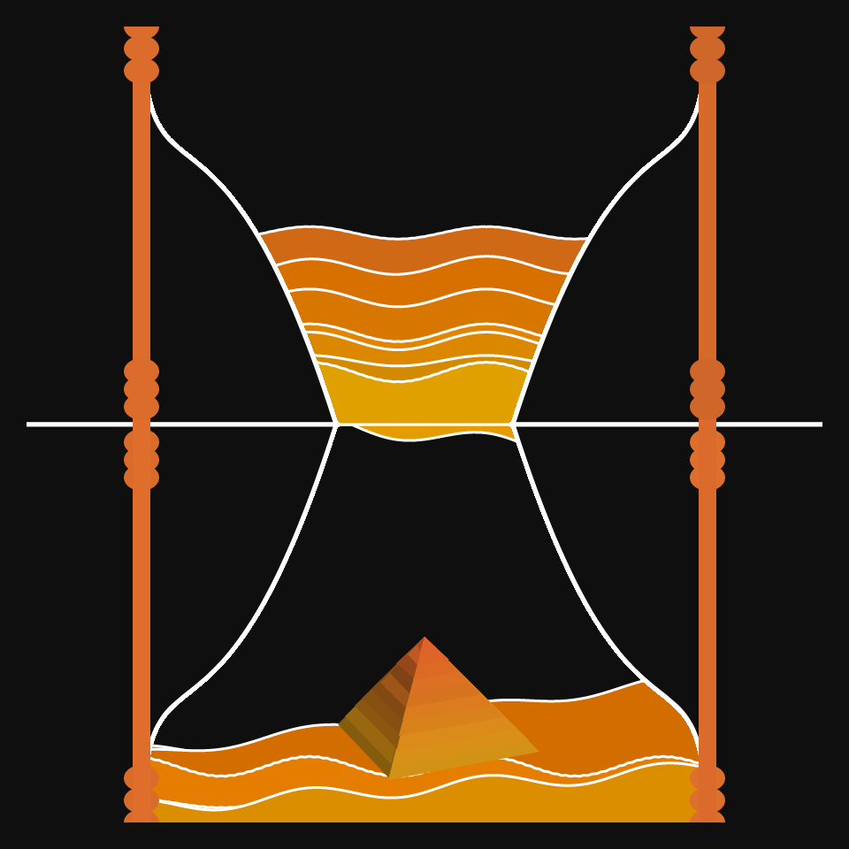
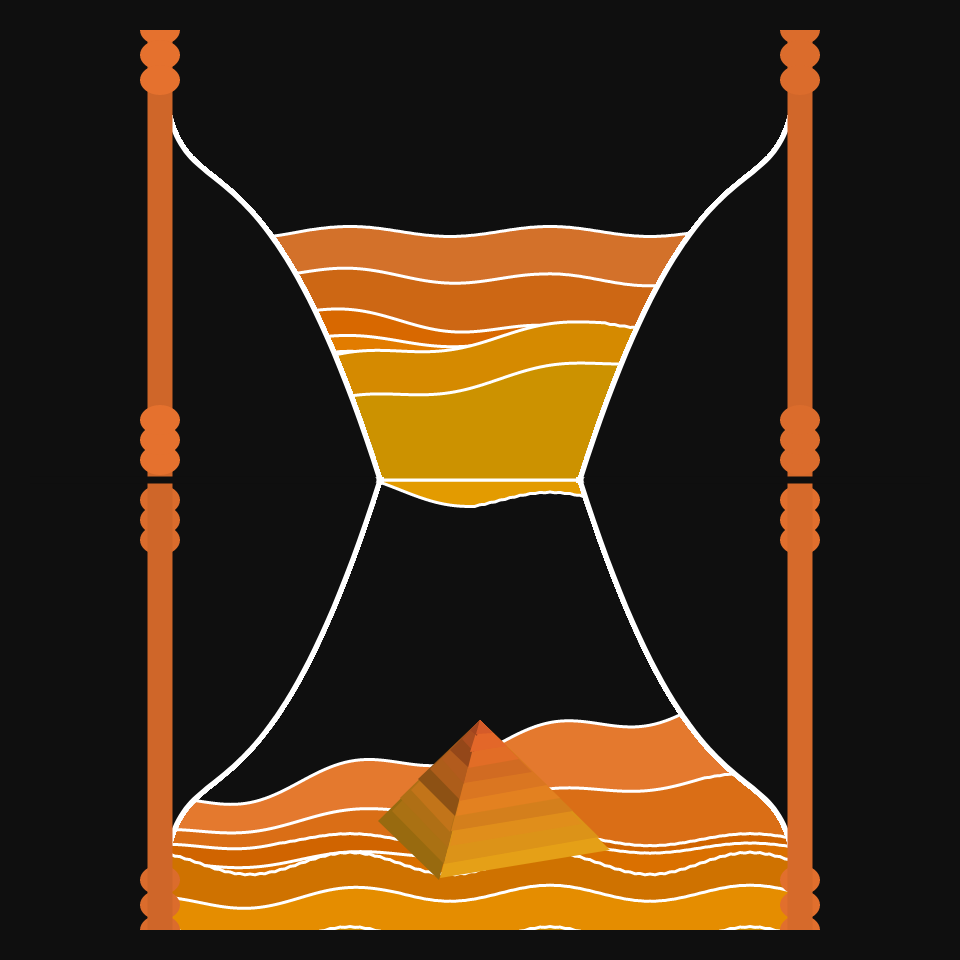
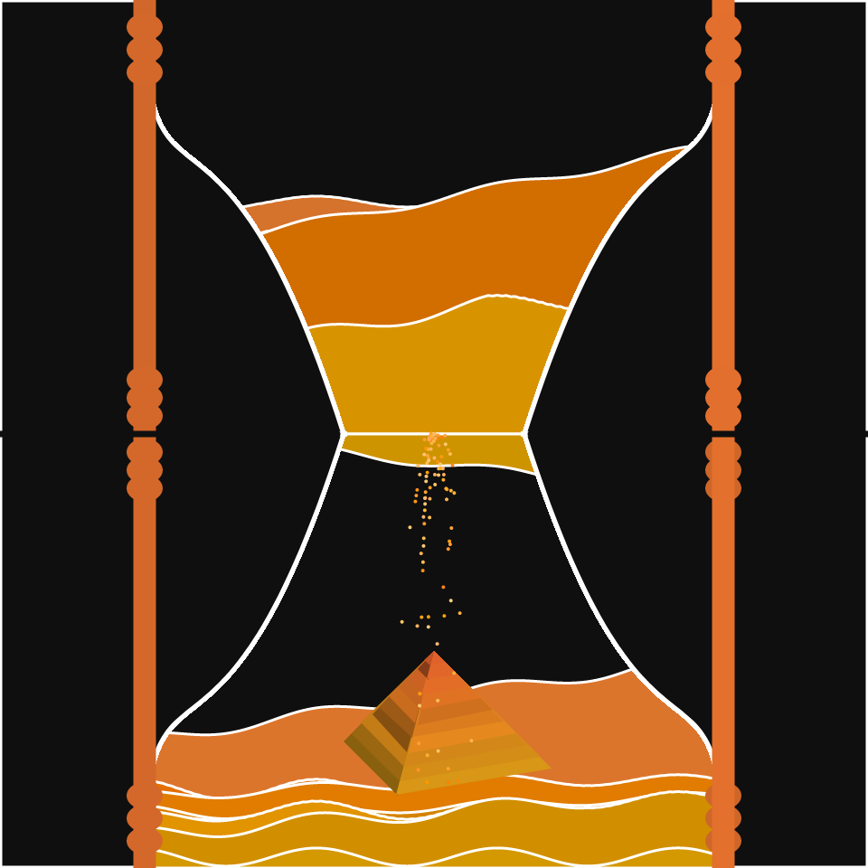

# DAILY SKETCH for 2022-01-15

## Done using P5.js

### Description

These `daily sketches` which are meant to be quick explorations     on whatever topic interested me on that day. This code is not typically optimized, but I share it as-is     for anyone interested.

         

## Progression of Images that were generated.

 
 
 
 
 
 
 
 
 

## 2022-01-15
Keywords: Genuary2022, shapes
 

## Description 

 Genuary2022 Sand.
 The idea was to imply sand (time) running out in Sand clock.
 

Made using P5.js. 

-----

