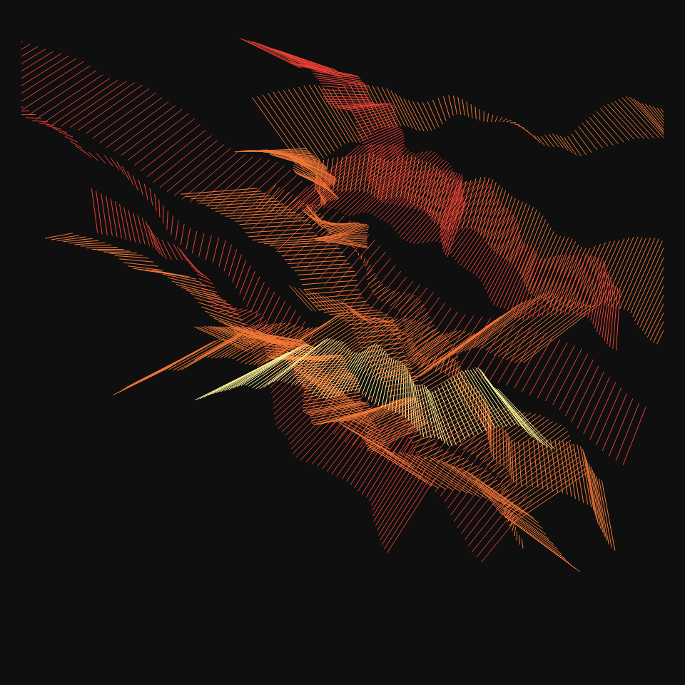
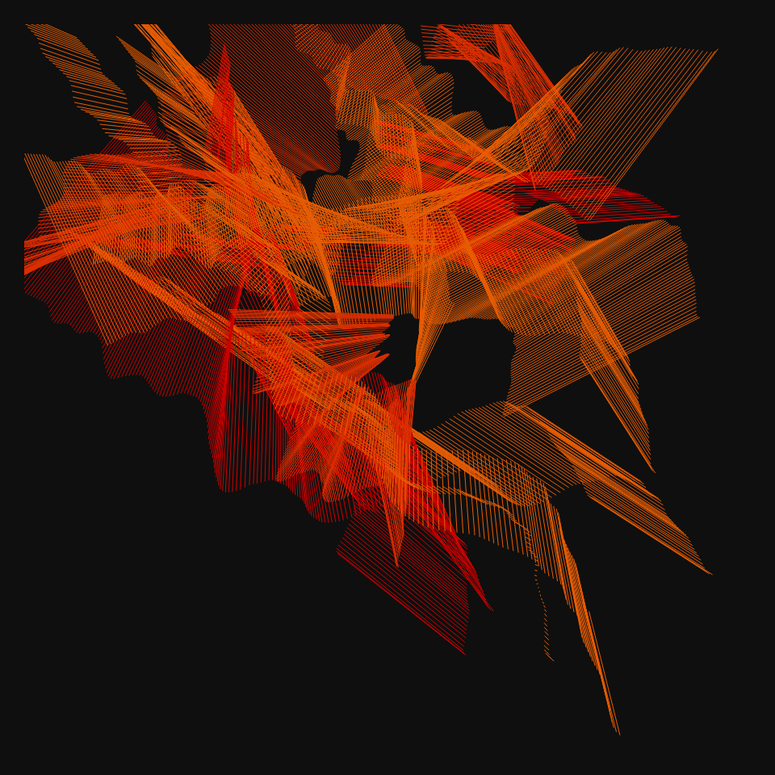
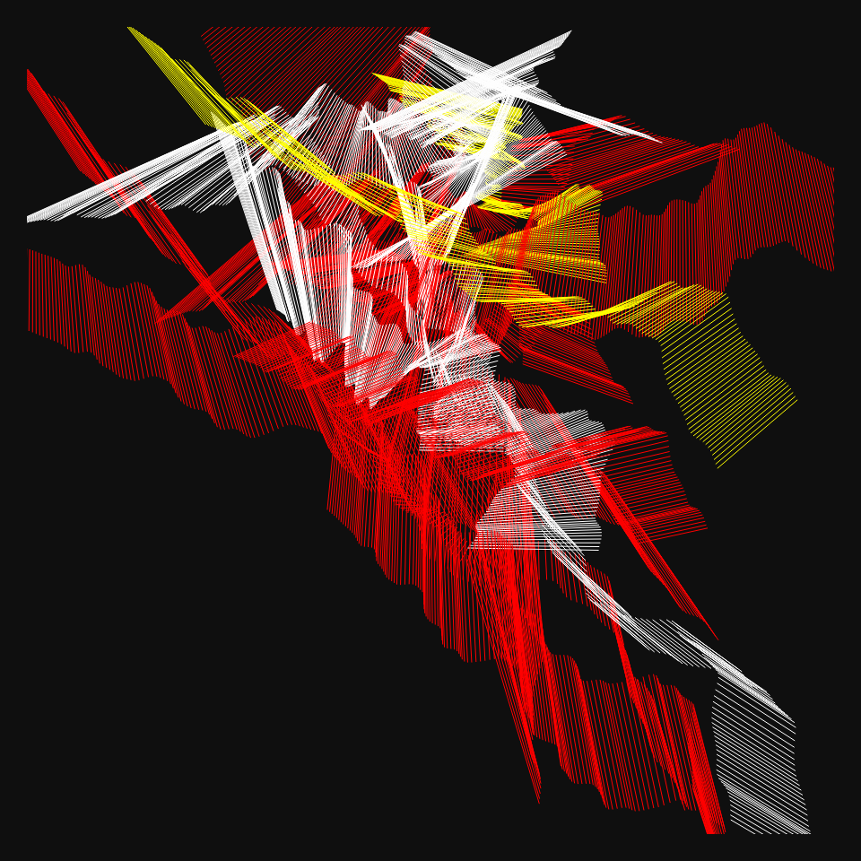
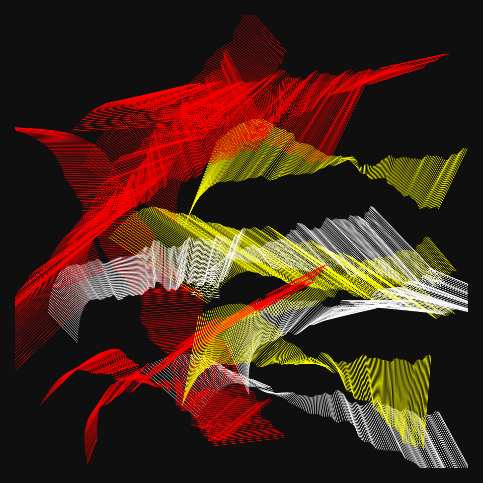
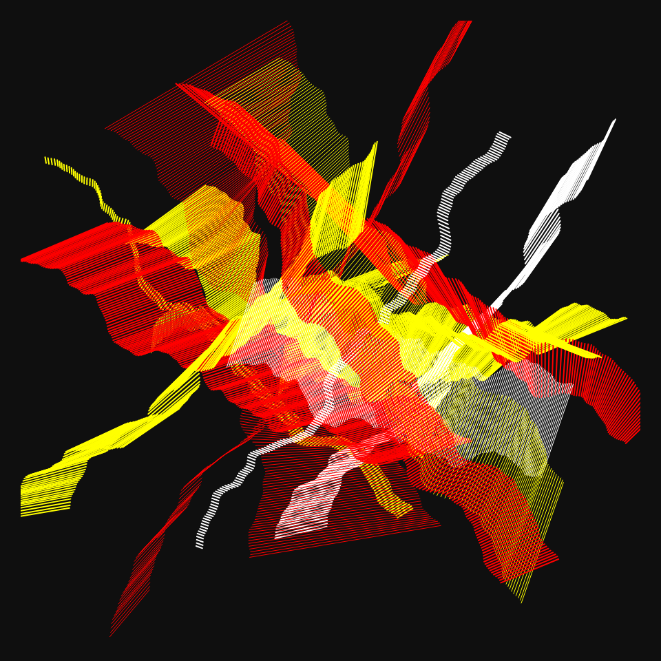
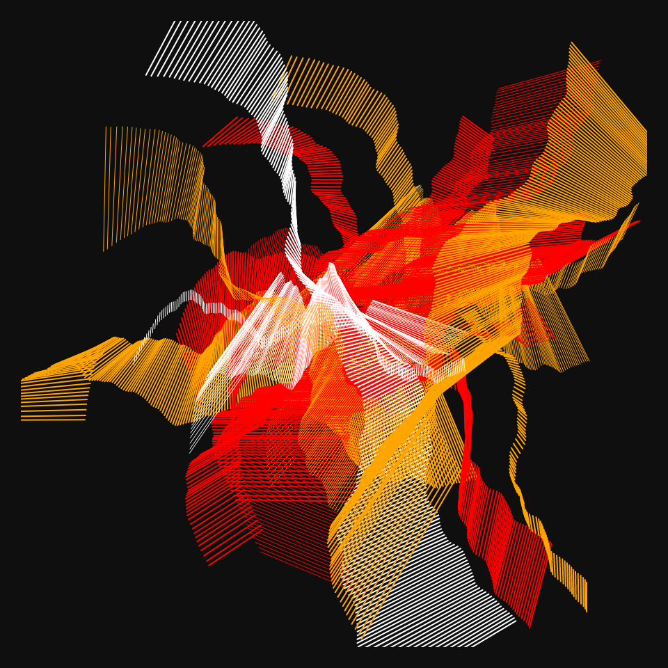
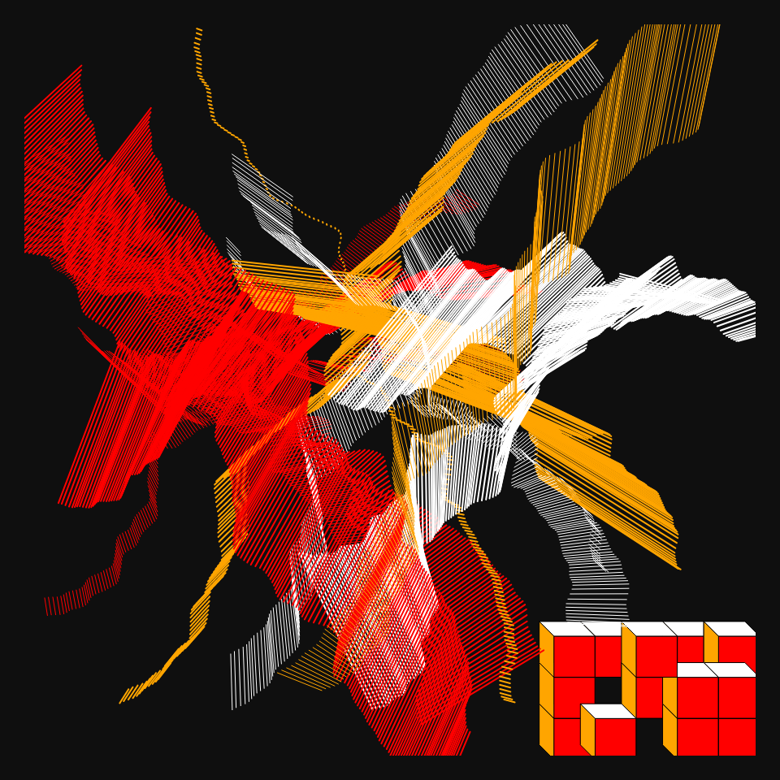
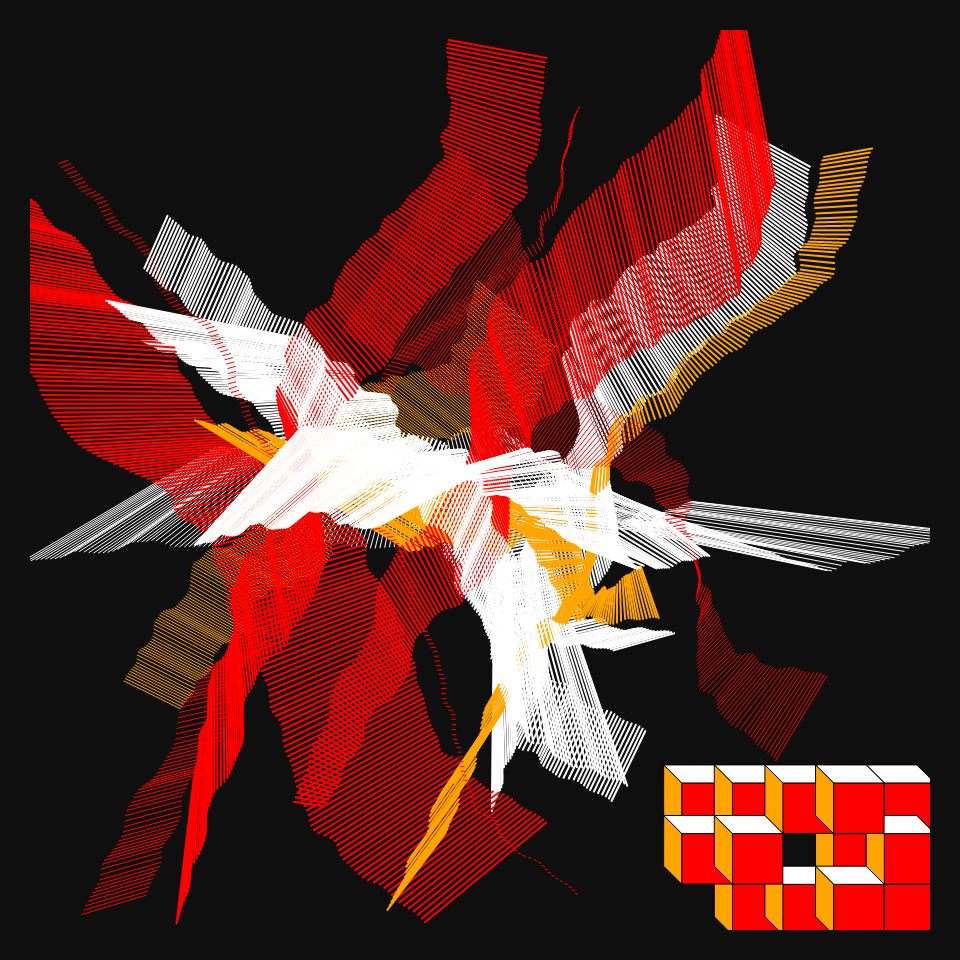

# DAILY SKETCH for 2022-01-17

## Done using P5.js

### Description

These `daily sketches` which are meant to be quick explorations     on whatever topic interested me on that day. This code is not typically optimized, but I share it as-is     for anyone interested.

         

## Progression of Images that were generated.

 
 
 
 
 
 
 
 
 

## 2022-01-17
Keywords: Genuary2022, colors
 

## Description 

 Three Colors...
 Idea is to draw two random curved lines. Connect them using a 100 ribs, each of one color.
 Use three colors for these...
 

Made using P5.js. 

-----

