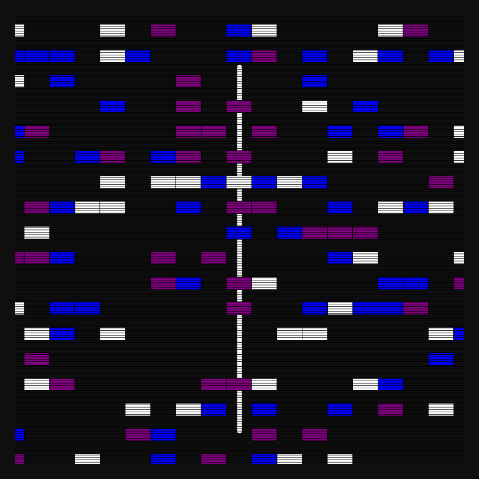
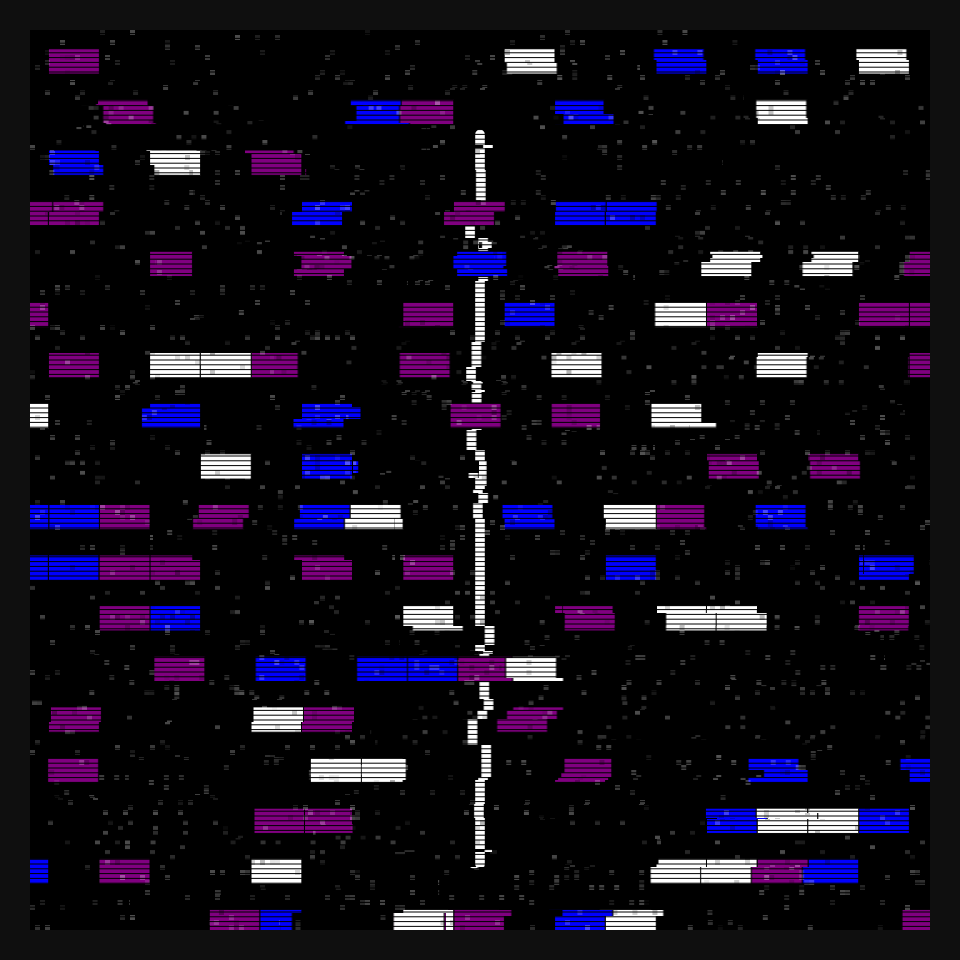
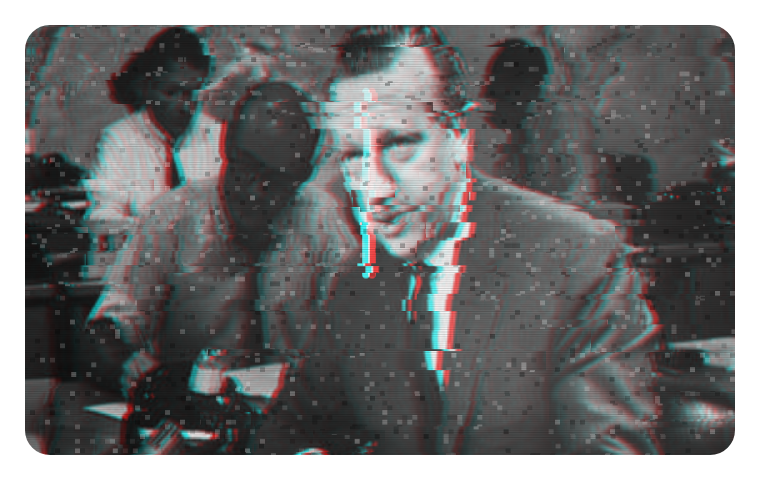

# DAILY SKETCH for 2022-01-18

## Done using P5.js

### Description

These `daily sketches` which are meant to be quick explorations     on whatever topic interested me on that day. This code is not typically optimized, but I share it as-is     for anyone interested.

                                                                              

## Progression of Images that were generated.

 
 
 
 
 
 
 
 
 
 
 
 
 
 
 
 
 
 
 
 
 
 
 
 
 
 
 
 
 
 
 
 
 
 
 
 
 
 
 
 
 
 
 
 
 
 
 
 
 
 
 
 
 
 
 
 
 
 
 
 
 
 
 
 
 
 
 
 
 
 
 
 
 
 
 
 
 
 

## 2022-01-18
Keywords: Genuary2022, image
 

## Description 

 VHS
 Idea is to show a base image and then add glitches to it.
 Horizontal smear, and color glitches.
 

Made using P5.js. 

-----

