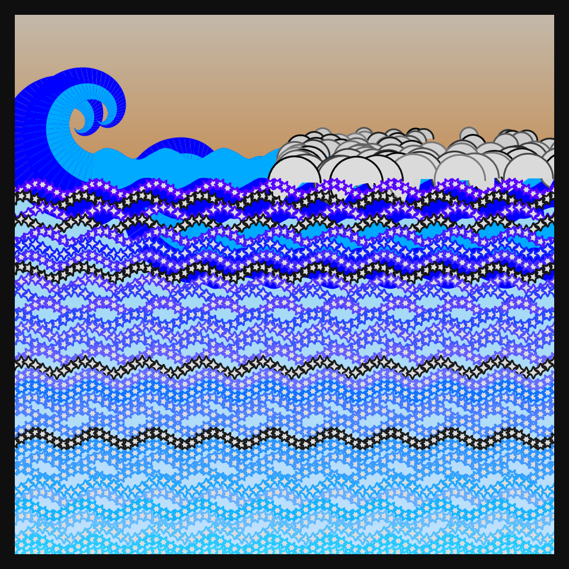

# DAILY SKETCH for 2022-01-20

## Done using P5.js

### Description

These `daily sketches` which are meant to be quick explorations     on whatever topic interested me on that day. This code is not typically optimized, but I share it as-is     for anyone interested.

   

## Progression of Images that were generated.

 
 
 

## 2022-01-20
Keywords: Genuary2022, shapes
 

## Description 

 A Sea of Shapes. some double spiral of wave heads
 and a row of stars in sinusoidal waves.
 

Made using P5.js. 

-----

