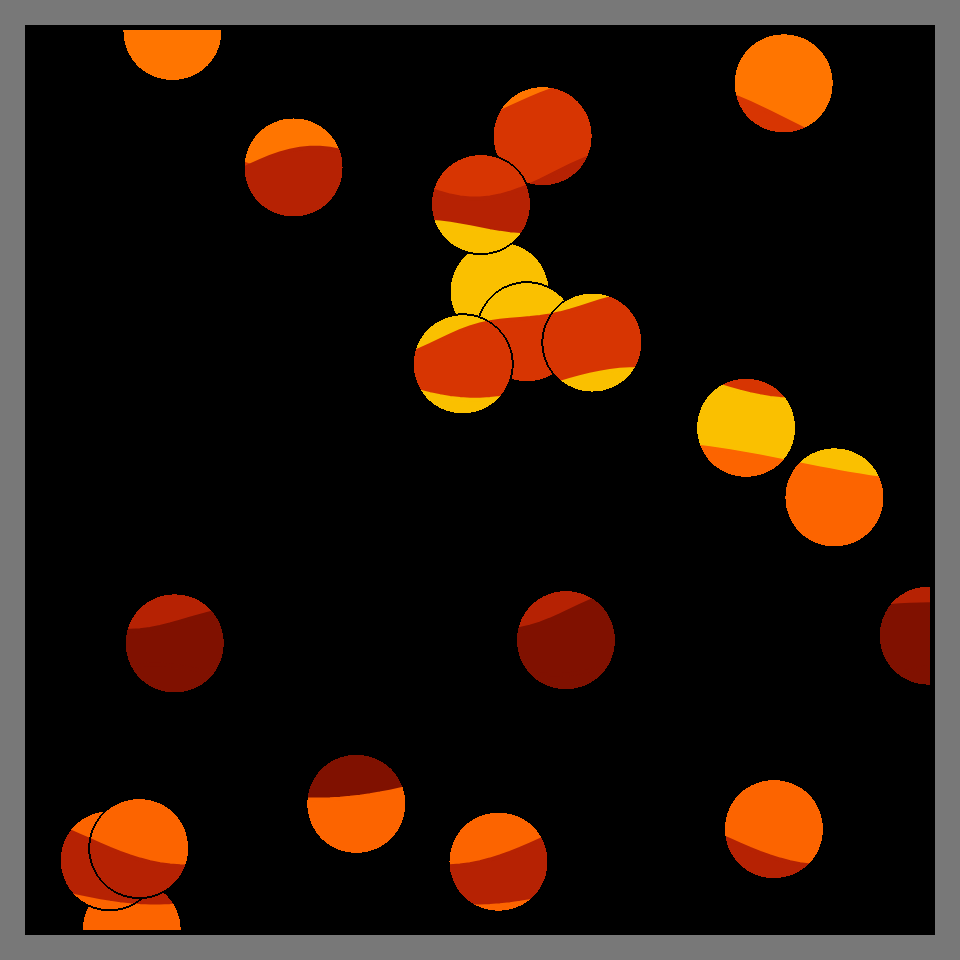
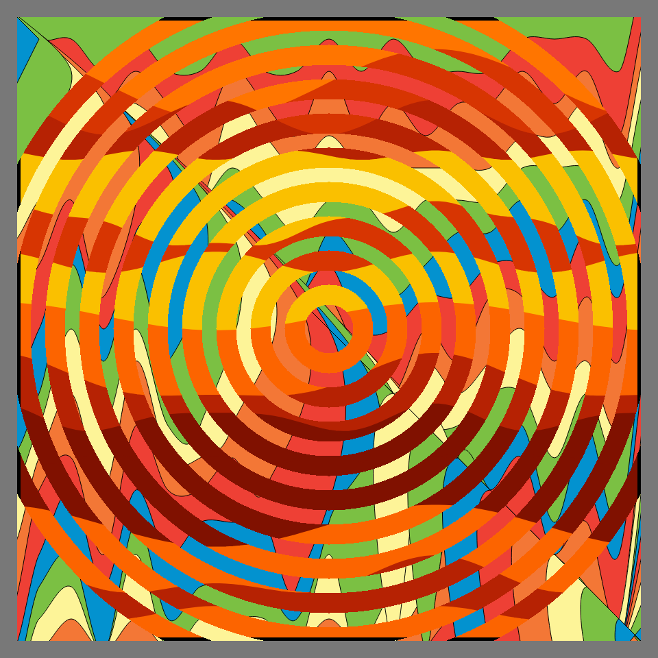
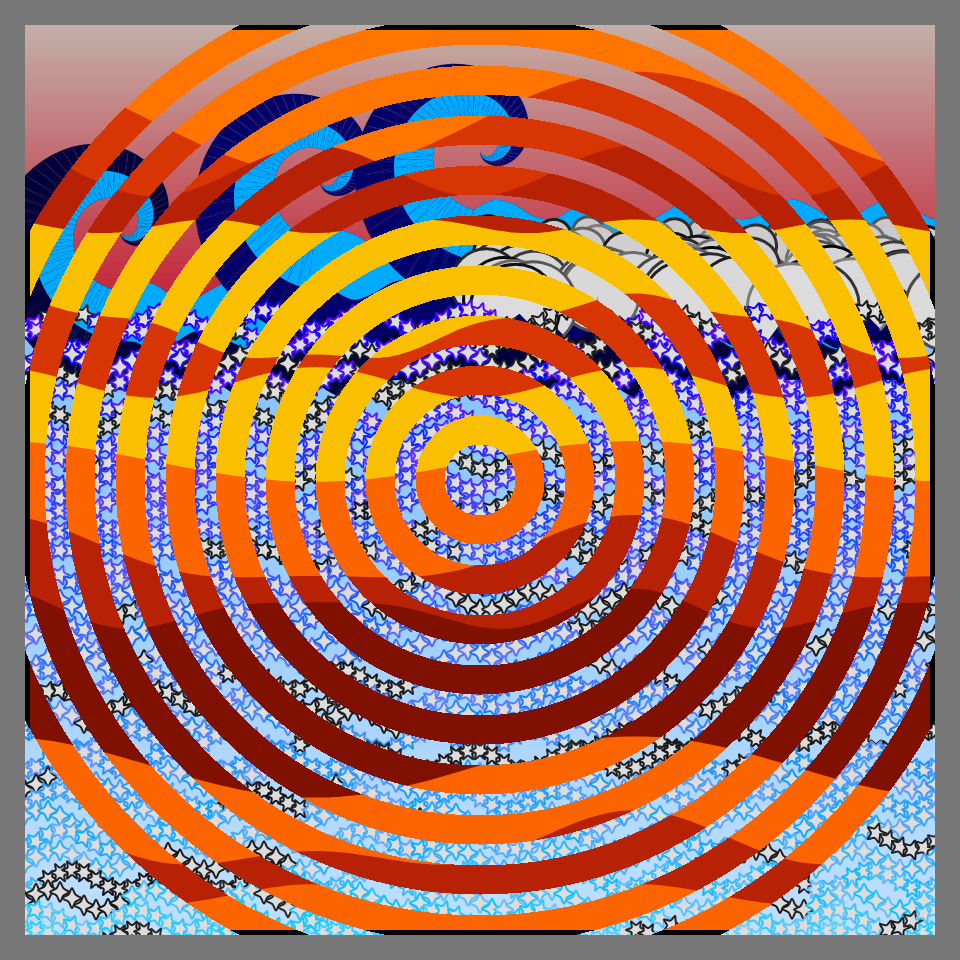
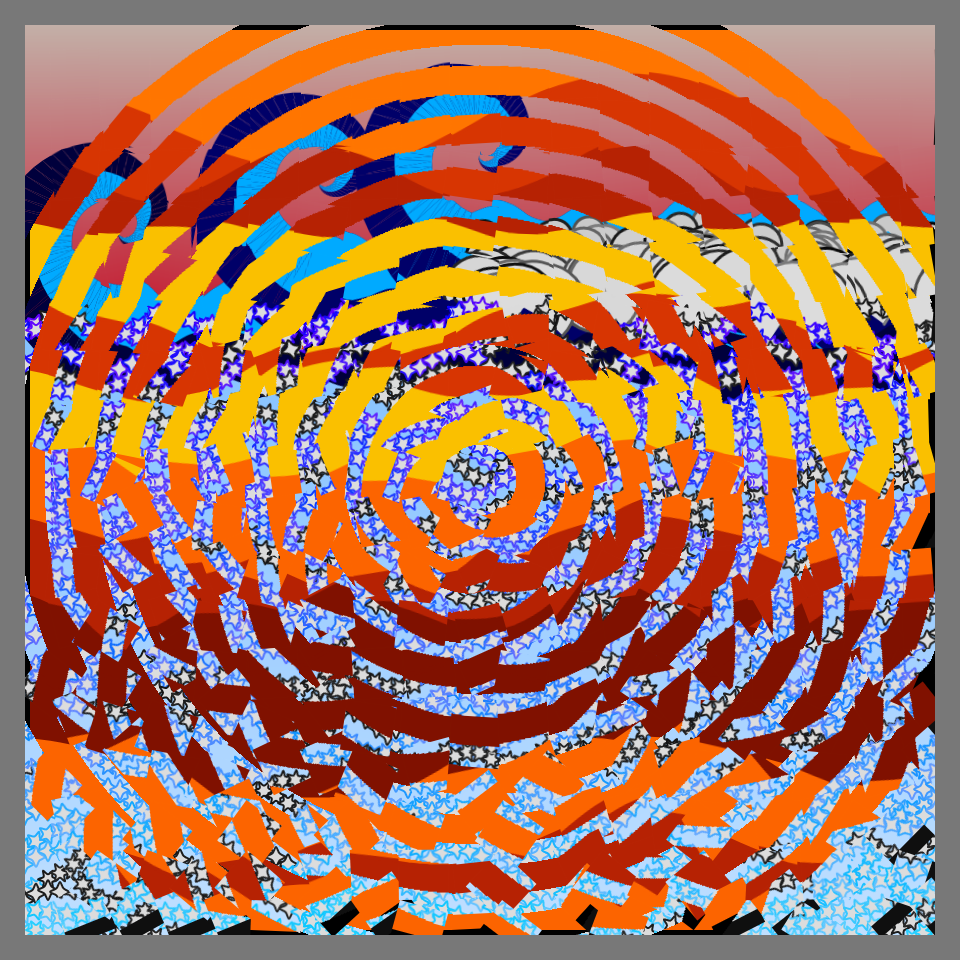
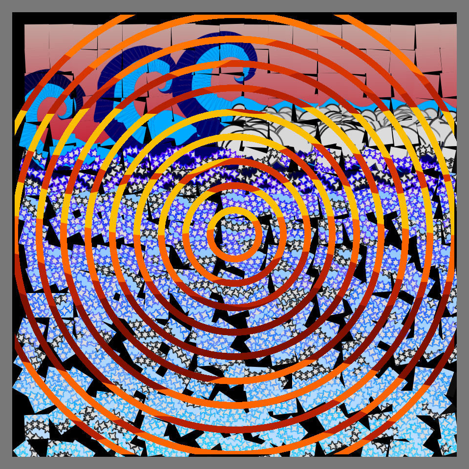

# DAILY SKETCH for 2022-01-21

## Done using P5.js

### Description

These `daily sketches` which are meant to be quick explorations     on whatever topic interested me on that day. This code is not typically optimized, but I share it as-is     for anyone interested.

        

## Progression of Images that were generated.

 
 
 
 
 
 
 
 

## 2022-01-21
Keywords: Genuary2022, images
 

## Description 

 Combine two of your pieces from previous days to make a new piece.
 Use your images to create something new. Combined "Cube Disarray" on one image.
 Used that as a background. Created Concentric circles with another image.
 Combined both to create a new work.
 

Made using P5.js. 

-----

