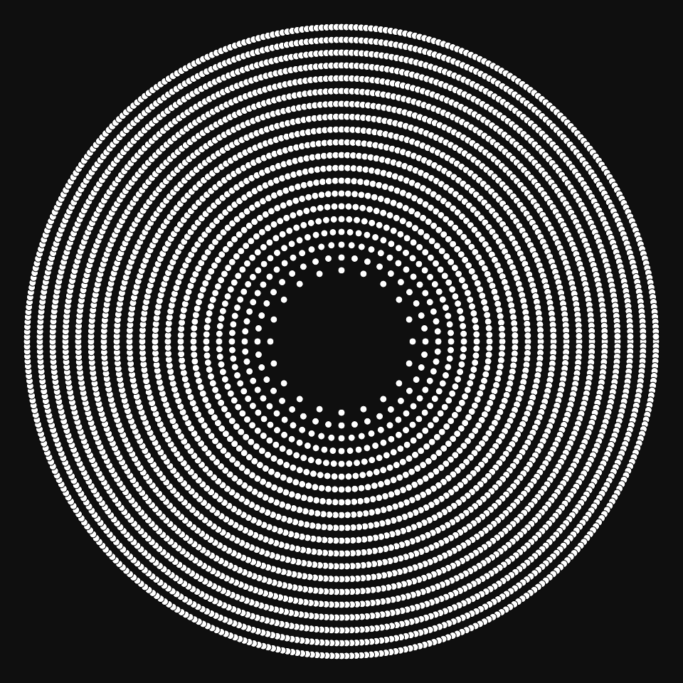
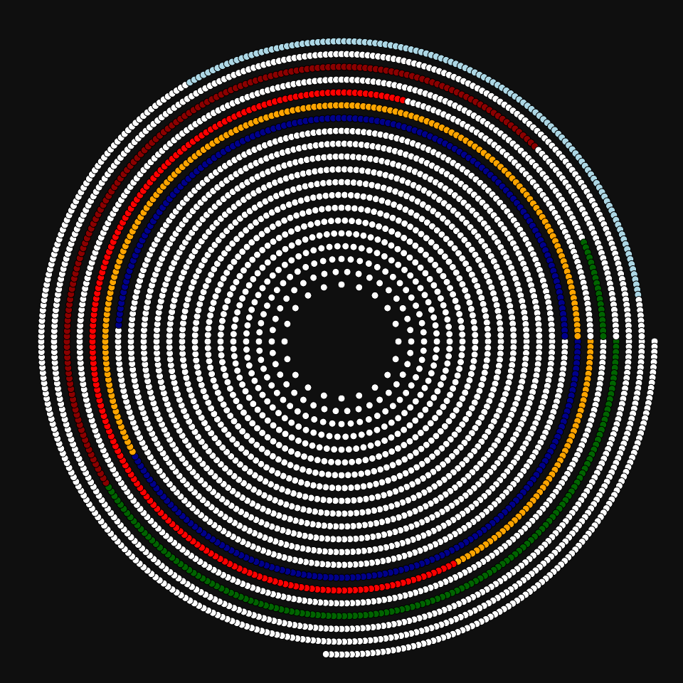
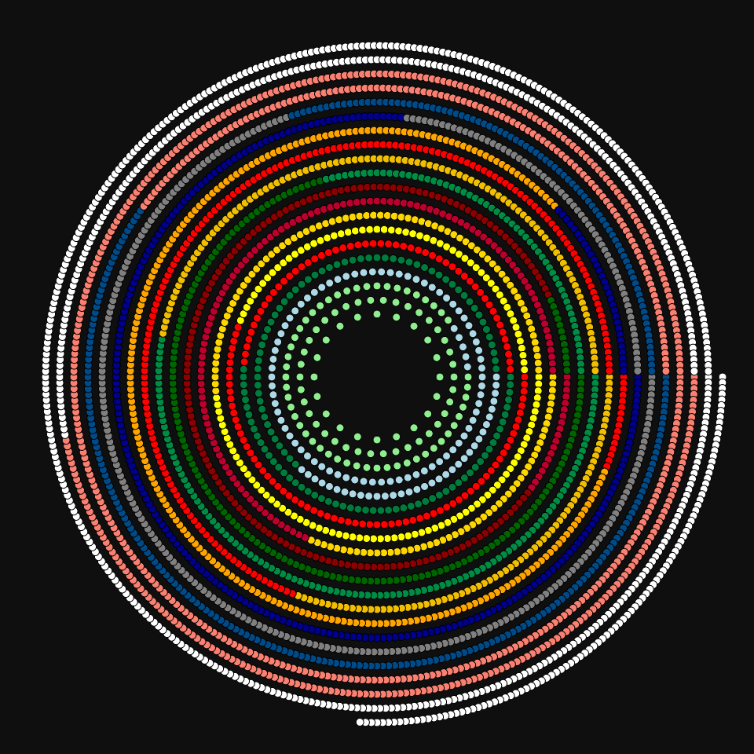
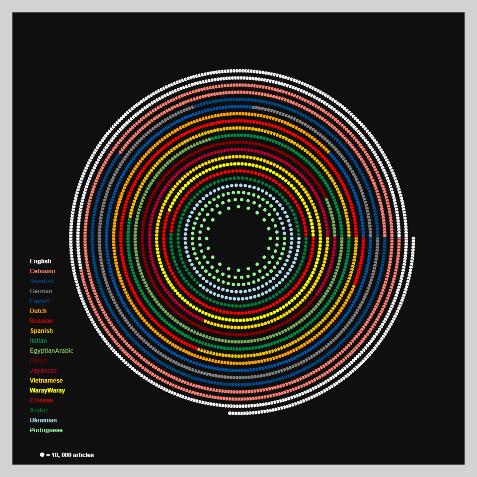

# DAILY SKETCH for 2022-01-22

## Done using P5.js

### Description

These `daily sketches` which are meant to be quick explorations     on whatever topic interested me on that day. This code is not typically optimized, but I share it as-is     for anyone interested.

     

## Progression of Images that were generated.

 
 
 
 
 

## 2022-01-22
Keywords: Genuary2022, calendar
 

## Description 

 Concentric circles showing wikipedia number of articles by language as on 1/22/2022.
 This won't be the same in one year.
 Each color represents one language, and each dot is 10,000 articles.
 Data from https://meta.wikimedia.org/wiki/List_of_Wikipedias#1_000_000+_articles
 

Made using P5.js. 

-----

