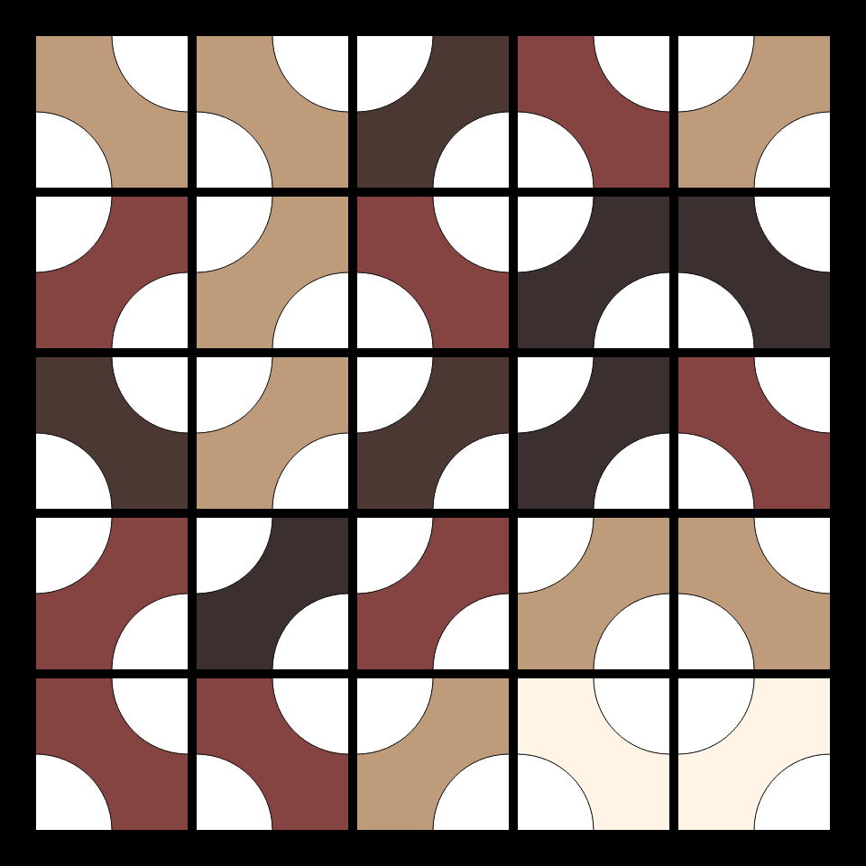
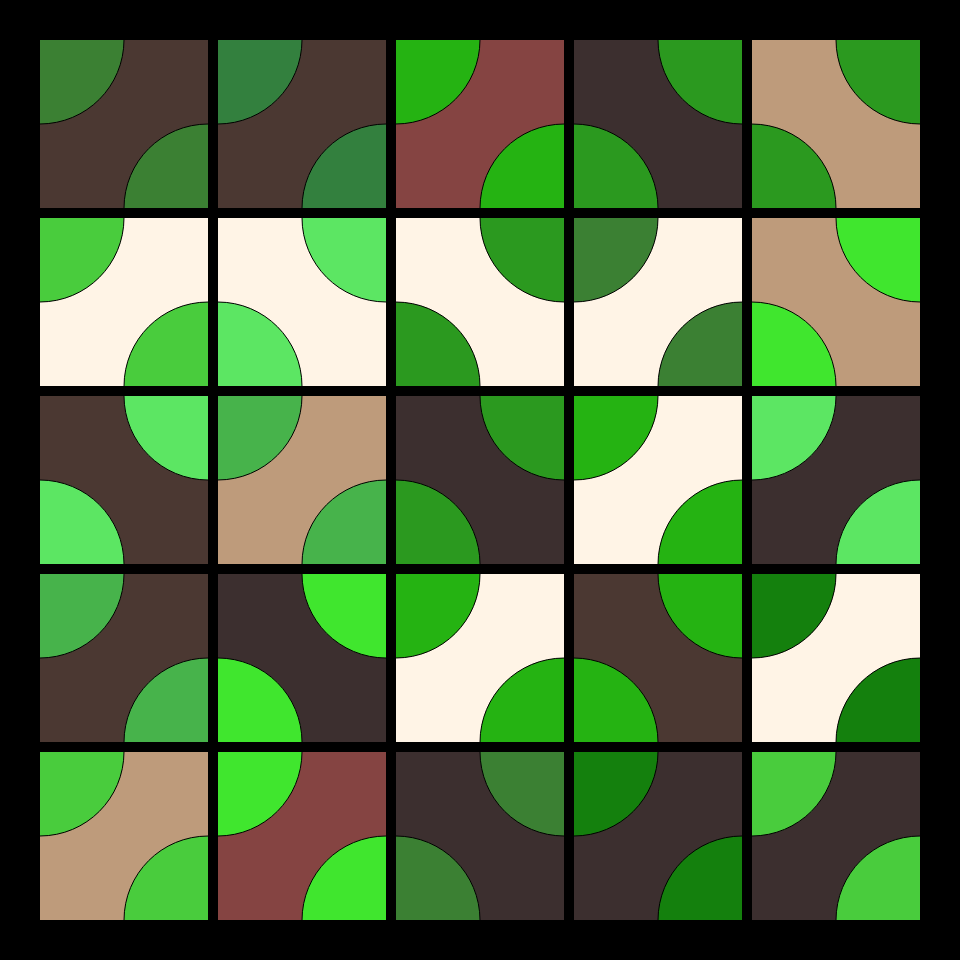
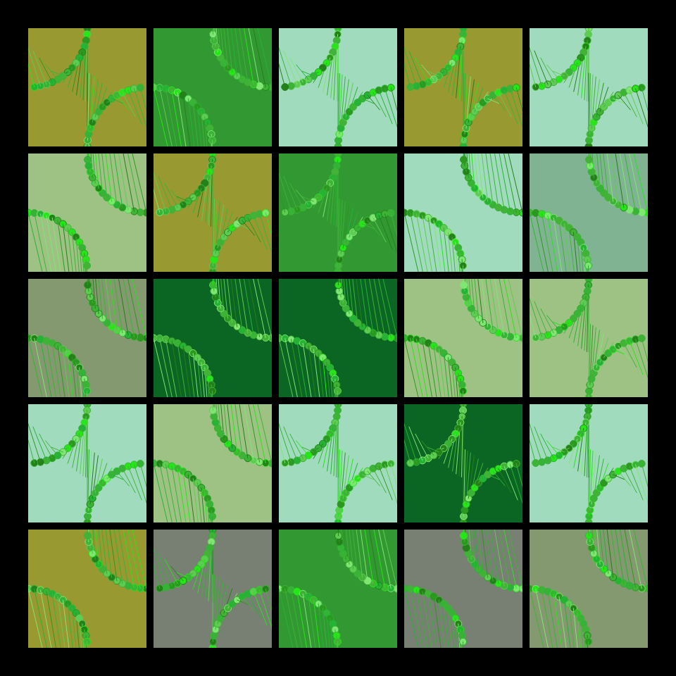
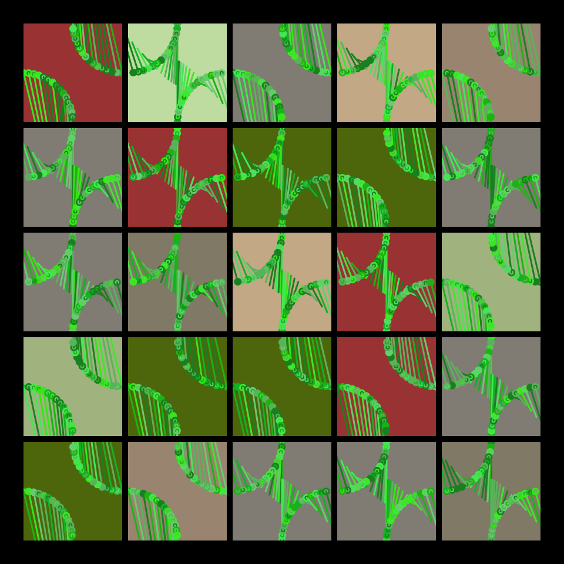
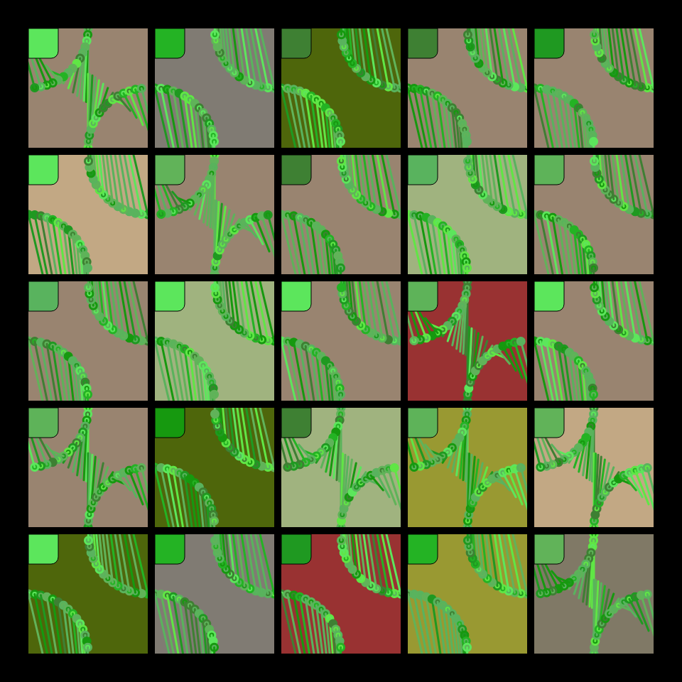
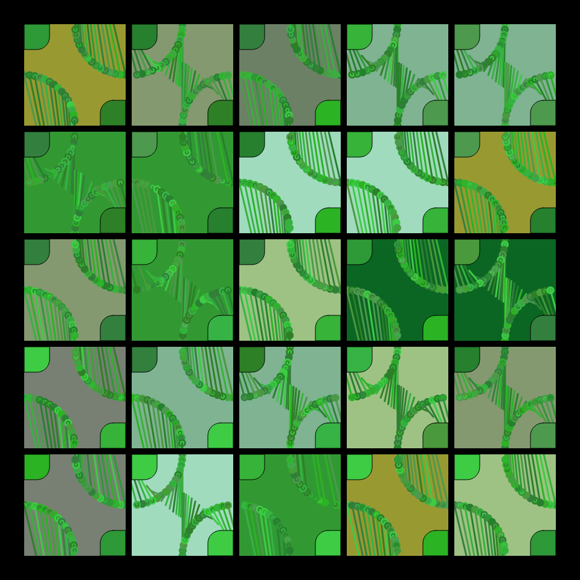
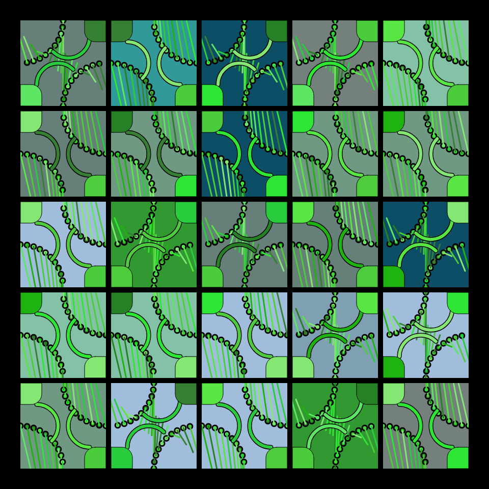

# DAILY SKETCH for 2022-01-23

## Done using P5.js

### Description

These `daily sketches` which are meant to be quick explorations     on whatever topic interested me on that day. This code is not typically optimized, but I share it as-is     for anyone interested.

        

## Progression of Images that were generated.

 
 
 
 
 
 
 
 

## 2022-01-23
Keywords: genuary2022, shapes, tiles, flow
 

## Description 

 Truchet tiles with some stylized "leafs"
 

Made using P5.js. 

-----

