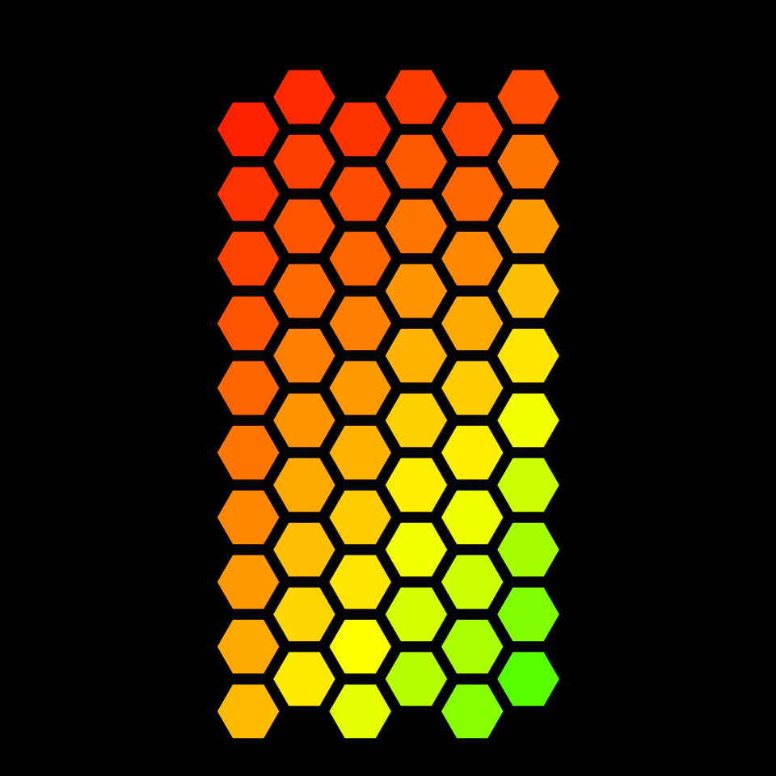
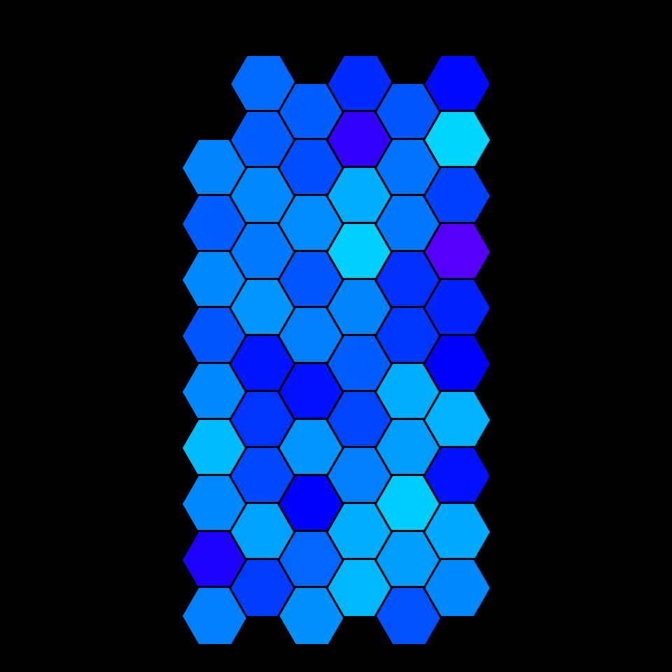
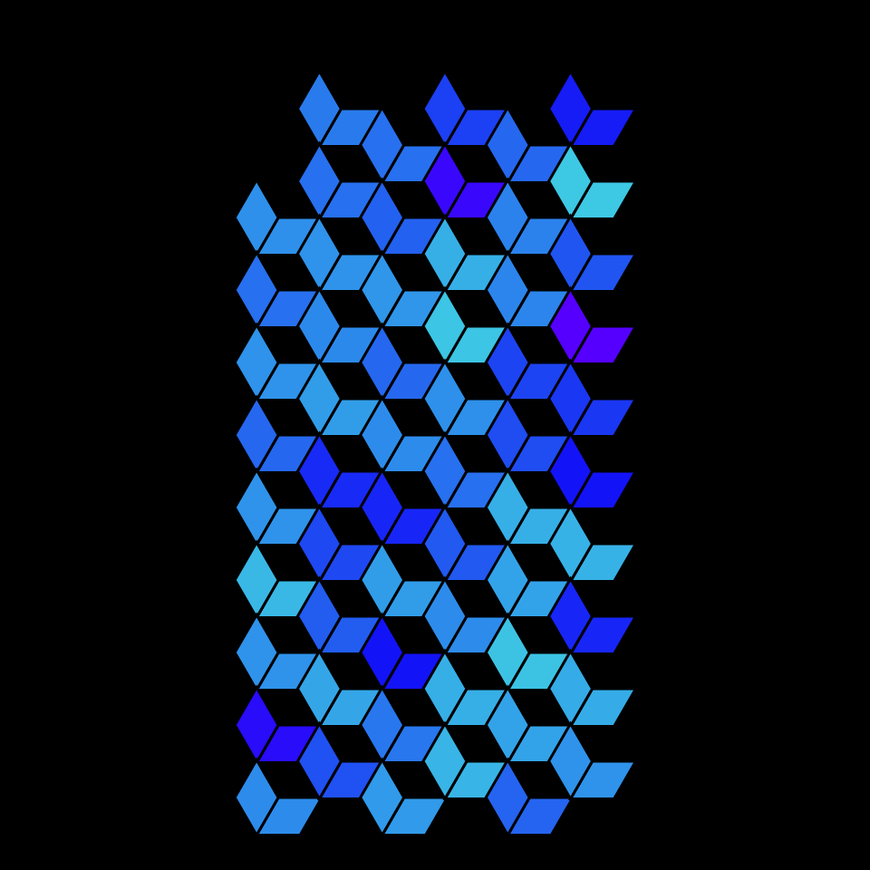
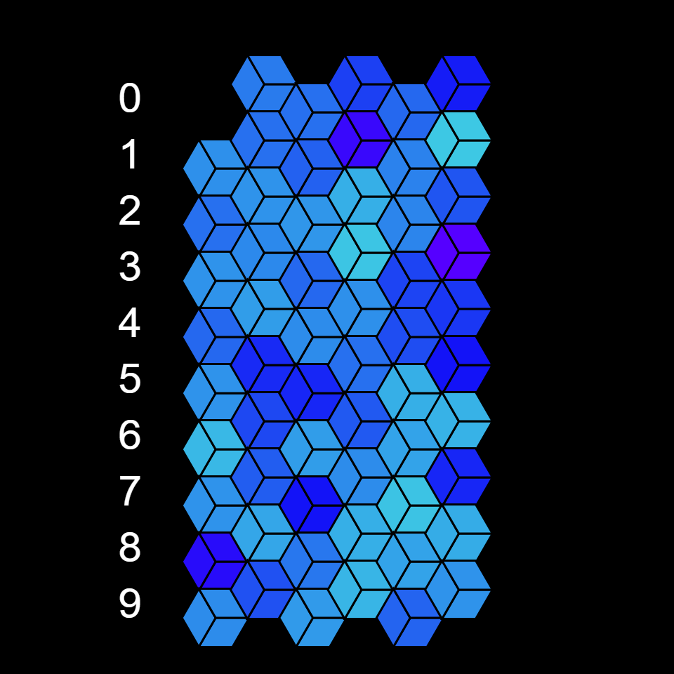
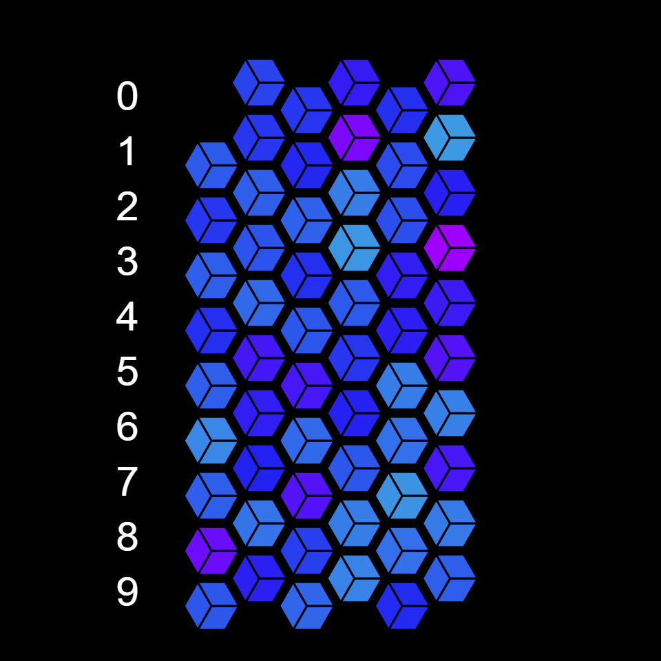

# DAILY SKETCH for 2022-01-24

## Done using P5.js

### Description

These `daily sketches` which are meant to be quick explorations     on whatever topic interested me on that day. This code is not typically optimized, but I share it as-is     for anyone interested.

      

## Progression of Images that were generated.

 
 
 
 
 
 

## 2022-01-24
Keywords: genuary2022, hexagons
 

## Description 

 Random number generator. PRND, NY Lotto numbers from 2003-2016. (From 1-59, 6 numbers are picked daily.)
 Color based on that number's frequency of showing up. The hexagon border color is based on the overall
 frequency of occurrence. In a truly random distribution, all the hexagons will look identical.
 

Made using P5.js. 

-----

