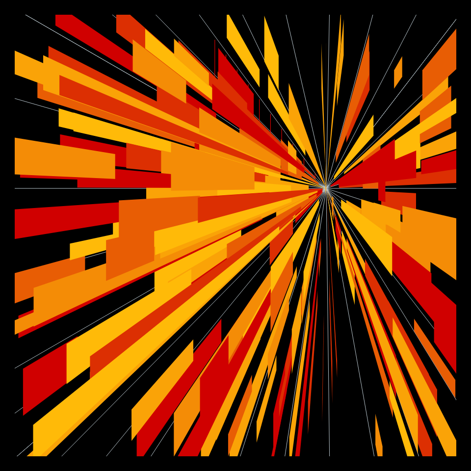
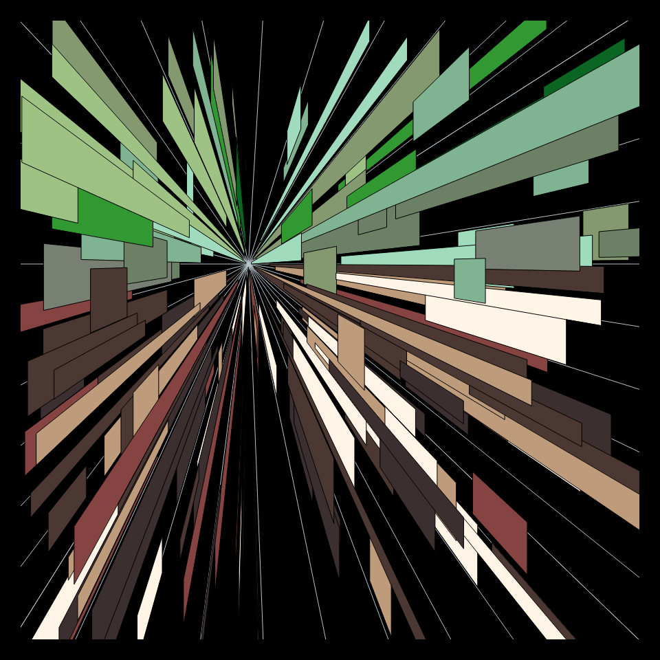
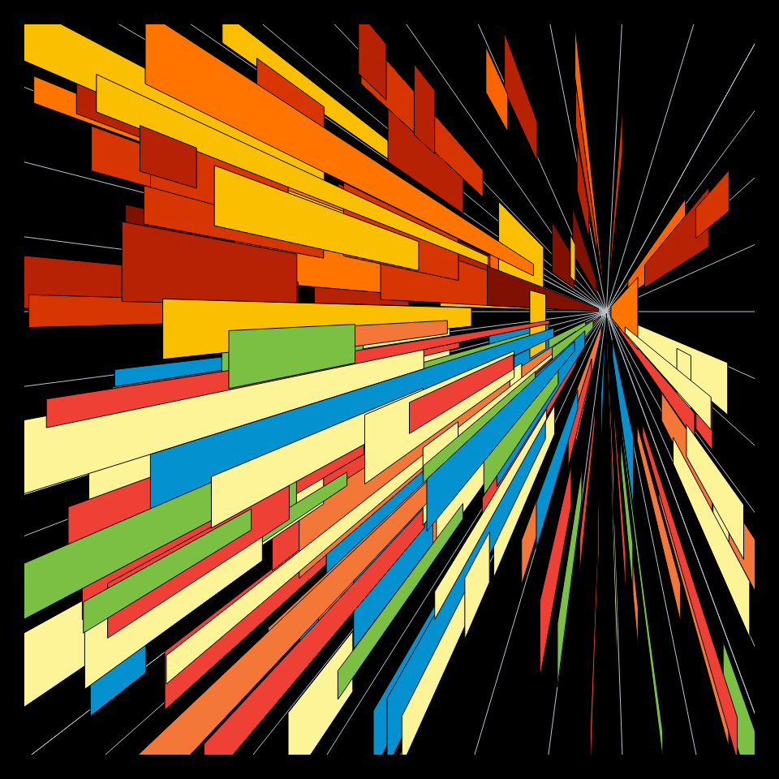

# DAILY SKETCH for 2022-01-25

## Done using P5.js

### Description

These `daily sketches` which are meant to be quick explorations     on whatever topic interested me on that day. This code is not typically optimized, but I share it as-is     for anyone interested.

    

## Progression of Images that were generated.

 
 
 
 

## 2022-01-25
Keywords: genuary2022, perspective
 

## Description 

 Descending into one-point vanishing point.
 

Made using P5.js. 

-----

