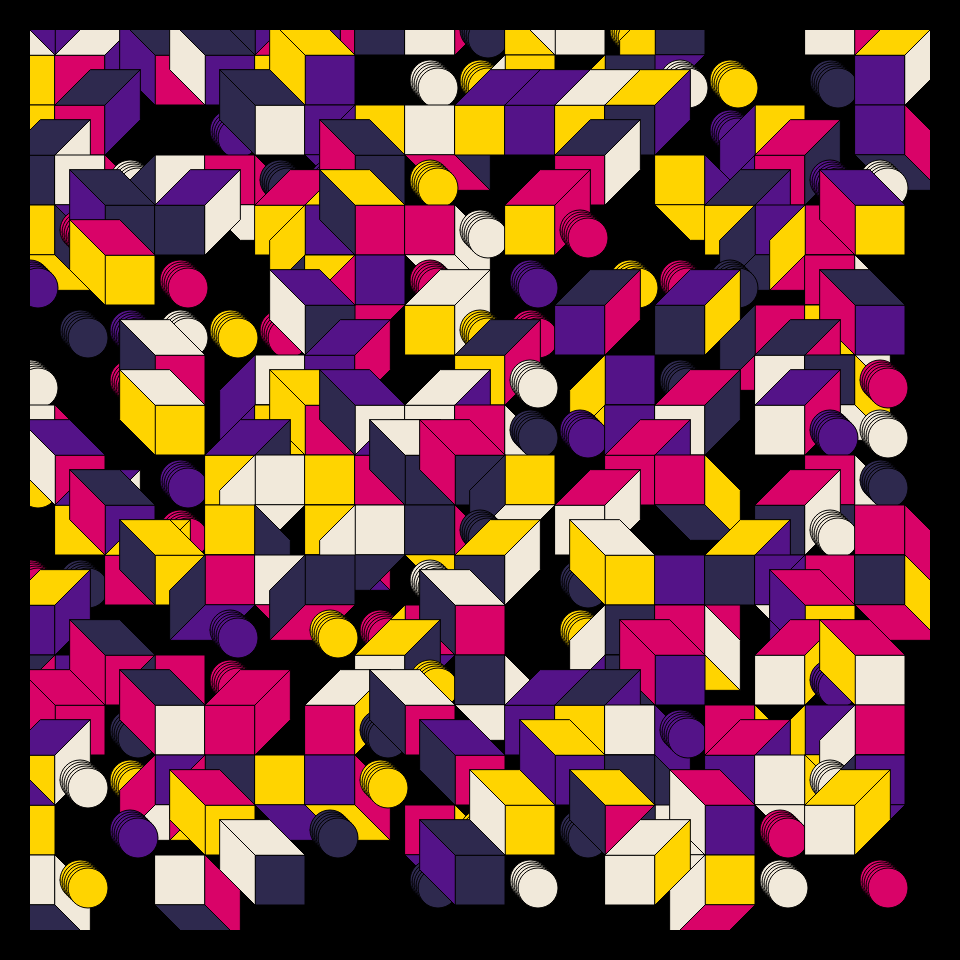
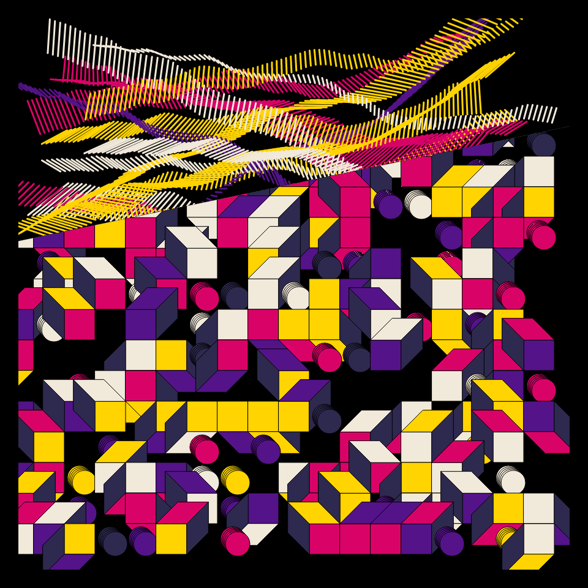

# DAILY SKETCH for 2022-01-27

## Done using P5.js

### Description

These `daily sketches` which are meant to be quick explorations     on whatever topic interested me on that day. This code is not typically optimized, but I share it as-is     for anyone interested.

   

## Progression of Images that were generated.

 
 
 

## 2022-01-27
Keywords: genuary2022, shapes, colors
 

## Description 

 Use of a palette. (I tried to make an overlapped image idea work. The idea works fine, but the end result was not pleasing.)
 

Made using P5.js. 

-----

