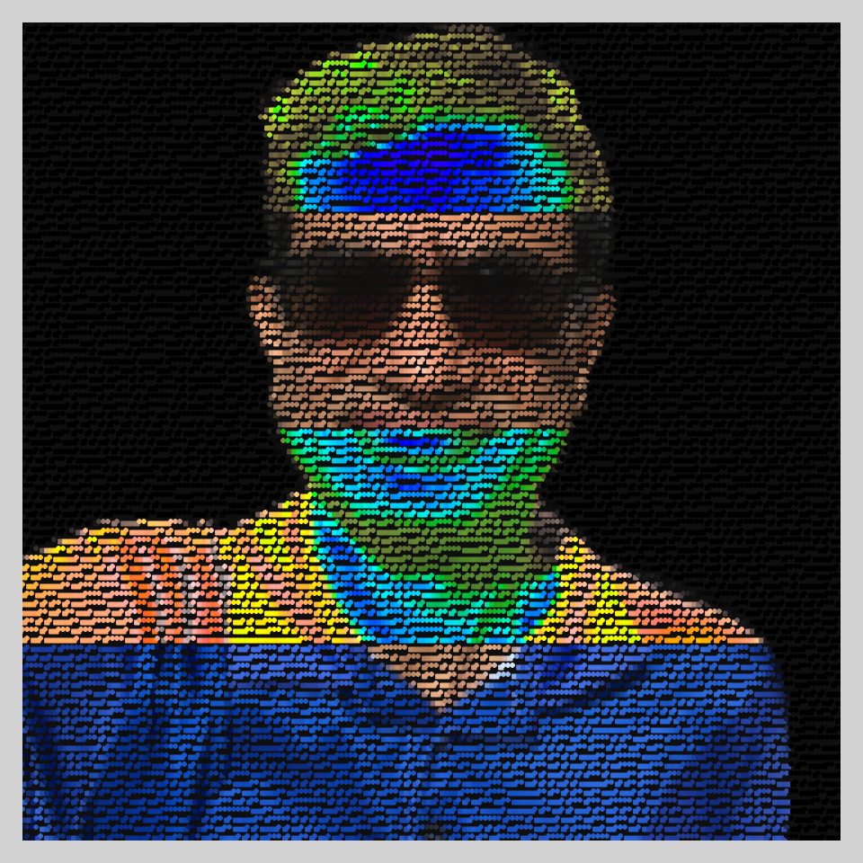
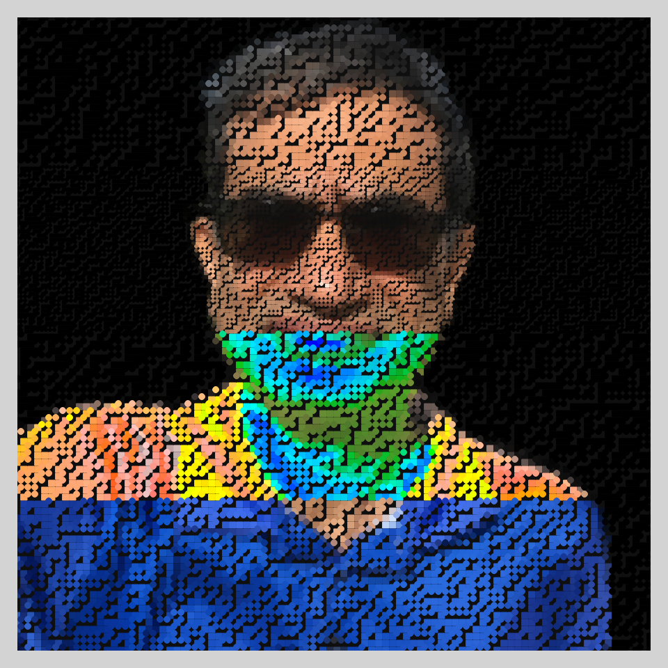
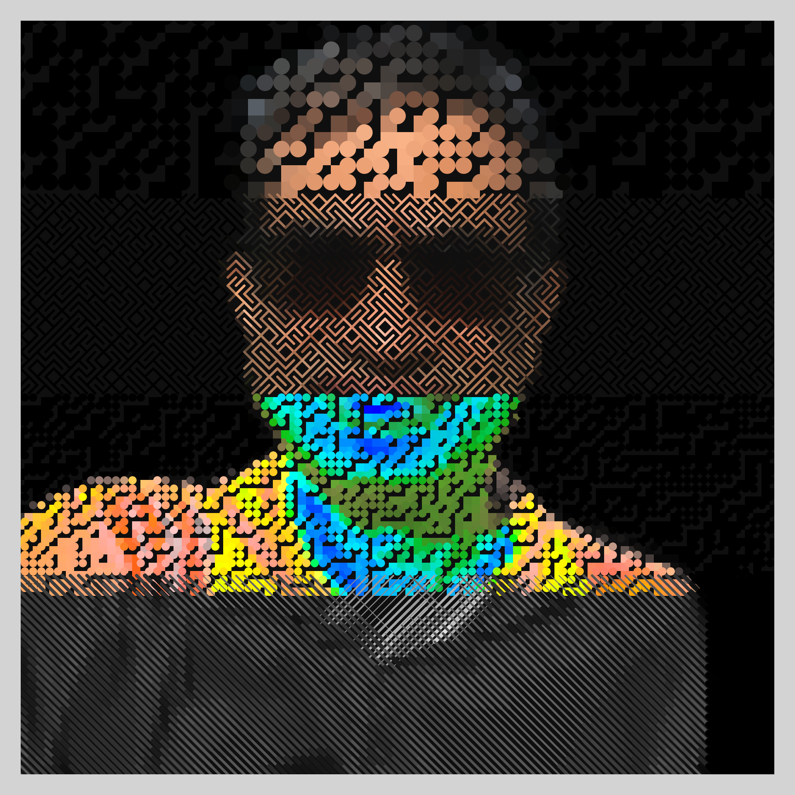
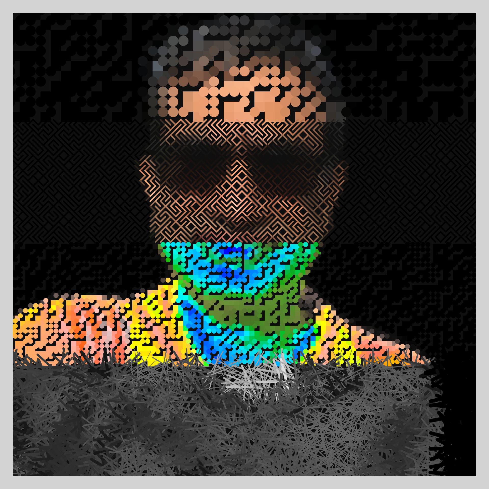
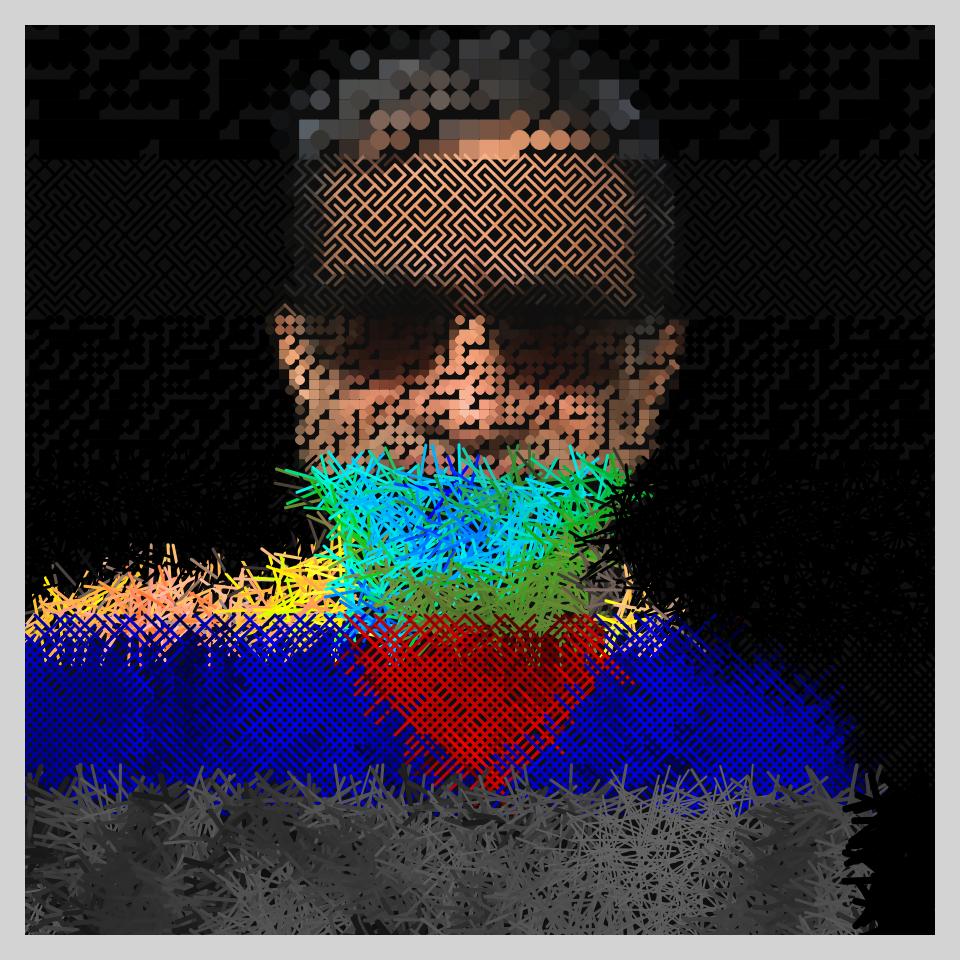

# DAILY SKETCH for 2022-01-28

## Done using P5.js

### Description

These `daily sketches` which are meant to be quick explorations     on whatever topic interested me on that day. This code is not typically optimized, but I share it as-is     for anyone interested.

      

## Progression of Images that were generated.

 
 
 
 
 
 

## 2022-01-28
Keywords: Genuary2022, image
 

## Description 

 Slices of myself. Manipulate image in different ways. 
 

Made using P5.js. 

-----

