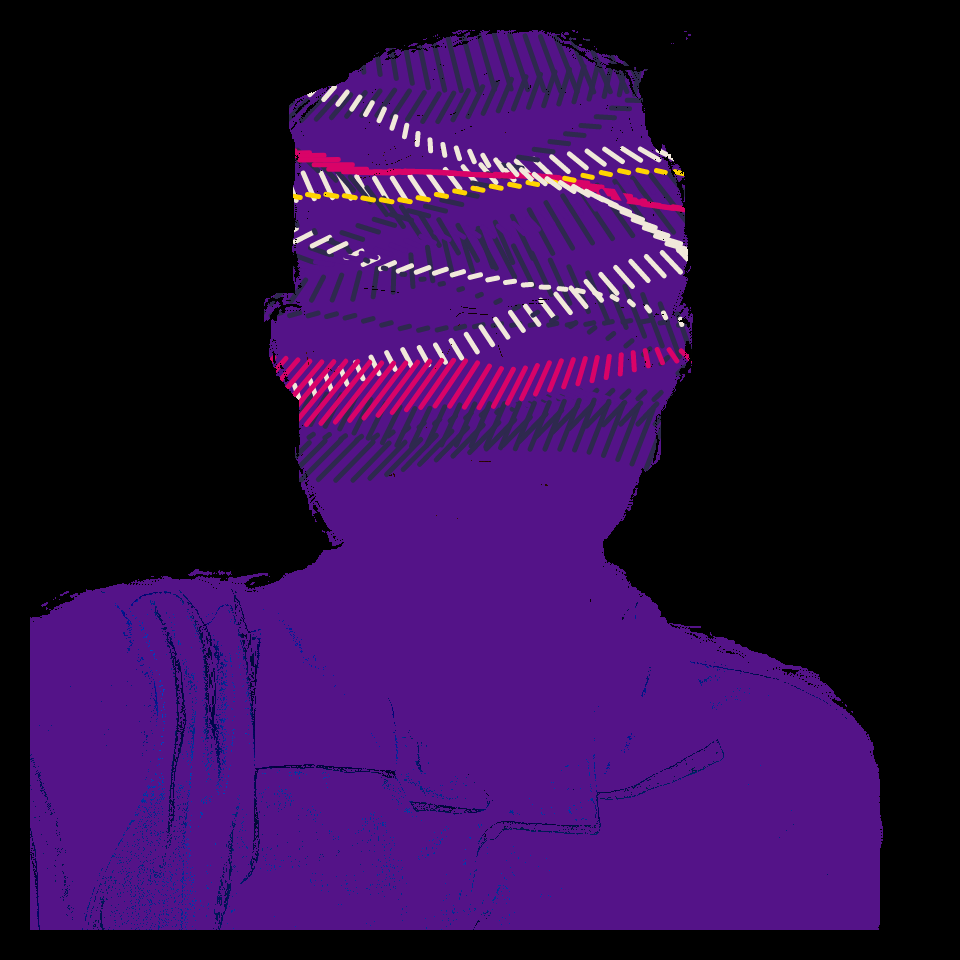
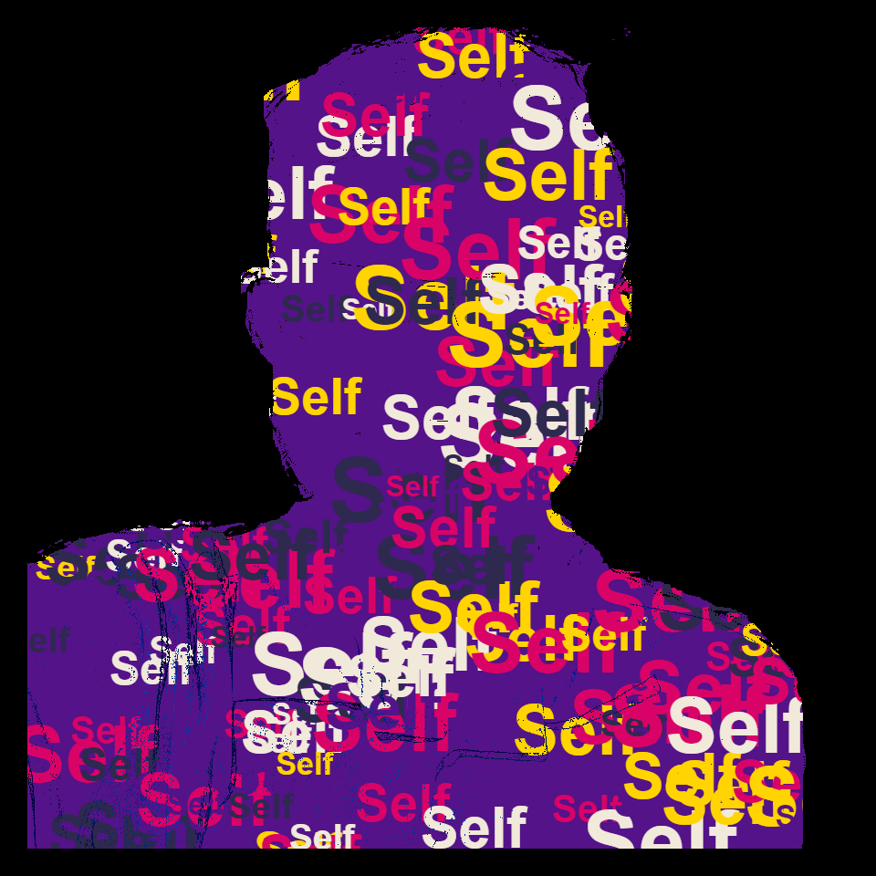

# DAILY SKETCH for 2022-02-01

## Done using P5.js

### Description

These `daily sketches` which are meant to be quick explorations     on whatever topic interested me on that day. This code is not typically optimized, but I share it as-is     for anyone interested.

   

## Progression of Images that were generated.

 
 
 

## 2022-02-01
Keywords: image, masking
 

## Description 

 Use a base image. It has the word "Self" repeated.
 Create a masked image (with holes for background to come through).
 Overlay and print. (Idea: Courtesy Syam Krishna)
 

Made using P5.js. 

-----

