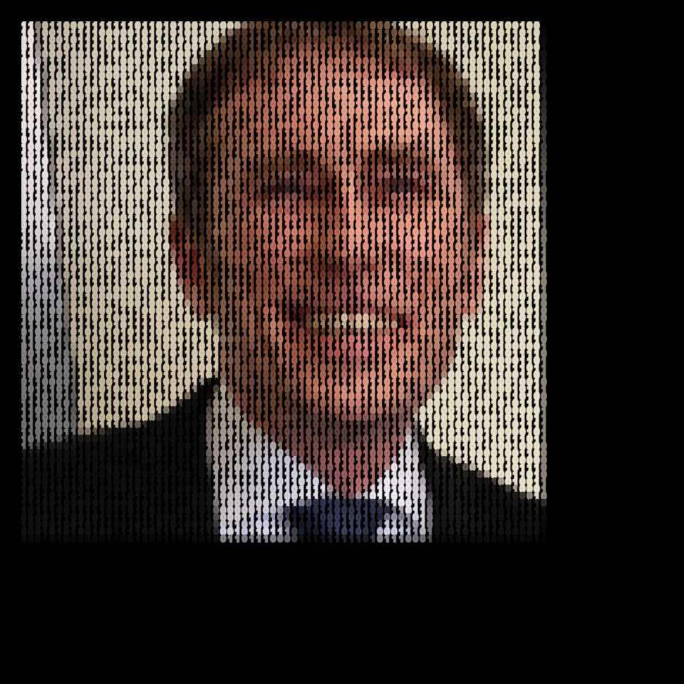
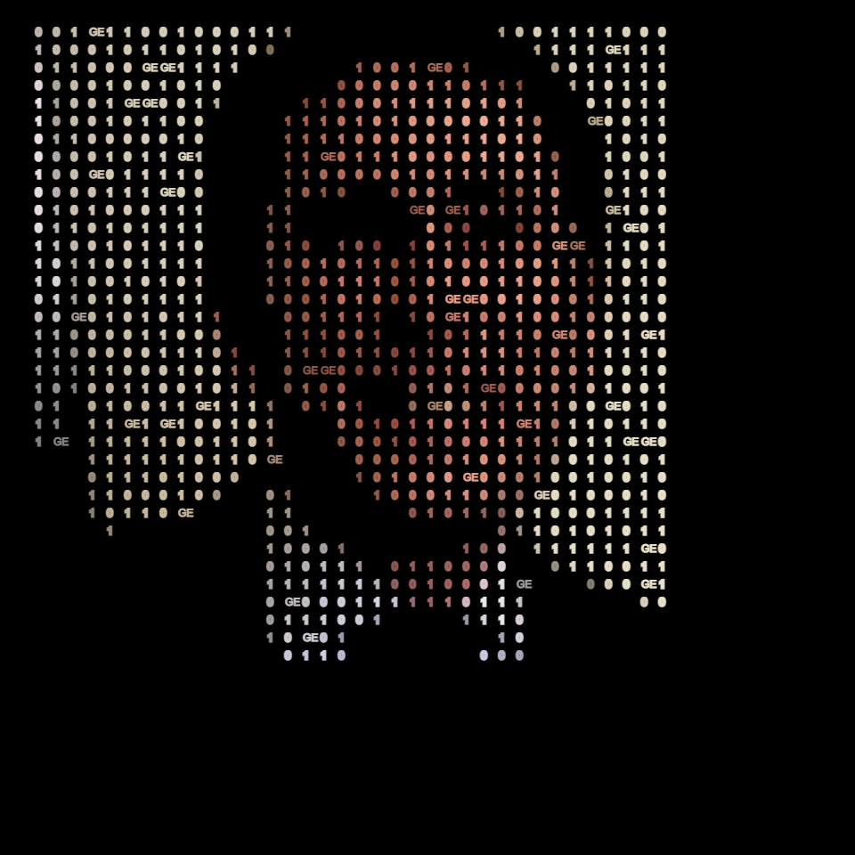
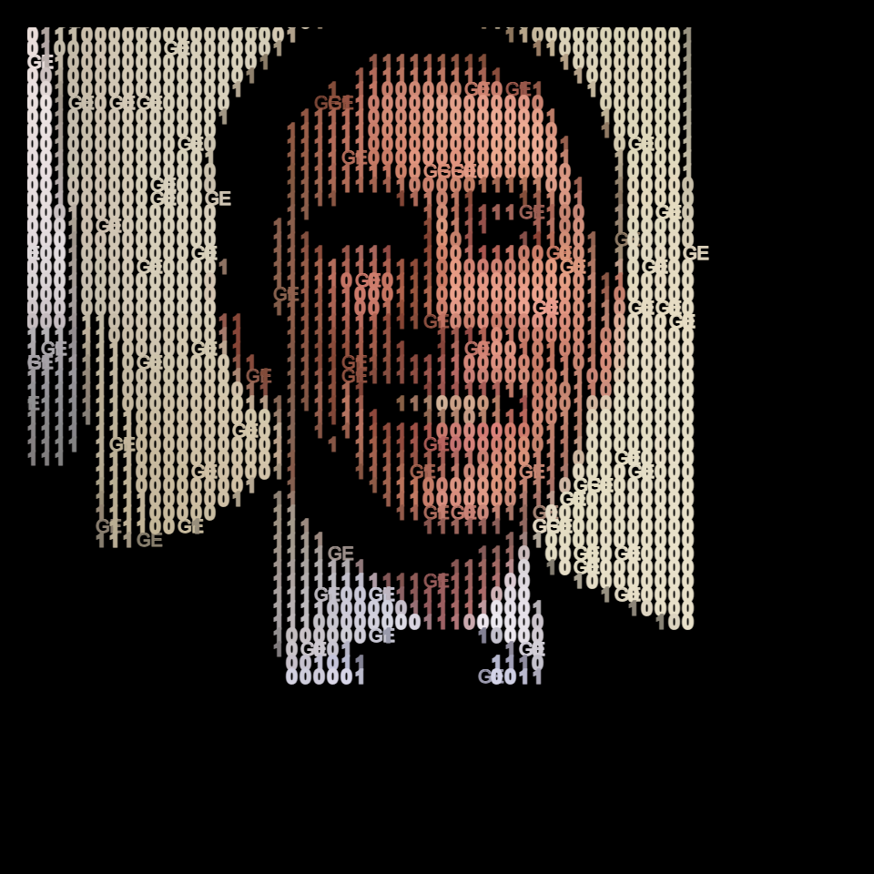

# DAILY SKETCH for 2022-02-04

## Done using P5.js

### Description

These `daily sketches` which are meant to be quick explorations     on whatever topic interested me on that day. This code is not typically optimized, but I share it as-is     for anyone interested.

    

## Progression of Images that were generated.

 
 
 
 

## 2022-02-04
Keywords: image
 

## Description 

 Use a base image. Re-cast if just with 0's and 1's and the letter GE.
 

Made using P5.js. 

-----

