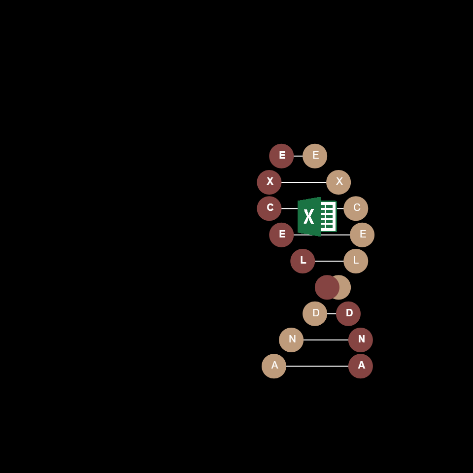

# DAILY SKETCH for 2022-02-05

## Done using P5.js

### Description

These `daily sketches` which are meant to be quick explorations     on whatever topic interested me on that day. This code is not typically optimized, but I share it as-is     for anyone interested.

  

## Progression of Images that were generated.

 
 

## 2022-02-05
Keywords: shapes
 

## Description 

 Double Helix experiments. Helix in a BBox. 
 Store the helix points in a list. and render.
 

Made using P5.js. 

-----

