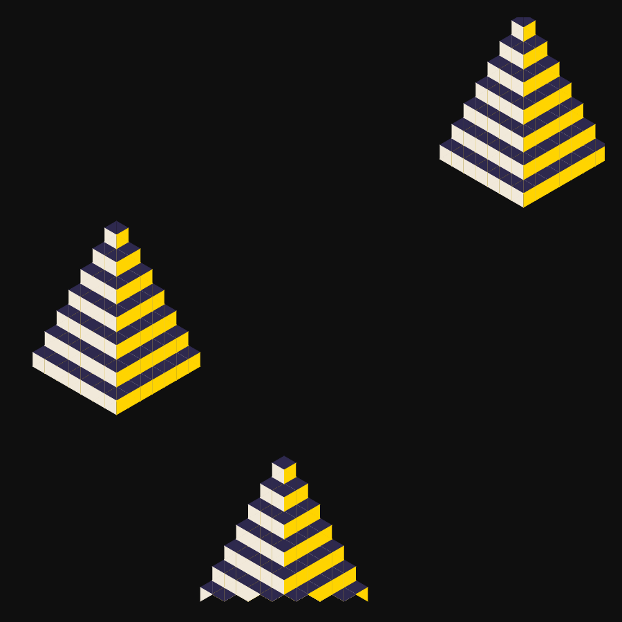
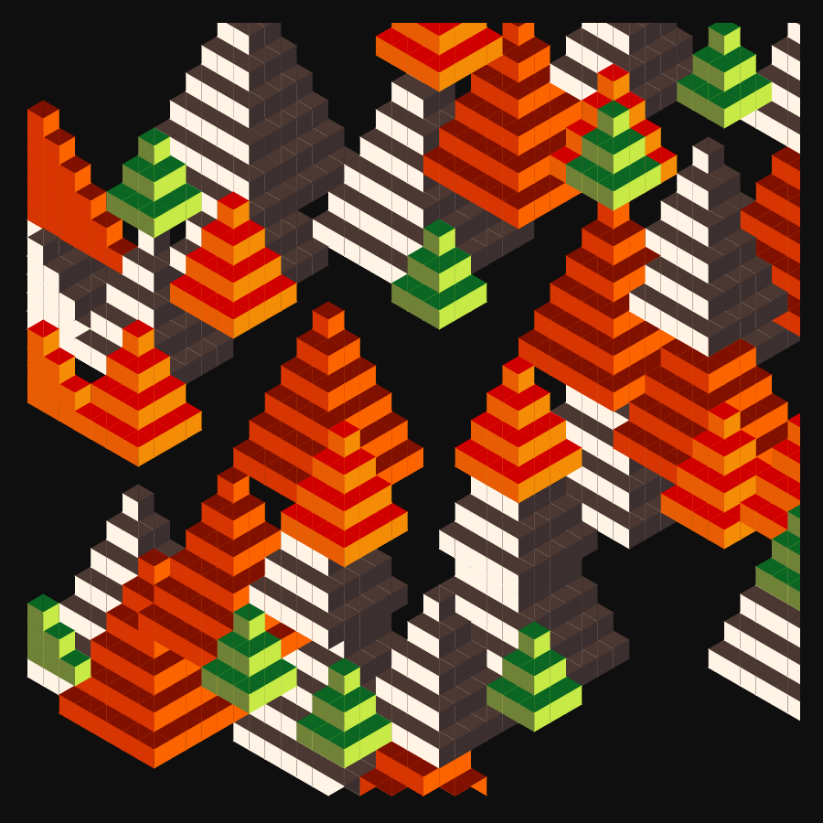
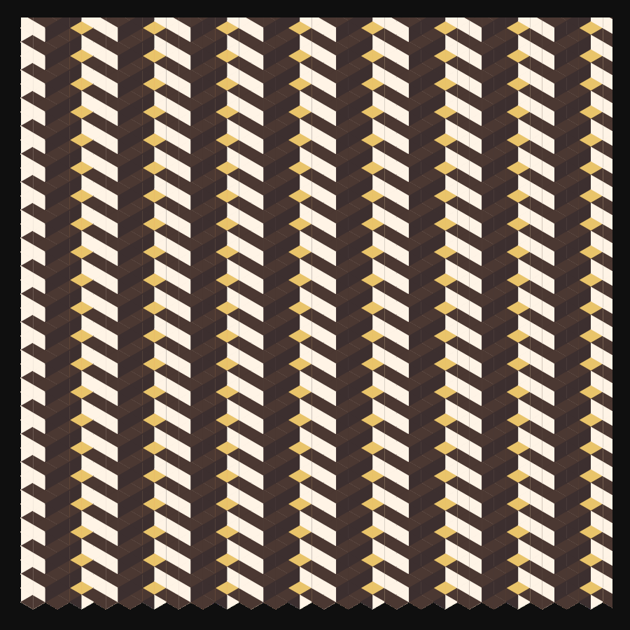
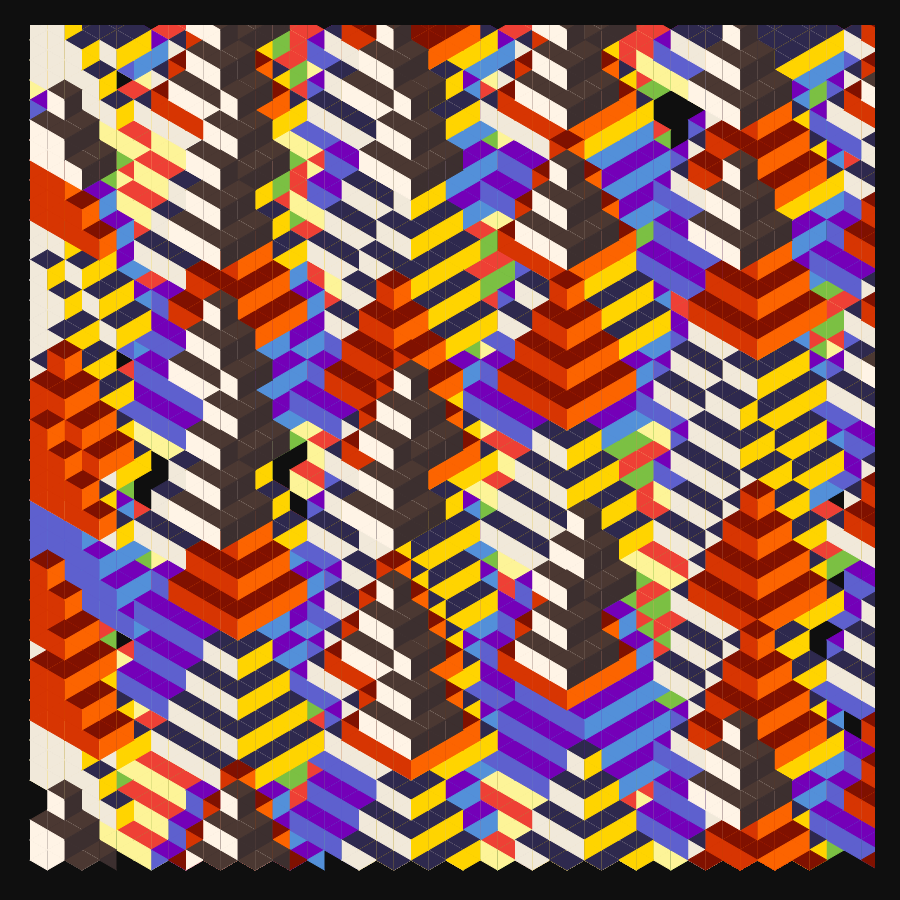
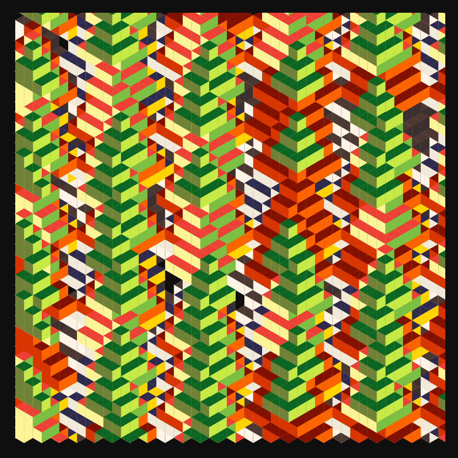
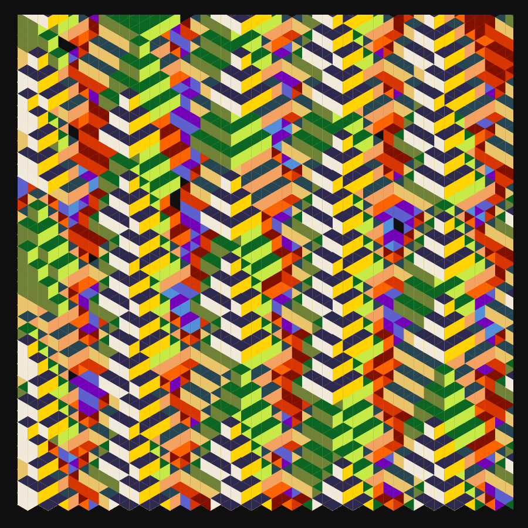
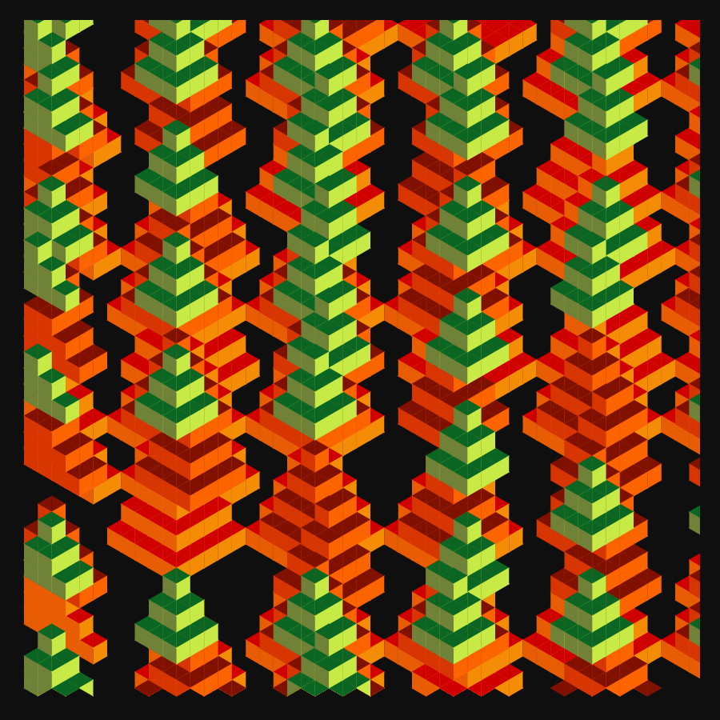
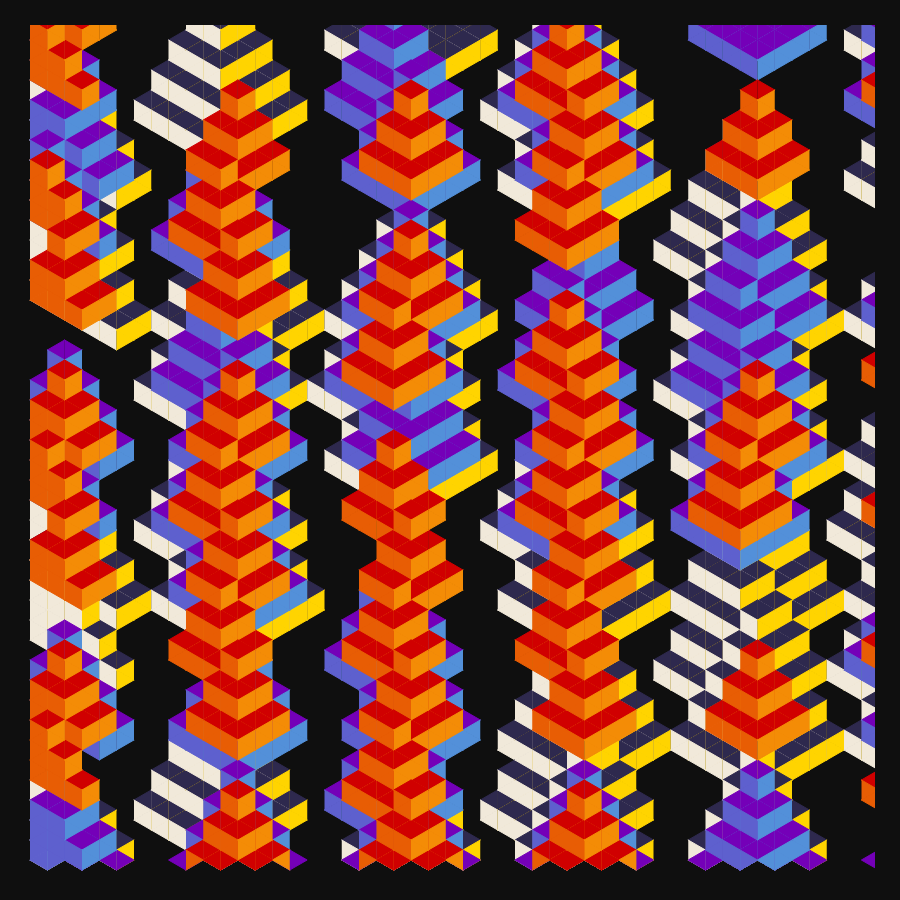

# DAILY SKETCH for 2022-03-01

### [Interactive Version](https://ram-n.github.io/generative_art/daily_sketches/2022/2022-03-01) 
 ### Done using P5.js

### Description

These `daily sketches` which are meant to be quick explorations     on whatever topic interested me on that day. This code is not typically optimized, but I share it as-is     for anyone interested.

        

## Progression of Images that were generated.

 
 
 
 
 
 
 
 

## 2022-03-01
Keywords: 3D, Shapes, pyramid
 

## Description 

 Isometric Projection (WIP)
 

Made using P5.js. 

-----

