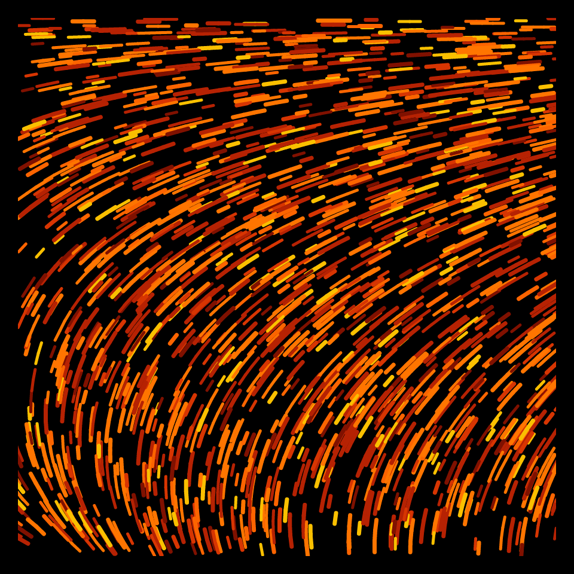
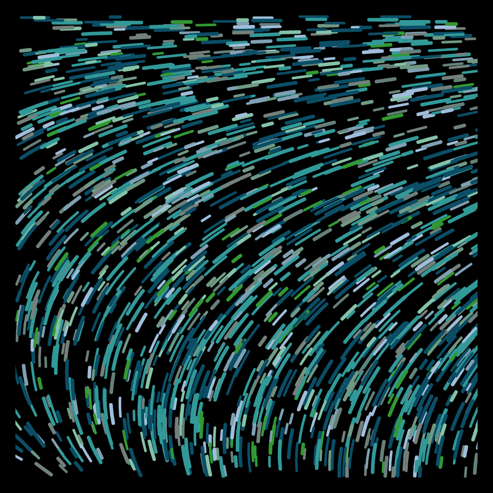
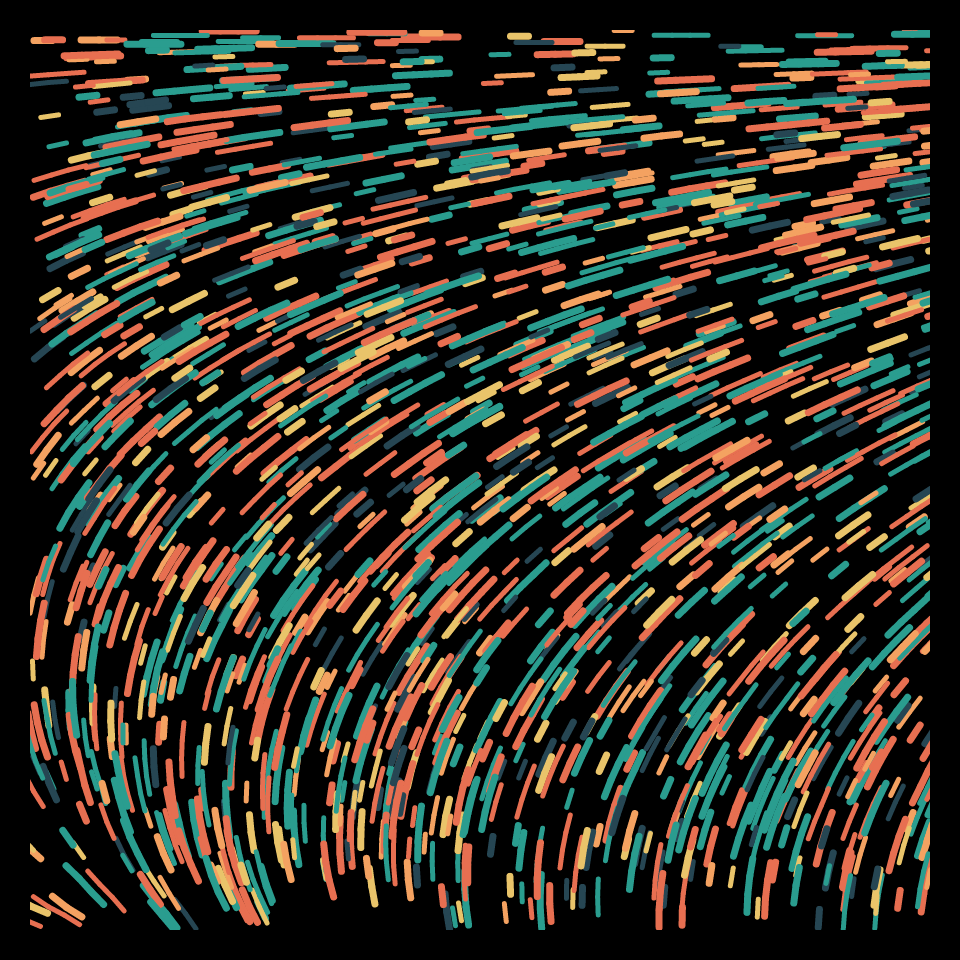

# DAILY SKETCH for 2022-03-05

### [Interactive Version](https://ram-n.github.io/generative_art/daily_sketches/2022/2022-03-05) 
 ### Done using P5.js

### Description

These `daily sketches` which are meant to be quick explorations     on whatever topic interested me on that day. This code is not typically optimized, but I share it as-is     for anyone interested.

   

## Progression of Images that were generated.

 
 
 

## 2022-03-05
Keywords: flow field
 

## Description 

 Draw 2000 segments randomly, in a flow-field
 Variation is that one strand is made up of segments, and each subsequent
 segment starts where the previous one ends. Longer segments are of one of two colors.
 

Made using P5.js. 

-----

