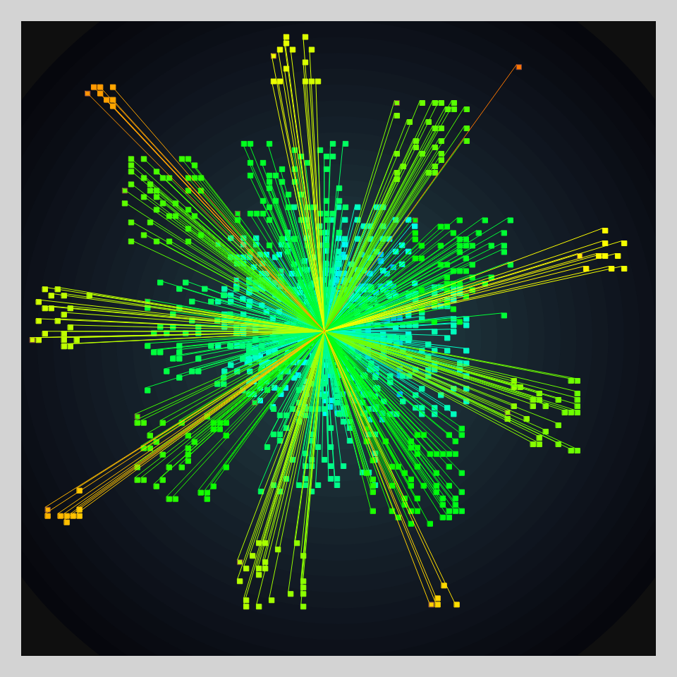

# DAILY SKETCH for 2022-03-08

### [Interactive Version](https://ram-n.github.io/generative_art/daily_sketches/2022/2022-03-08) 
 ### Done using P5.js

### Description

These `daily sketches` which are meant to be quick explorations     on whatever topic interested me on that day. This code is not typically optimized, but I share it as-is     for anyone interested.

 

## Progression of Images that were generated.

 

## 2022-03-08
Keywords: Spiral 
 

## Description 

 On a spiral, draw n^2 squares for n going from 1 to 30. 
 Instead of tiny square, there is a gossamer thread connecting each tiny square to the origin.
 

Made using P5.js. 

-----

