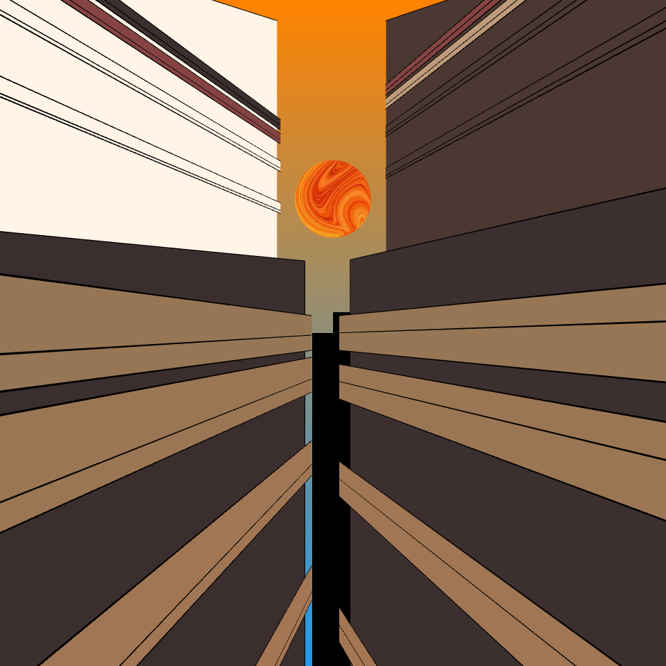

# DAILY SKETCH for 2022-03-19

### [Interactive Version](https://ram-n.github.io/generative_art/daily_sketches/2022/2022-03-19) 
 ### Done using P5.js

### Description

These `daily sketches` which are meant to be quick explorations     on whatever topic interested me on that day. This code is not typically optimized, but I share it as-is     for anyone interested.

 

## Progression of Images that were generated.

 

## 2022-03-19
Keywords: space, genuary2022
 

## Description 

 The Space between two generated buildings...leads to outer space with an orange planet...
 

Made using P5.js. 

-----

