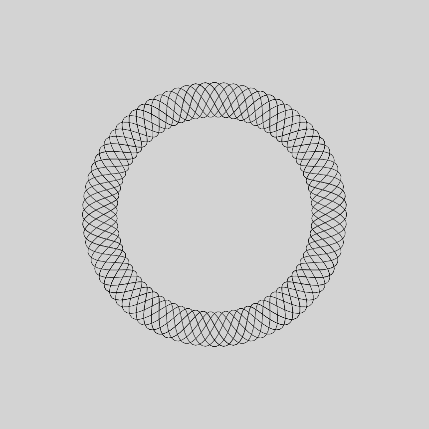
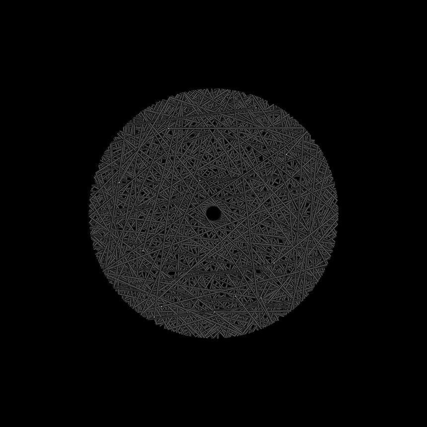

# Daily Sketches

Quick sketches created during daily practice. I hope to spend under 1 hour to create these sketches.
Some days it takes a lot longer.

Daily Sketches: [2021](2021/)
-----
-----
***
## 2021-03-04

Made with P5.js. [Code](2021/2021-03-04/)

-----

## 2021-03-03

Made with P5.js. [Code](2021/2021-03-03/)

-----
## 2021-03-02

Made with P5.js. [Code](2021/2021-03-02/)

-----

## 2021-03-01 

Made with P5.js. [Code](2021/2021-03-01/)

-----

## Project Structure

In each day's directory, you will find the following.
- Art artifact samples (jpeg, png or gif) files under the `images/` directory
- Code (typically, *.js (run under P5) or the *.py that you can run under Processing)

Optionally you can also find:
- A brief description of the end product, and possibly the thinking behind it, where appropriate
- Some technical notes and challenges (if any)
- References, if any including inspirations.

## Code and Common Modules

_p5.js_
sketch.js and index.html, under that day's directory.

_Python_
For most of these, I am using the `Processing` Framework. Since I mostly code in Python, I use [the Python extension of Processing](https://py.processing.org/reference/), which is not as popular as its Java version. Also, I sometimes create small resuable code segments which I use in multiple projects. I'm sharing all my genart code, in case it is useful to others. These I tend to keep in a folder called `common`.

Ram