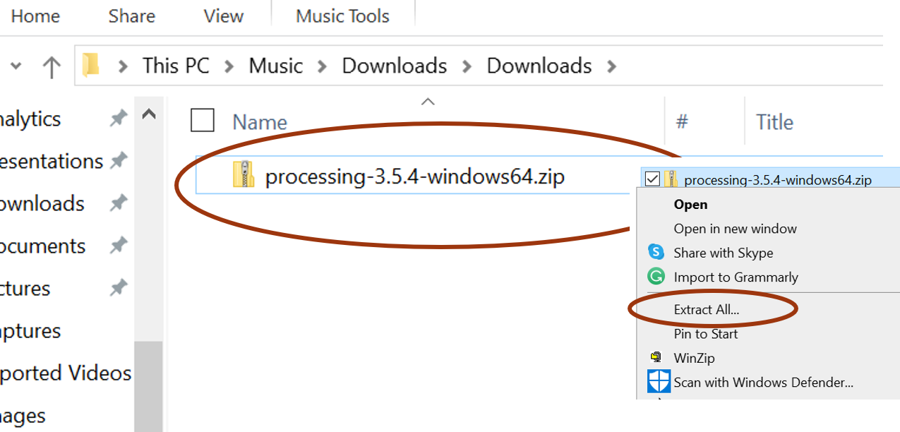
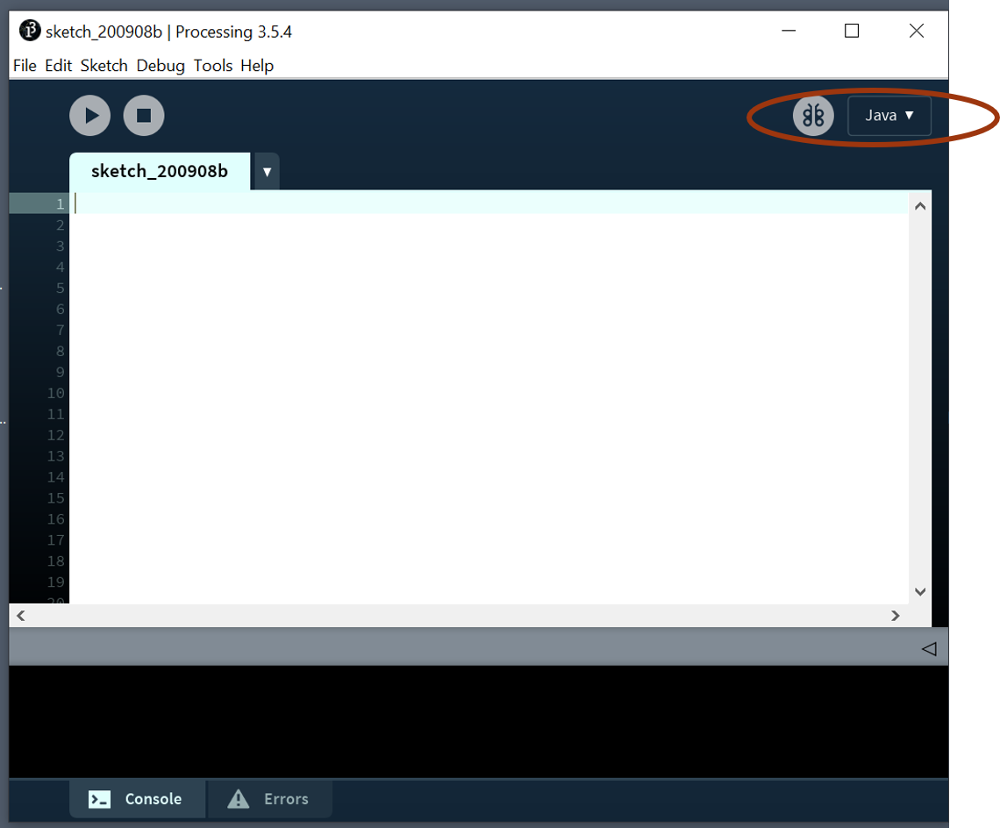
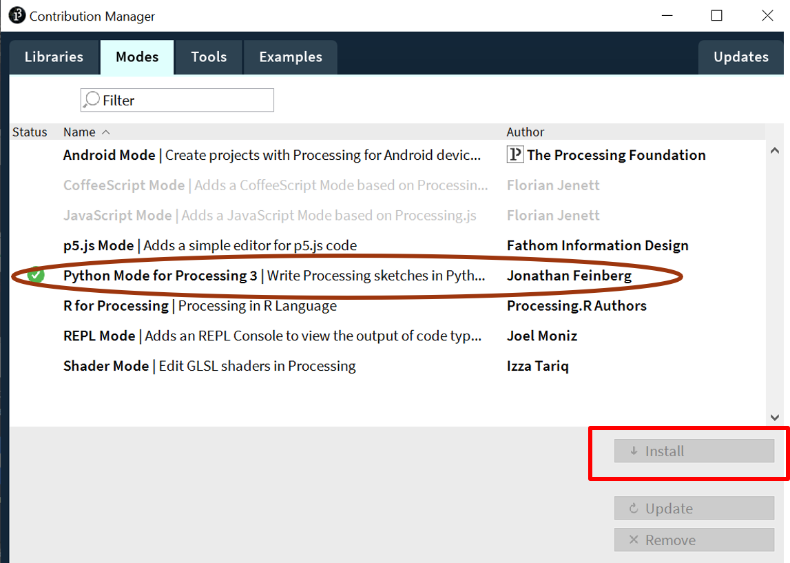

.. contents::  
   :local:
   :depth: 1

Download and Install Processing.py
=========================================================

Let's take a step by step look at how to download and install Processing (Python Mode)

There are 3 Steps:
1. Download the compressed zip file
2. Unzip/uncompress the file
3. Install the Python mode Add-on

.. image:: ../workshop/images/install/1_ppy_website.png
   :width: 400   

.. image:: ../workshop/images/install/3_make_shortcut.png
   :width: 400   

.. image:: ../workshop/images/install/3_make_shortcut.png
   :width: 400   

.. image:: ../workshop/images/install/4_load_processing.png
   :width: 400   

.. image:: ../workshop/images/install/6_addon.png
   :width: 400   

   
.. image:: ../workshop/images/install/8.png
   :width: 400   
