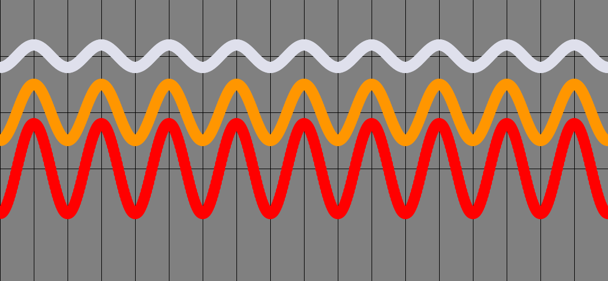
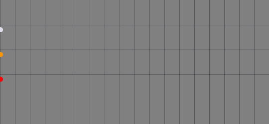
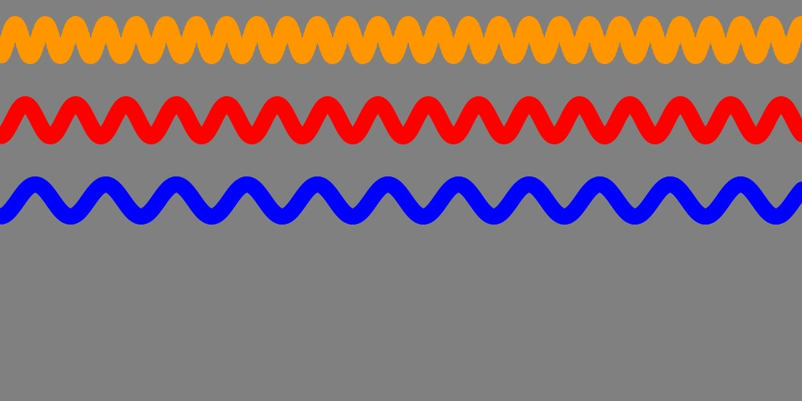

.. contents::  
   :local:
   :depth: 1

Tutorial: How can we animate a ball to move in a sine wave?
================================================================

Find the `Code: <https://github.com/Ram-N/generative_art/blob/master/ball_animations/sinusoidal_ball.py>`_ here.

Observe the 3 balls in the following figure:

If you pay attention, you will notice that all 3 have the exact same frequency, but they each have different amplitudes.
It becomes easier to see if we let the balls leave trails (see the image below).

.. image:: ../ball_animations/images/amplitudes.gif
   :width: 400   

Thought Process
----------------

We want a few balls to move from left to right, but instead of a straight line, it would be along
a cosine or a sine curve.

There are 3 Steps in most Ball movement animations:

1. At each frame, we could compute its x and y coordinates
2. We would update its coordinates and store it for each ball
3. Display each ball at its latest location. (This is very common and nothing unusual here.)

What can we vary?
------------------------------------

1. We could vary the FREQUENCY of the Sine/cosine curve.
2. We could vary the AMPLITUDE (how high does it bounce?)

How to make `cosine()` vary with time?
--------------------------------------

cos(x) is always between -1 and 1. To bring in a time component, we could use the built-in
variable called `frameCount` (note the camel-case in the name.)

cos(frameCount) will always vary from -1 to +1, and will be constantly changing over time. So we are getting somewhere.

How to change the amplitude of each ball?
+++++++++++++++++++++++++++++++++++++++++++++++++++++++++

Now `cos(frameCount) * 20` will always vary from -20 to + 20. So that is how we will get our *amplitude* going.
If we multiply `cos(frameCount)` by three different numbers, one for each ball, we will have 3 different amplitudes.

In the following image, we have 3 balls, moving with 3 different amplitudes:   

What about the Frequency? Consider these two choices
+++++++++++++++++++++++++++++++++++++++++++++++++++++++++

Consider::

    cos(frameCount) vs 
    cos(frameCount * 2)

One moves twice as fast as the other. It completes its 'rotations' faster. So that can be our proxy for frequency.

Let's put it all together. 

Look at this one line of code::

   b.vy = cos(radians(frameCount * angle_step) * FREQ[idx]) * AMPLITUDE[idx]

We are setting the `y` position (coordinate) of ball `b` here. To understand this, start always from the innermost.
frameCount is just an integer that forever is increasing. `angle_step` is a constant. I am using 6 degrees in my code.

`radians(frameCount * angle_step)` is where we convert degress to radians. It is a straight conversion. Read upon on radians
if this is new to you. Then we multiply this by a FREQ[idx] where idx is the index for each ball.
This is how we can control a ball's frequency. Finally, we are multipling by AMPLITUDE.

So, to recap, we are using many constants to control how much the ball moves in the y (vertical) direction. That's all.

Setting things up
-------------------

1. Frequency variations. Create a list to hold each ball's Frequency: `FREQ = [0.5, 1, 2]`

2. amplitude variations: Create a list to hold each ball's Amplitude: `AMPLITUDE = [10, 20, 50]`

In the following image, we have 3 balls, moving with 3 different frequencies:   

This is a small script. You can find it in github. Do give it a try:
`sinusoidal_ball.py <https://github.com/Ram-N/generative_art/blob/master/ball_animations/sinusoidal_ball.py>`_

  
