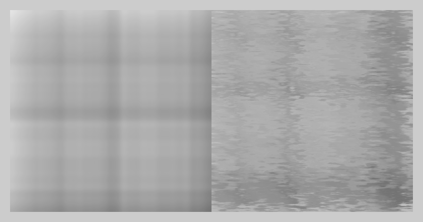

# Experiments in Domain Warping

This directory contains several of my Domain Warping (DW) attempts.

If you are new to Domain Warping, I have a Markdown Page in which I store my research. 

(Basically, materials that I came across when I was learning it)

With each new 'experiment' I'm trying to build on the previous one.

### Experiment 2: Following StackOverflow

In the GameDev StackExchange, I found a very good and clear example of Domain Warping.
Along with some sample C# code. This is my attempt at doing the same, in python.

The code can be found in [dw_2.py](dw_2.py).

### Experiment 3: Show the imapact of scale on DW

There are so many knobs in these experiments. It is difficult to show the effect of such a vast grid of options. One way is to animate things. This is one such attempt.

In each frame, the distortion_strength is increased by 5.
You can see the impact.

Several other examples can be found in the [images](images/) directory.

