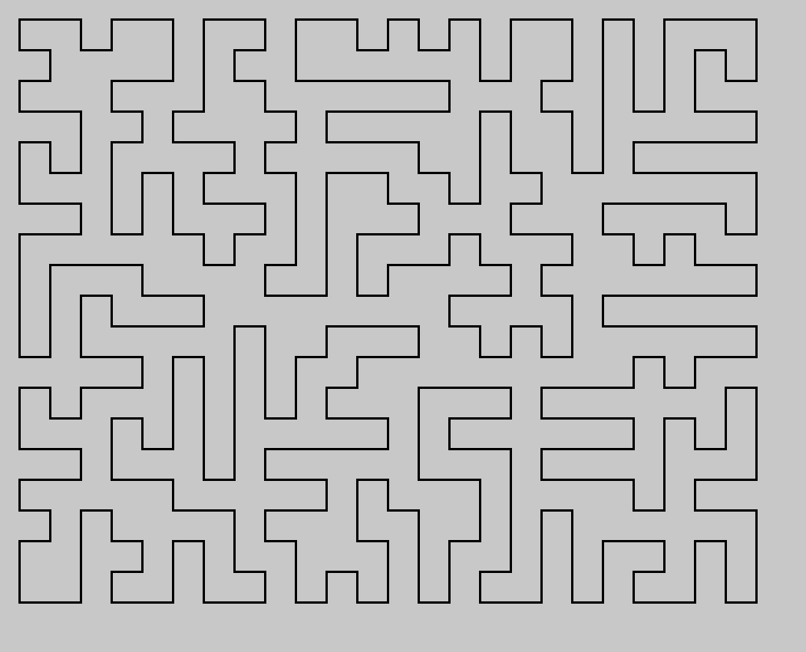
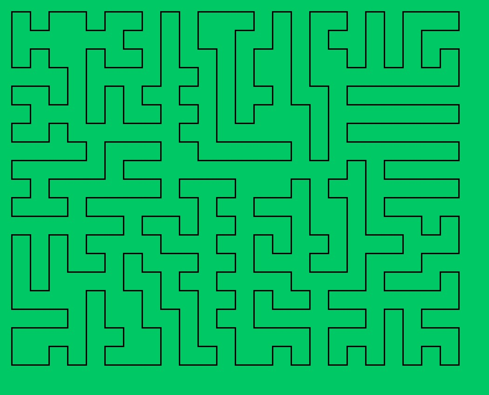

# Dots and Dashes

## Concept

1. Start with a rectangular shape.
2. Keep shrinking the area (with Perimeter increasing) without ever losing continuity.
3. Do this randomly until no more shrinking is possible.

## Variations

In each execution, since the line to shrink are randomly chosen, we end up with different final shapes.
Here are a couple of end results:

