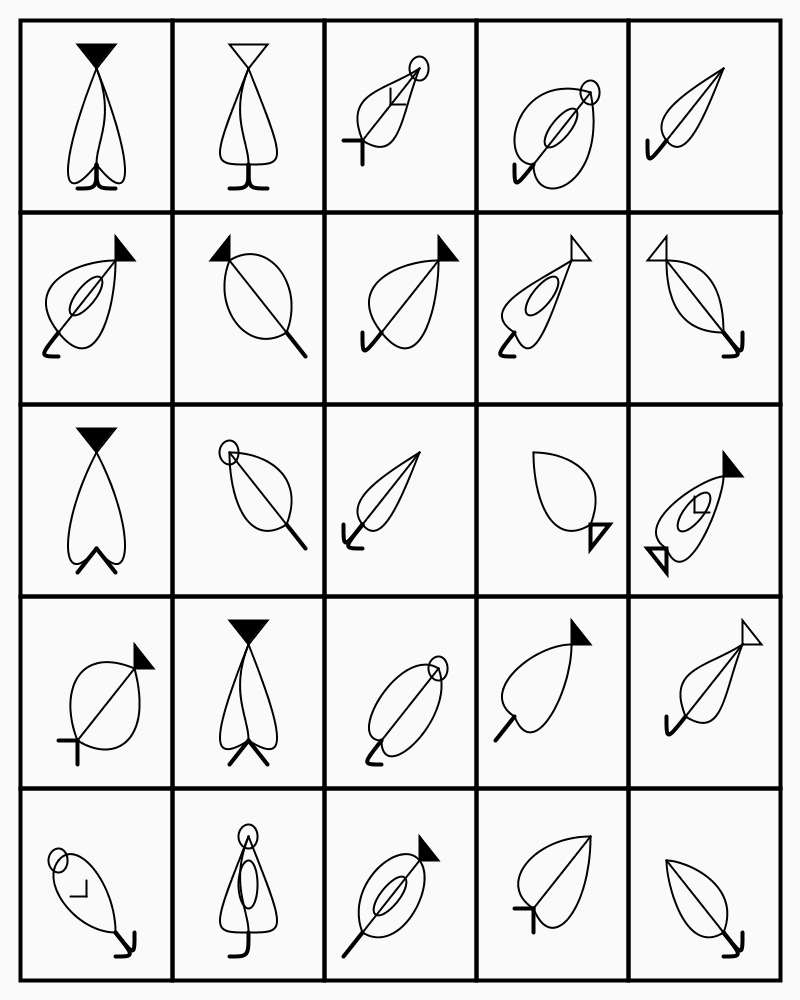
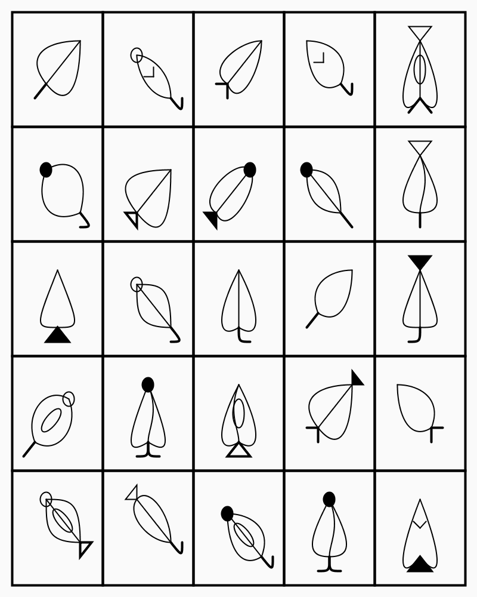

# Generative Fonts

`font.py` has the Class, with grid, size and several rules encoded. It can be a good starting point for creating your own Fonts.

## Leafont - a Leaf-based font

This was the first generative font that I coded. Each leafletter is based on a leaf-shape. 

### Parts
Each letter has 4 parts:
    1. A main shape (leaflike, with a straight, left or right slant)
    2. A bottom base
    3. A top decoration
    4. An interior decoration inside the main shape.

TODO
- Add some code to disallow duplicates.
- Add Colors and Fills can make the Leafont alphabet grow.

### How was it drawn

Even though I research cardioids quite a bit, I ended up not using them.
Instead, I rely on three main Processing shapes: 
    - bezier
    - triangle
    - ellipses

## Resources

- https://mathworld.wolfram.com/Folium.html
- https://mathworld.wolfram.com/Cardioid.html
- [ultra-short video with code on Cardioids](https://www.youtube.com/watch?v=2hETmClAGnA)
- [cardioid.py](cardioid.py)