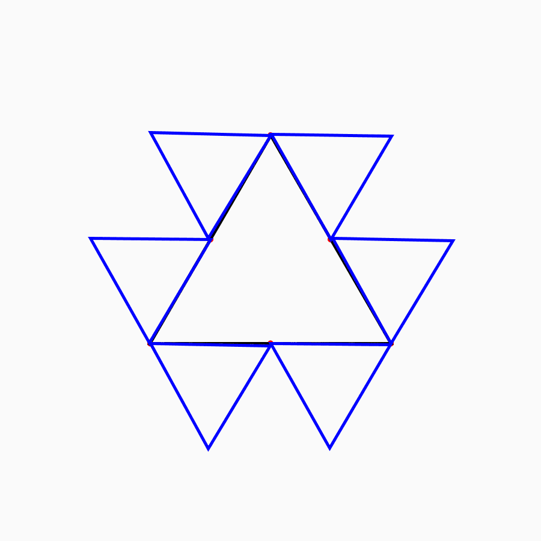
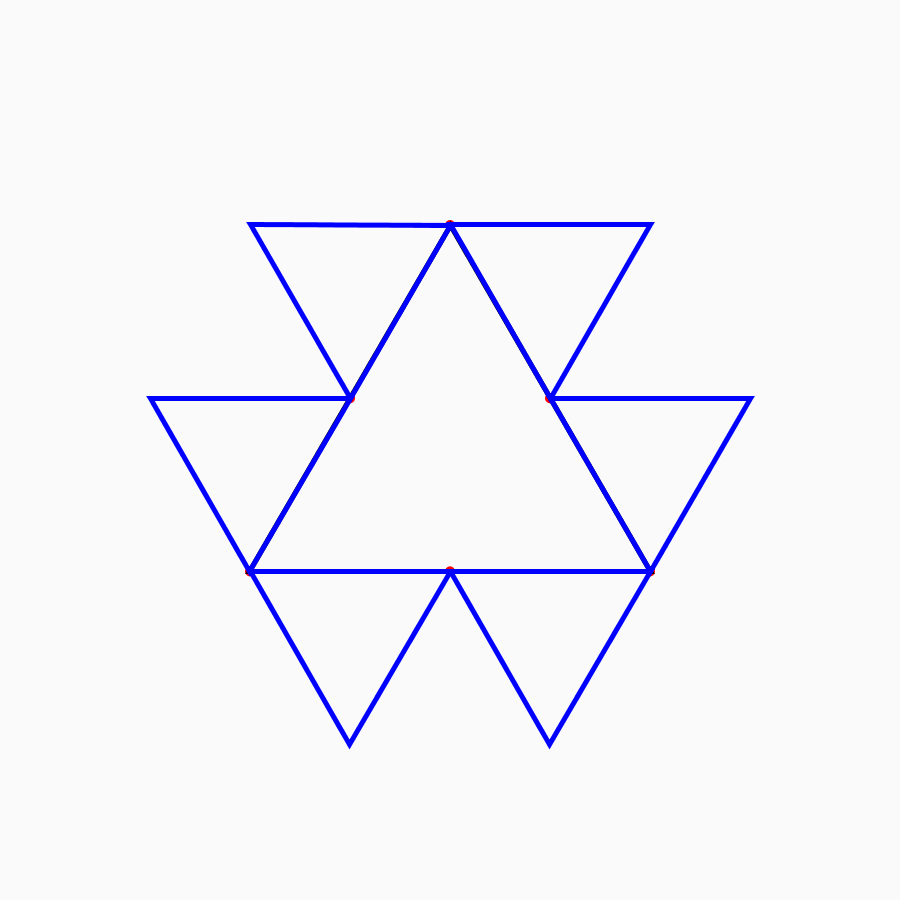
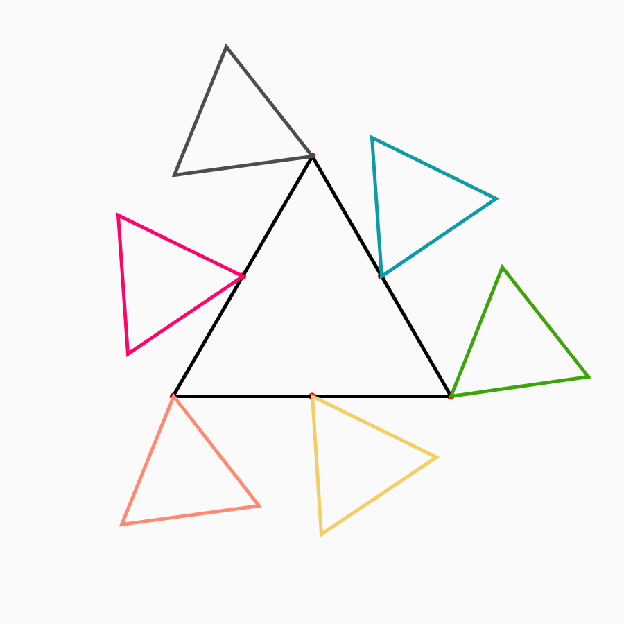

# Geometric Rollers

Main concept: One set of shapes (tumblers) rolls over a base shape.

## The Challenge At Hand

Take a Base shape. (Triange/square/ rect, ellipse etc.)
Roll 1 or more smaller shapes around it.

## Step by Step Approach
Going to start with an Equilateral Traingle. Will roll 2 (6?) smaller traingles around this one.
1. First, create a Base Triangle.
    This include `translate()` and `rotate()`
2. Find 6 Pivot points. These are the points around which the tumblers rotate.
3. Translate to each pivot point. and Draw a triangle there.
    One vertex is 0,0. Second is *away* from the base, the third vertex is *along* the base triangle.
4. First roll one traingle, which involves rotating and rendering with FrameCount.

