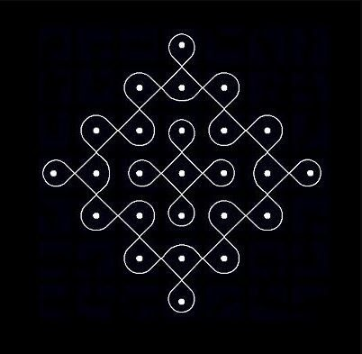
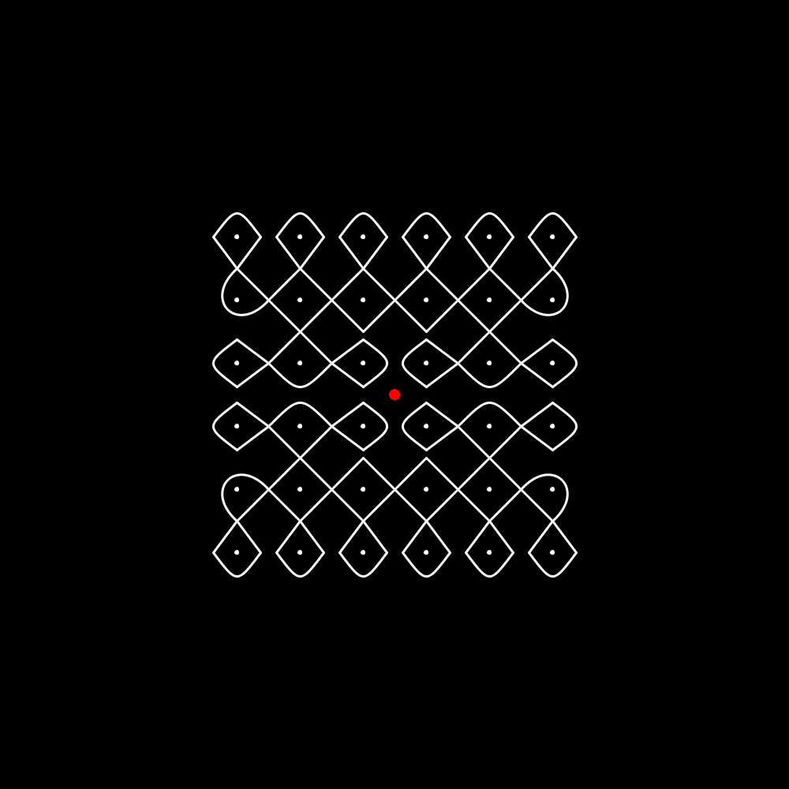
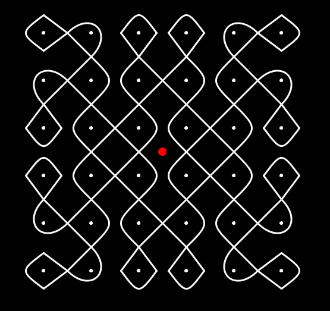
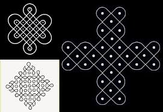

# Generative Kolams

## Nomenclature

- Dots: These are the `pullis` in pulli-kolam. These dots are visible, and usually the kolam-line goes *around* these without touching them.

- fine-grid: A rectangle around the dot. This could be a 5x5 or an 8x8 sub-grid. By definition this grid is very fine. Typically, this grid is not rendered, but is used as scaffolding for calculating the covers around dots.

- Symmetry: Could be 2-way symmetry or 4-way Symmetry for the dots.

- Dot-pattern shape: Rhombic, square, circular, 5-2-1 (5, 3 and 1, and then 3 and 5)

- Covers: This is the loop around each dot. In a proper pulli kolam, no dot should be left uncovered.

## Inspiration
[YouTube Video from MathLapse](https://youtu.be/a0n14YSIFyU)
This 3-minute video makes the dots (and junctions) as vertices and generates an "Euler-graph" which is the kolam itself. This is the kernel of what 'draw' will do.

From the [mathLapse article](https://imaginary.org/film/mathlapse-math-art-south-indian-traditional-art-suzhi-kolam), there is a mention of a sub-class of kolams:

    Single Stroke kolam also called as “ANTHATHI Kolam” in Tamil Nadu. The Smooth line starts at a point and end in the same point. Single stroke kolam can be drawn for any type of dot structure (rhombic, square, triangular, or free shapes)

As can be seen here, there are many other possibilities to create a SL kolam based on the set of dots above.

## Pattern Variations
1. Each dot-cell can share junctions with its neighbor (called `overlapping borders`)
2. Each dot-cell has its own set of junctions. (`non-overlapping.`)
3. The dot covers can be `blocky` or `narrow` (This has to be specified as a kolam_spec)

## Top-level Functions

- Place Dots (dx, dy) render dots
- Create fine-grid
- Generate Junctions
- Junction to Junction Connections. This is useful when the dots are further apart.

## Things to work on
- Have an option in which 'island formation' is minimized, or eliminated. In a 3x3 dots, the bottom 3 and the right 3 dots cannot *all* be zeros. That would an island to be formed.

- Take care of dot square size odd (5, 7). This involves drawing 1/2 covers!
- Implement diminishing dot patterns. 7-5-3 or 8-6-4 type of patterns
- Given a (posx, posy) get the dot object (Done)
- Given a px, py, get the dot's cover pattern 
- Given a px, py get dot's neighborhood pattern. (Neighbor posx, posy.. or None. The directions of neighbors. Would be N, E, S, W or NW, NE, SE, SW)- Implemented

### Aesthetics
- Implement completely new covers each frame change. (Done. get_random_kolam(dots='all))
- Implement a random version wherein only one dot changes in each new 'frame change'.

### Common Utilities
1. For the Grid, I use the same class/files as in Chess_Art (`grid.py`)
2. For finer grid near the dots, I use fine-grid based on what I did in `generative fonts` finer grid.py

Several other examples can be found in the [images](images/) directory.
