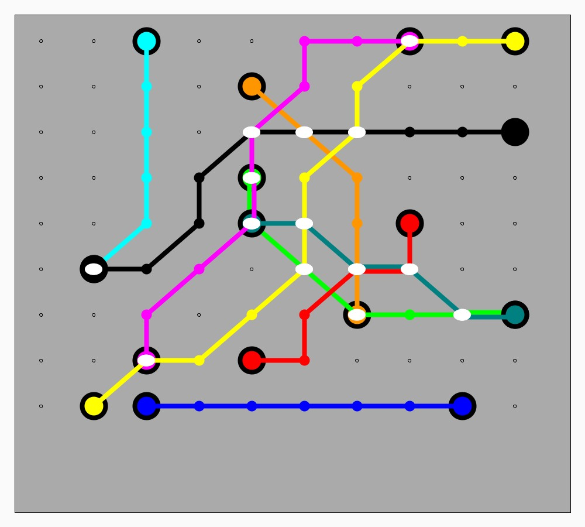
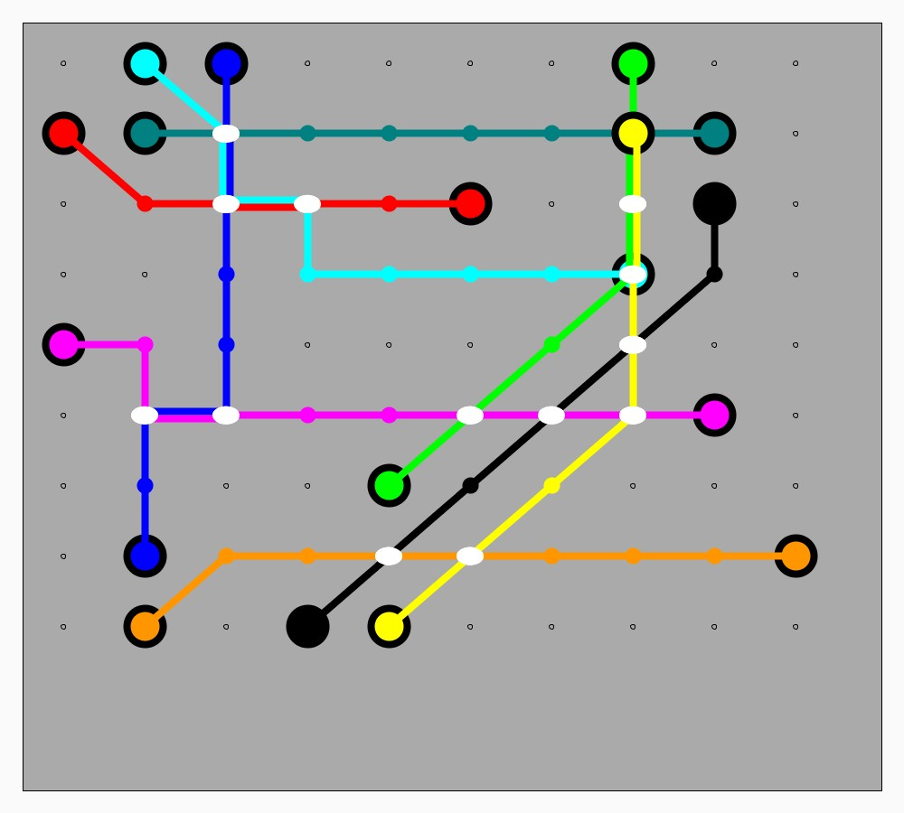
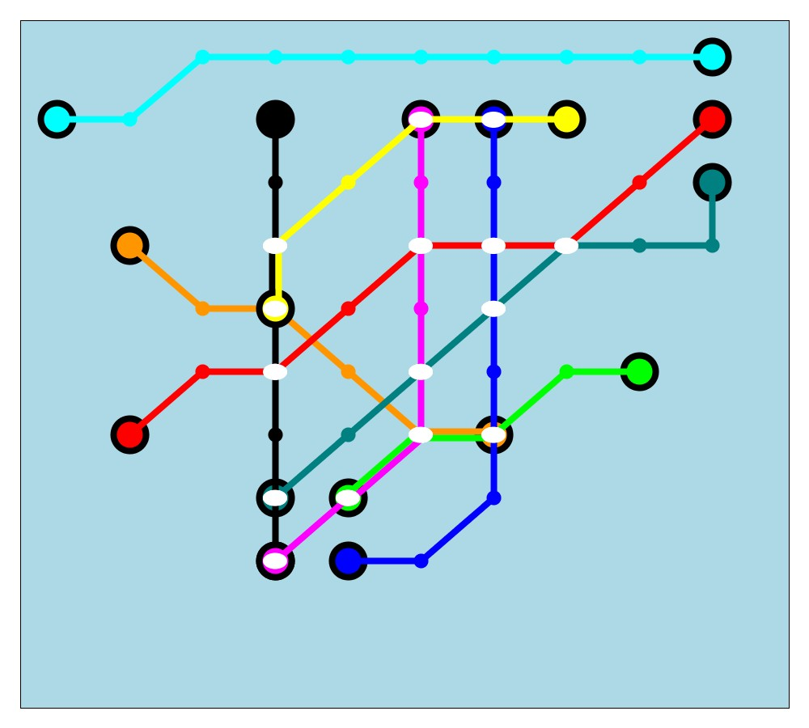
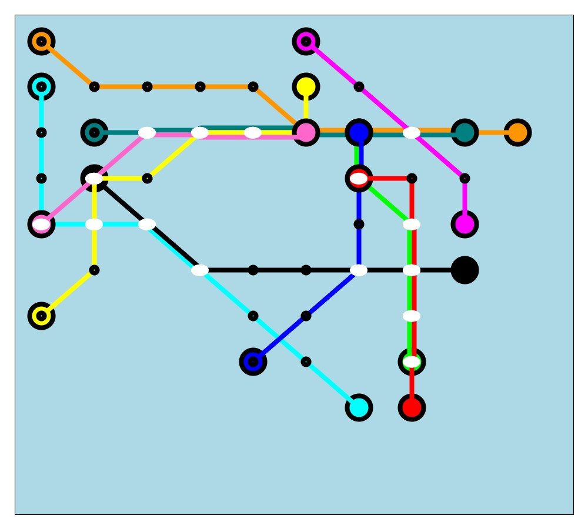

# Metro Maps

This project creates Metro Maps for imaginary cities.

What would the Metro (subway) map look like, for imaginary cities? Each time the code is run, it produces a
different set of Terminals, Routes, Junctions and Stations.

**Xanadu Metro Map**

2. A "Line" goes from an O station to a D station. (O and D should be closer to the boundaries of the grid.)
3. Parallel lines run fat and adjacent to each other
4. Some stations are "junctions" where the lines will cross each other. Show those with a white oval. These are
places wherein passengers can switch lines.
6. All lines can only run at 90 or 45 degree lines, a convention followed ever since the London Underground created its famous maps.

**More Intricate Rules**
1. Overlapping routes should be nicely aligned
2. Minimal crossovers of routes
3. Control the amount of 45 degree and 90 degree lines.

**Dynamic** (Not implemented)
D1. Lines and Stations "disappear" over time, starting from origin until the destination disappears.
D2. For every disappearance, a new station/node/line reemerges elsewhere.

Note: The rules for intersecting lines, overlapping segments and showing them elegantly got overly complex.
So I haven't implemented the dynamic component yet. Might come back to it.

## Static Metro Maps. Samples

A few more examples can be found in the [images](images/) directory.

