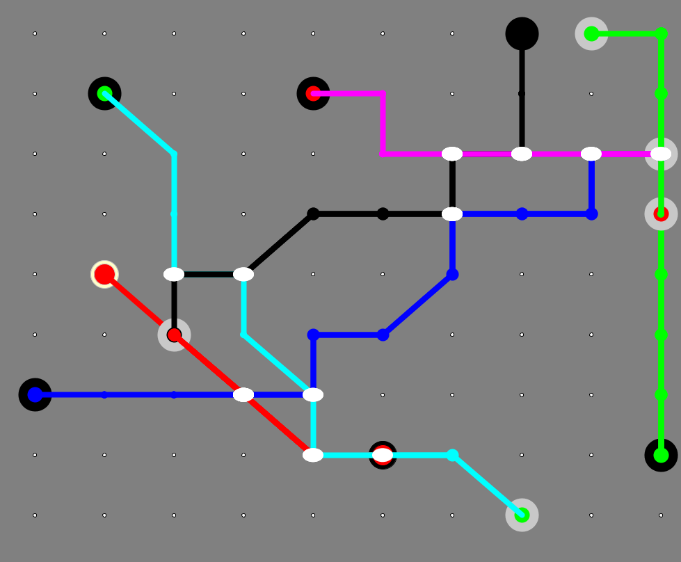

# Metro Maps

This project creates Metro Maps for imaginary cities.

**Xanadu Metro Map**

1. Stations can only be placed on an invisible grid. Hexagonal centers?
2. A "Line" goes from an O station to a D station. (O and D should be closer to the boundaries of the grid.
3. Parallael lines run fat and adjacent to each other
4. Some stations are "junctions" where the lines will cross each other
5. Junctions are shown with a bigger circle with a colored border.
6. All lines can only run at 90 or 45 degree lines.

**Dynamic**

D1. Lines and Stations "disappear" over time, starting from origin until the destination disappears.
D2. For every disappearance, a new station/node/line reemerges elsewhere.

## Static Metro Maps

These were the early gif-loop attempts

