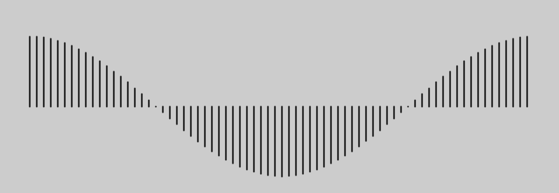
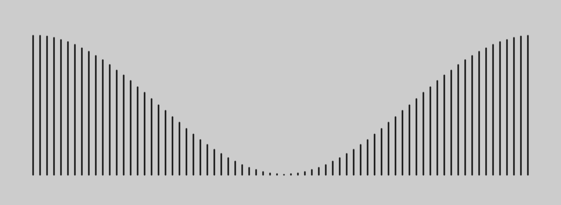

```
ring_incr = 50
for i in range(50, 255, ring_incr):
    print('phase',     map(i,50,255,0,100))
```
Notice that phase starts close to 0, and ends up right around 100.

```
ring_incr = 50
for i in range(50, 255, ring_incr):
    print('scale', map(i,50,255,1.75,0.01))    
```

Notice that phase starts close to 1.75, and ends up right around 0 with increasing i.

As the documentation tells us,  `scale()` Increases or decreases the size of a shape by expanding and contracting vertices.

So this is one way of keeping each circular shape's (ring's) size a little different.  Otherwise they will all be plotted on top of each other.

To see this in action, make sc=1 and see what happens
`scale(sc)` 
Since sc depends only on ring_num (which is different for each ring), we end up having a different scale
for each ring. In this case, the rings start out big (scale=1.75) and diminish in radius to scale=0.01.


## Understanding `noise_max`

## A quick review of `cos(theta)` and `cos(theta + t)`

You might recall that `cos(anything)` is always between -1 and 1. Cosine(0) is 1.

First, let's make theta (the angle) go from zero to TWO_PI in small increments.
What happens to cos(theta)?



Often, when we are drawing lines or physical quantities, we don't want negative numbers. 
To avoid negative values, we can lift everything up by a constant number:


## `cos(theta + t)`
Now, let's see what happens when we add a time component to theta, and then take its cosine.

Basically, we are now summing two quantities, a linear time component t and a rotational component theta.
But all that cosine cares about, is the remainder after TWO_PI multiples.

If theta or t changes slowly, the values will stay stable.


If theta or t changes rapidly, the values will fluctuate with high frequency.


Try running this:
```
for frame in range(0,200):
    max_noise =2*(cos(t)+2)
    print(t, cos(t)+2, max_noise)
    t+=0.01*PI
```
Note that max_noise cannot go below 2 i.e. (2 x (-1+2)) and it cannot go above 6 i.e. (2 x (1+2)).
So we bound our "noise" parameter to be within an upper and lower bound.


As the frameCount progress (with each execution of the draw() function) t increases monotonically.
However, thanks to cos(t), we know that the max_noise gets bounded. 
Based on `2 * (cos(t)+2)` we can tell that the max_noise will always stay within (2, 6).
In fact, it will start at value 6, go slowly down to 2, and then it will make the reverse trip where it will
slowly increase back to 6.

In English: max_noise is one way of controlling the figures/shapes to slowly contract and expand in a periodic manner, with time.

# Dealing with Perlin Noise


### Making Gif Loops

Once we have dozens of images (1 per frame) saved, we have to make it into one nice animated gif.
For that, I've used EZgif.com. I also resized and cropped the gif to make its size smaller.

Hope that was useful!
Ram
