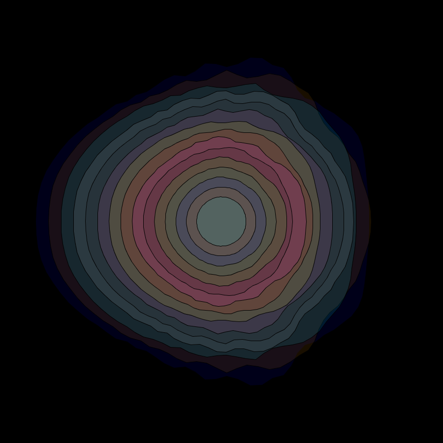
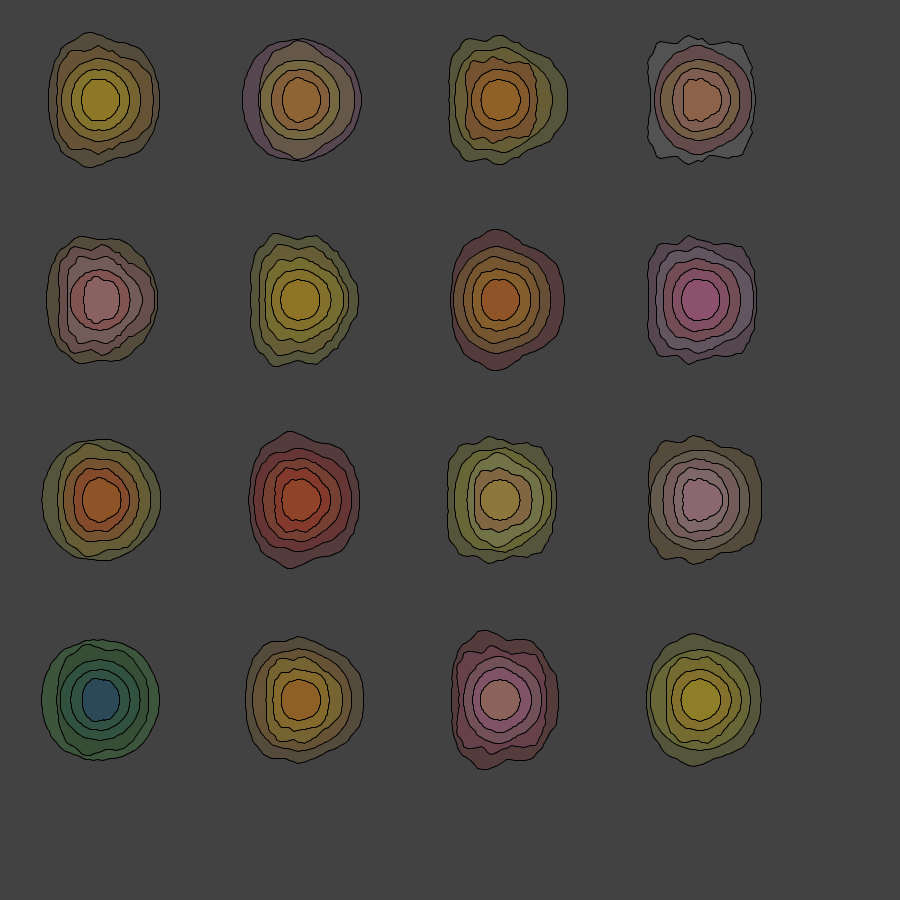

# Sinusoid Based Images

## PANCAKES

[images](images/)

A Grid of Stacked Pancakes 

# Order from Chaos
4 things that can be varied for each pancake.
    1. Radius - Large to small, shrinking
    2. Color - Dark to Brigher
    3. Alpha - Diffused to Opaque
    4. Roundness - Jagged to Round

