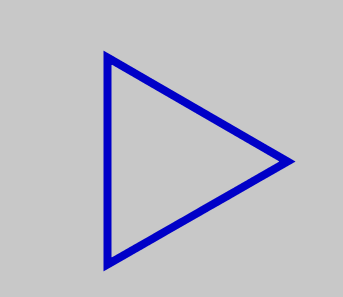
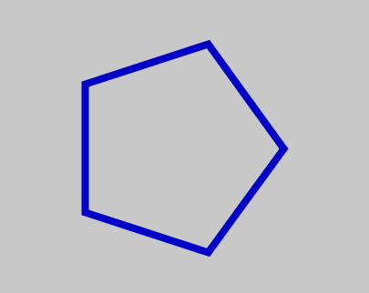

.. contents::  
   :local:
   :depth: 1

Tutorial: Creating "Circular Noise" using Processing.py
=========================================================

In this Tutorial we are going to try and create this animated gif:

.. image:: ../sinusoidal_sketches/circular_noise/images/cn_purple.gif
   :width: 400   

Note that it has multiple components. Let's try to build this, piece by piece.
`The code can be found here <https://github.com/Ram-N/generative_art/blob/master/sinusoidal_sketches/circular_noise/circular_noise.py>`_

Acknowledgement
-------------------

This is originally the work of Liam Gardner, who posted the image and code to Reddit. Deconstructing
fun projects by others is a very good to develop our programming muscle. Thanks to Liam for
the permission to use his code as a starting point. The `github repo can be found here <https://github.com/GardnerLiam/CircularNoise>`_ (Javascript). 

How to Approach this?
======================

There is a lot going on. So we have to deconstruct it to understand such images.

1. There are rings. And there are a number of them each with varying size. Since this is the main feature,
perhaps we can try starting there.

2. The rings have "noise" (bumpiness). We have to try and build that. One idea is to start with perfect 
circles and then add the noise.

3. Noise over time. If you stare at the animation, you can see that the rings rotate, as well as "wobble" a bit.
We have to recreate that too. That wobbling is dependent on "time" or the framecount of our animation.

In Processing, it is almost always a good idea is to start with a simple image that works. Then we can layer on complexity.
In fact, this is how most artists and programmers approach any project. So let's think of some simplifications.

Simplifications
-----------------

1. Let's forget the animation for the time being. We'll start with a static image. If that is satisfactory, we can bring in the animation aspects. I often do this. I will get the static image to my satisfaction,
and only then think of dynamic components. In several projects, I have stopped with just the static image.

2. Reduce the number of rings. In fact, we could start with 1 ring, and then move to 2, and then to many.

3. Start with circular rings, and then experiment with noise.

Before we go further, let's get some terminology out of the way. It helps to be able to refer to things.

Nomenclature
--------------

First, let's define a few things.

.. glossary::

   Ring
      Let's call these circular jagged shapes 'rings'

   theta 
      It is the rotational angle. For a circle, ``theta`` goes from 0 to 360 degrees, or TWO_PI radians. 
      (We will mostly be working with radians). We will be using ``cos(theta)`` and ``sin(theta)`` a lot.

   Edges 
      Even though it is a ring, our shape is made up of ``edges``. If our shape had 3 edges, it 
      would be a traingle. 6 edges would make it a Hexagon. Over 25 edges and the polygon starts \
      looking very close to circular. Our ``shape`` is a combination of numerous small edges.

   Radius 
      The distance from the center to the edge of the shape (of the ring)

   Noise 
      It is a proxy for some variability in the radius. Noise is what gives the ring a "bumpy" appearance. 
      We will be using Cosine a lot to generate noise. The reason for that is that cosines are periodic.

   Perlin Noise
      A fancier version of random numbers, in which one term is close to another, depending on the 'offset.'
      If two offsets are close to each other, the random numbers will be close to each other as well.

   Scale
      A way to control the size of each ring. Scale can be greater than or less than 1. Think of zooming in 
      or zooming out. That's what ``scale`` provides us.

   Time, time-value, FrameCount
      We'll use this interchangeably to denote the passage of time needed for animation. 
      A Frame is a frozen point of time value.

Let's get started.

Static rings
==============================

In Processing, we are going to only use ``setup()``. We will get to ``draw()`` later.
We could use a circle or ellipse to start, but instead let's use ``BeginShape`` and ``EndShape``.

Here's some `setup()` code to get started::

   def setup():
      size(800,800)
      background(200)
      stroke(0,0,200)
      translate(width/2, height/2)
      strokeWeight(8)
      noFill()
         
To create a static ring, we use beginShape and endShape::

      num_sides = 20
      theta_increment = TWO_PI/num_sides
      beginShape()
      for theta in frange(0, TWO_PI, theta_increment):
         radius = 120
         x = radius*cos(theta)
         y = radius*sin(theta)
         vertex(x, y)        
      endShape(CLOSE)

This creates to the following "rings" depending on the value of ``num_sides``

.. image:: ../sinusoidal_sketches/circular_noise/images/cn_20_static.png
   :height: 100   

As you can see, even with 20 sides, the polygon looks like a circle. Let's stick with 20 sides for now. We 
have no noise, and only one ring, but we are off to a start!

----------------------
Adding Multiple Rings
----------------------

One way to do that would be to change the ``radius`` variable. This is a reasonable approach.
One drawback is that we have to keep track of all the calculations and plot accordingly.

Practioners of Processing use a very neat trick! We will plot the **exact same shape** over and 
over again. And we change only one thing! The ``scale.``

So we keep the same radius, and change the "scale." As the documentation tells us,  
``scale()`` increases or decreases the size of a shape by 
expanding and contracting vertices. So this is one way of keeping each circular shape's 
(ring's) size a little different.  Otherwise they will all be plotted on top of each other.

Here's what the code looks like,
and the result::

   for ring in range(num_rings):
        sc = (ring+1) *  0.8
        scale(sc)
        beginShape()
        for theta in frange(0, TWO_PI, theta_increment):
            radius = 100
            x = radius*cos(theta)
            y = radius*sin(theta)
            vertex(x, y)        
        endShape(CLOSE)

.. image:: ../sinusoidal_sketches/circular_noise/images/cn_3rings_5.png
   :height: 100   

.. image:: ../sinusoidal_sketches/circular_noise/images/cn_3rings_20.png
   :height: 100   

Note that ``scale()`` impacts everything, even the line width. Also, pay attention that we only changed
the scale amount (``sc``) in each loop.

Adding some noise to the rings (jaggedness)
================================================

Next, we want to modify the radius of the rings. Let's make the ring radius depend on ``theta``
and ``cos(theta)``.  Here's a super-quick refresher on ``cos(theta)`` and ``cos(theta+t)``.

`cos(theta)` vs `cos(theta + t)`
--------------------------------------------------------

You might recall that `cos(anything)` is always between -1 and 1. Cosine(0) is 1.

First, let's make theta (the angle) go from zero to TWO_PI in small increments.
What happens to cos(theta)?

.. image:: ../sinusoidal_sketches/circular_noise/images/cos_theta.png
   :width: 200   

Often, when we are drawing lines or physical quantities, we don't want negative numbers. 
To avoid negative values, we can lift everything up by a constant number:

.. image:: ../sinusoidal_sketches/circular_noise/images/cos_theta_plus_offset.png
   :width: 200   

Adding a second component: ``cos(theta + t)``
--------------------------------------------------

Now, let's see what happens when we add a time component to theta, and then take its cosine.

Basically, we are now summing two quantities, a linear time component t and a rotational component theta.
But all that cosine cares about, is the remainder after TWO_PI multiples.

If theta or t changes slowly, the values will stay stable.

.. image:: ../sinusoidal_sketches/circular_noise/images/cos_theta0.5_plus_t.png
   :width: 200   

If theta or t changes rapidly, the values will fluctuate with high frequency.

.. image:: ../sinusoidal_sketches/circular_noise/images/cos_theta_plus_t.png
   :width: 200   

Bringing in Perlin Noise
===========================

Pay attention to this one line::

   x_noise_offset = map(cos(theta), -1, 1, 0, max_offset)
   radius = map(noise(x_noise_offset, y_noise_offset), 0, 1, 100, 200)

We are *mapping* cos of the angle (rotation) to get a noise_offest.
We will then use this offset to get a Perlin Noise value (smooth random number) and drawing out a radius.
Thus the radius is no longer a constant, but will vary with ``theta``.

Code::

   num_sides = 30

      for ring in range(num_rings):
         scale((ring+1)*0.6)
         beginShape()
         for theta in frange(0, TWO_PI, theta_increment):
               x_noise_offset = map(cos(theta), -1, 1, 0, max_offset)
               y_noise_offset = map(cos(theta), -1, 1, 0, max_offset)
               
               radius = map(noise(x_noise_offset, y_noise_offset), 0, 1, 100, 200)
               x = radius *cos(theta)
               y = radius *sin(theta)
               vertex(x, y)        
         endShape(CLOSE)

Notice that the ``map`` function takes the noise value (between 0 and 1) and 
makes it into a radius from 100 to 200. ``max_offset`` is one way to control the magnitude of the noise.

|pic1| becomes |pic2|

.. |pic1| image:: ../sinusoidal_sketches/circular_noise/images/cn_3rings_20.png
   :height: 100   

.. |pic2| image:: ../sinusoidal_sketches/circular_noise/images/cn_add_noise.png
   :height: 100   

.. |pic3| image:: ../sinusoidal_sketches/circular_noise/images/cn_add_ring_noise.png
   :height: 100   

One more modification we could make. Did you catch that each ring has the exact same noise? 
To change that, we have to add a *ring-number-based quantity*. If we do that, each ring will
be different from the other rings in the same 'family.' 

Change the line::

   x_noise_offset = map(cos(theta), -1, 1, 0, max_offset)

to::

   x_noise_offset = map(cos(theta), -1, 1, 0, max_offset) + map(ring, 0, num_rings, 0 ,100)

For each ring, we are adding a proportional number from 0 to 100. And then feeding that into noise.
This results in:

|pic2| becoming |pic3|

You might want to pause here and try running the above yourself.
Everything that we've seen upto this point is in a small script called
`circular_noise_static.py <https://github.com/Ram-N/generative_art/blob/master/sinusoidal_sketches/circular_noise/circular_noise_static.py>`_
in the github repo.

Adding Frame to Frame variability
----------------------------------------

We are now able to create static images. One last thing remains. How to get them animated?
For this, we will have to move the ``create_shape`` function to draw(). And then we'll try and 
introduce frame-to-frame variations::

   frame_incr = frameCount * TWO_PI / 200

and when mapping the x and y offsets for the noise, add a frame component::

   x_noise_offset = map(cos(theta + frame_incr), -1, 1, 0, max_offset) + 
   map(ring, 0, num_rings, 0, 100)

Notice that we have added a **frame_incr** when taking the x_noise. You can find this in
the script 
`circular_noise_animated.py <https://github.com/Ram-N/generative_art/blob/master/sinusoidal_sketches/circular_noise/circular_noise_animated.py>`_

Let' wrap up with some variations:

Wrapping up with a few Variations
====================================

What if we made max_noise go down to zero at times? If we did that, all noise in the radius would vanish
and we'd get a smooth circle.

If max_noise = ``2 * (cos(t)+2)``, ``max_noise`` cannot go below 2 i.e. ``(2 x (-1+2))`` and it cannot go above 6 i.e. ``(2 x (1+2))``.
So we bound our "noise" parameter to be within an upper and lower bound.

As the frameCount progress (with each execution of the draw() function) ``t`` increases monotonically.
However, thanks to ``cos(t)``, we know that the max_noise gets bounded. 
Based on ``2 * (cos(t)+2)`` we can tell that the max_noise will always stay within (2, 6).
In fact, it will start at value 6, go slowly down to 2, and then it will make the reverse trip where it will
slowly increase back to 6.

In English: ``max_offset`` is one way of controlling the figures/shapes to slowly contract and expand in a periodic manner, with time.

Effect of dampening the max_offset variable
---------------------------------------------

Let's say that for a few frames, we want to squeeze down on max_offset so hard that we allow not variations at all. 

We can do this by setting::

   max_offset= 2 * (cos(time_value)+1)

For certain time_values, cos() = 0. Thus, the radius is exactly equal for all values of theta. (Rotation invariant)
Look at this GIF to see the impact of this change. (Watch as the rings get smoother over time, and grow jagged again)

.. image:: ../sinusoidal_sketches/circular_noise/images/noise_cancel.gif
   :width: 200   

Variations with Polygons
--------------------------

.. image:: ../sinusoidal_sketches/circular_noise/images/cn_triangles.gif
   :width: 400   

.. image:: ../sinusoidal_sketches/circular_noise/images/cn_hex.gif
   :width: 400   

========================================================
Variation: Apply the same Perlin Noise to all the Rings
========================================================

One final variation that we could try. Let's have the *same* noise applied to each ring in each frame.
That gives a nice effect.

.. image:: ../sinusoidal_sketches/circular_noise/images/same_phase_all_rings_similar2.png
   :width: 200   

Here' what it looks like, when the noise for each shape is the same, when we *only* scale it linearly.

.. image:: ../sinusoidal_sketches/circular_noise/images/cn_red_no_linear_noise.gif
   :width: 300

Making Gif Loops
------------------------

Once we have dozens of images (1 per frame) saved, we have to make it into one nice animated gif.
For that, I've used `EZ_gif.com <http://ezgif.com>`_ . I also resized and cropped the gif to make its size smaller.

Be sure to play around with the code. That is really the only way to learn and understand. Thank you
for your time. Hope that was useful!

Ram